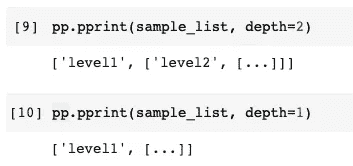

# 您的 Python 输出可以更漂亮

> 原文：<https://towardsdatascience.com/your-python-output-can-be-prettier-c697ace3f161?source=collection_archive---------9----------------------->


照片由 Pixabay 上的 [LNLNLN](https://pixabay.com/users/lnlnln-1131094/) 拍摄

## 从 Python Pretty 打印机库的基础到高级用法

每种编程语言都可以输出。控制台中的打印变量可以被认为是最基本的调试方法——至少您知道它包含什么。如果您使用诸如 Jupyter Notebook 之类的交互式笔记本，这对 Python 来说更是如此，因为运行一个单元后，输出就是您所拥有的全部。

但是，您是否对输出的格式感到困扰？例如

*   有许多打印在一行中的键-值对的字典
*   嵌套列表打印在不可读的一行中
*   有非常深的不感兴趣的嵌套对象的字典

你可能已经知道 Python 中漂亮的打印机库，也可能不知道。无论哪种情况适合你，本文都将尝试引导你进入其中，并进行深入探讨。

请注意，漂亮的打印机库是 Python 内置的，因此您不需要下载任何东西。

# 1.基本用法


照片由[詹姆斯·德莫斯](https://pixabay.com/users/jamesdemers-3416/)在 [Pixabay](https://pixabay.com/photos/bridge-park-garden-japanese-garden-53769/) 拍摄

首先，我们需要导入这个库，并为演示目的构建一个示例字典。

```
import pprint as ppsample_dict = {
    'name': 'Chris',
    'age': 33,
    'message': 'Thank you for reading my article!',
    'topic':'Python Programming'
}
```

现在，如果我们简单地打印这本字典，所有内容都将在一行中输出。

```
print(sample_dict)
```


嗯，这可能还不算太糟，但是如果我们有更多的键值对或者一些值非常长怎么办？阅读起来会很困难。现在，让我们来看看漂亮的打印机库能做些什么。

```
pp.pprint(sample_dict)
```


首先，每个键值对都显示在一行中，这样可读性更好。此外，您可能没有注意到，字典会自动按字母顺序对键名进行排序。

# 2.文本换行


照片由 [SpencerWing](https://pixabay.com/users/spencerwing-4260422/) 在 [Pixabay](https://pixabay.com/photos/gifts-ribbons-wrapping-holiday-2872124/) 上拍摄

我猜大多数 Python 开发者都知道上面显示的基本用法。然而，你知道漂亮的打印机库有更多的参数和标志，可以用来进一步定制输出吗？

其中一个示例用法是文本换行。假设我们不仅满足于每行有一个键-值对，还希望在值太长时有文本换行。在这种情况下，我们可以使用`width`参数。

```
pp.pprint(sample_dict, width=30)
```


因此，我们可以使用宽度来约束行的长度，以获得更好的可读性。除此之外，`indent`参数可以在每一行前面添加缩进。

```
pp.pprint(sample_dict, width=30, indent=10)
```


# 3.嵌套对象截断


由 [Pixabay](https://pixabay.com/photos/egg-nest-tree-branches-leaves-1600890/) 上的 [JerzyGorecki](https://pixabay.com/users/jerzygorecki-2233926/) 拍摄的照片

有时，我们可能不想查看输出内容的所有细节。例如，我们可能想防止递归打印，或者只是对嵌套对象中更深层次的内容不感兴趣。

假设我们有一个如下的嵌套 Python 列表。

```
sample_list = ['level1', ['level2', ['level3']]]
```

如果我们使用普通漂亮的打印机，将不会有什么不同，从正常的打印。

```
pp.pprint(sample_list)
```


但是，如果我们指定了`depth`参数，任何比参数更深的内容都将被截断。

```
pp.pprint(sample_list, depth=2)
# OR
pp.pprint(sample_list, depth=1)
```



# 4.实例化漂亮的打印机


Pixabay 上 [leulietmorgan](https://pixabay.com/users/leulietmorgan-817101/) 的照片

到目前为止，它是非常酷的。然而，编写上面演示的代码只是为了打印某些东西，每次都是**，这可能太冗长和累了。**

**的确，我不会建议用漂亮的打印机来代替默认的打印功能。听起来有点怪:)所以，只在必要的时候使用。例如，当您调试来自 web 服务的 JSON 响应时。**

**然而，这是另一个问题。当你想不止一次而是多次使用漂亮的打印机时。每次都写带参数的函数也很累。事实上，我们可以用所有必要的参数实例化 Pretty Printer 类。然后，我们可以反复使用它。**

**`PrettyPrinter`类位于`pprint`包的根层。所以，还是重新导入吧。**

```
import pprint
```

**然后，我们可以在构造函数中传递参数，如下所示。**

```
pp = pprint.PrettyPrinter(depth=2)
```

**之后，我们得到了具有预定义样式的实例，可以直接使用。**

```
pp.pprint(sample_list)
```

****

# **5.实践中的例子**

****

**由[在](https://pixabay.com/users/free-photos-242387/) [Pixabay](https://pixabay.com/photos/businessman-newspaper-business-man-1031755/) 上的自由照片拍摄的照片**

**最后但同样重要的是，我想向您展示一个实际的例子来说明我们何时需要漂亮的打印机库。**

**让我们使用 PyPI 样例项目中的样例 JSON。这个例子也在官方文档中使用。**

```
import json
import pprint
from urllib.request import urlopen
with urlopen('[https://pypi.org/pypi/sampleproject/json'](https://pypi.org/pypi/sampleproject/json')) as res:
    project_info = json.load(res)['info']del project_info['description']
```

**请注意，我已经删除了`description`键，因为它太长了，无法在本文中恰当地演示。**

**如果我们简单地打印它，我们从输出中得不到任何有用的信息。一切都在一条线上。**

```
print(project_info)
```

****

**我们不能简单地使用 Pretty Printer 库来生成可读的输出，而不是复制输出并使用 Sublime 等额外的文本编辑器来格式化和美化 JSON 文档。**

```
pprint.pprint(project_info, depth=1, width=60)
```

****

# **摘要**

****

**由[免费拍摄的照片](https://pixabay.com/users/free-photos-242387/)在 [Pixabay](https://pixabay.com/photos/laptop-desk-workspace-workplace-336373/) 上**

**在本文中，我介绍了 Python 内置的漂亮的打印机库。当然，我们不一定要用它来代替默认的打印功能。我们必须在使用前导入它，代码会变得冗长。然而，在某些情况下，我们可以使用它来生成更好的可读输出，以方便我们的编程和调试活动。**

**[](https://medium.com/@qiuyujx/membership) [## 通过我的推荐链接加入 Medium 克里斯托弗·陶

### 作为一个媒体会员，你的会员费的一部分会给你阅读的作家，你可以完全接触到每一个故事…

medium.com](https://medium.com/@qiuyujx/membership) 

**如果你觉得我的文章有帮助，请考虑加入灵媒会员来支持我和成千上万的其他作家！(点击上面的链接)****