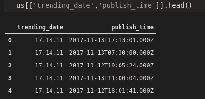
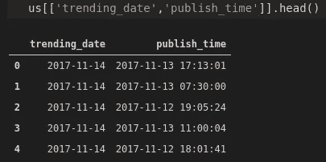

# 熊猫和海牛的 YouTube 趋势视频分析

> 原文：<https://towardsdatascience.com/youtube-trending-video-analysis-with-pandas-and-seaborn-8eec48a5e2d9?source=collection_archive---------44----------------------->

## 第 1 部分:数据清理和操作


诺德伍德主题公司在 [Unsplash](https://unsplash.com/s/photos/youtube?utm_source=unsplash&utm_medium=referral&utm_content=creditCopyText) 上拍摄的照片

我在 Youtube 上看视频比看电视还多。我坚信很多人都是这样做的。我在电视上看到的一些评论员现在正在 Youtube 上主持节目。

首要的动机当然是金钱。人们可以在 Youtube 上赚很多钱。你挣多少取决于你的视频被看了多少。

在这两篇文章中，我们将分析美国的趋势视频统计数据。第一部分包括数据清理和对熊猫的操作，因为[数据集](https://www.kaggle.com/datasnaek/youtube-new?select=USvideos.csv)不是最吸引人的分析格式。在[的第二部分](/youtube-trending-video-analysis-with-pandas-and-seaborn-c9903a0f811d)，我们将对数据进行分析和可视化，以推断出有价值的见解。我们将使用 Seaborn 库来创建可视化。

第一步是导入库并将数据集读入数据帧。

```
import numpy as np
import pandas as pd
import seaborn as sns
sns.set(style='darkgrid')us = pd.read_csv("/home/soner/Downloads/datasets/USvideos.csv")us.shape
(40949, 16)
```

数据集包含 16 列和大约 4 万行。

下面是 16 列的列表。

```
us.columnsIndex(['video_id', 'trending_date', 'title', 'channel_title', 'category_id','publish_time', 'tags', 'views', 'likes', 'dislikes', 'comment_count','thumbnail_link', 'comments_disabled', 'ratings_disabled','video_error_or_removed', 'description'],
dtype='object')
```

有些列对于我们的分析来说是多余的，因此我们将删除它们。

```
us.drop(['video_id','thumbnail_link', 'description'], axis=1, inplace=True)us.shape
(40949, 16)
```

已经删除了三列。axis 参数指示是删除列还是行。inplace 参数用于保存数据帧中的更改。

我们应该经常检查列的数据类型，因为有些函数和方法只能用于某些数据类型。例如，日期必须以 datetime 数据类型存储，以便我们可以使用 pandas 的日期时间功能。

```
us.dtypes
trending_date             object
title                     object
channel_title             object
category_id                int64
publish_time              object
tags                      object
views                      int64
likes                      int64
dislikes                   int64
comment_count              int64
comments_disabled           bool
ratings_disabled            bool
video_error_or_removed      bool
dtype: object
```

趋势日期和发布时间列具有需要作为日期时间更改的对象数据类型。我们先来看看这些栏目。



(图片由作者提供)

发布时间列可以很容易地用 astype 函数进行转换，因为它的格式是正确的。

```
us['publish_time'] = us['publish_time'].astype('datetime64[ns]')
```

对于趋势日期列，我们需要一些重新格式化。前两个字符代表年份的后两位数字(例如 17 是 2017)。由于数据属于 2017 年和 2018 年，一个简单的解决方案是用“20”连接该列。

```
us['trending_date'] = ['20'] + us['trending_date']
```

趋势日期列中的顺序是年、日和月，这不是标准格式。但是，我们可以使用 to_datetime 函数的 format 参数轻松处理它。

```
us['trending_date'] = pd.to_datetime(us['trending_date'], format = "%Y.%d.%m")
```

这是这两列现在的样子。



(图片由作者提供)

让我们也检查一下数据类型。

```
us[['trending_date','publish_time']].dtypestrending_date    datetime64[ns]
publish_time     datetime64[ns]
dtype: object
```

视频发布时间和其趋势时间之间的差异可能是分析的有用信息。因为两列都有 datetime 数据类型，所以我们可以很容易地计算时差。

```
us['time_diff'] = us['trending_date'] - us['publish_time']us['time_diff'][:5]
0   0 days 06:46:59
1   0 days 16:30:00
2   1 days 04:54:36
3   0 days 12:59:56
4   1 days 05:58:19
Name: time_diff, dtype: timedelta64[ns]
```

我们通过使用一个减号来计算差值，并将其分配给一个名为“time_diff”的新列。此列的数据类型是 timedelta，这是时间间隔的标准。

发布时间列包含日期和时间。通过使用 dt 访问器下的日期和时间方法，我们可以很容易地访问每个部分。

```
print(us['publish_time'].dt.date[0])
2017-11-13print(us['publish_time'].dt.time[0])
17:13:01
```

我们还应该对文本数据进行一些预处理。例如，我们可能需要在热门视频标题中找到最常见的词。

```
us['title'][:5]0                   WE WANT TO TALK ABOUT OUR MARRIAGE
1    The Trump Presidency: Last Week Tonight with J...
2    Racist Superman | Rudy Mancuso, King Bach & Le...
3                     Nickelback Lyrics: Real or Fake?
4                             I Dare You: GOING BALD!?
Name: title, dtype: object
```

有些标题包含所有大写字母，而有些是大写字母和小写字母的混合。让我们把它们都转换成小写字母。

str 访问器的底层方法将为我们完成这项工作。

```
us['title'] = us['title'].str.lower()us['title'][:5]0                   we want to talk about our marriage
1    the trump presidency: last week tonight with j...
2    racist superman | rudy mancuso, king bach & le...
3                     nickelback lyrics: real or fake?
4                             i dare you: going bald!?
Name: title, dtype: object
```

最好也去掉标点符号，这样我们的文本数据会更清晰。去掉标点符号有很多替代方法。使用 str 访问器的 replace 函数并执行基于正则表达式的替换的最简单方法之一。

```
us['title'] = us['title'].str.replace(r'[^\w\s]+', '')us['title'][:5]0                   we want to talk about our marriage
1    the trump presidency last week tonight with jo...
2    racist superman  rudy mancuso king bach  lele ...
3                       nickelback lyrics real or fake
4                                i dare you going bald
Name: title, dtype: object
```

你可能会因为第二行和第三行的点而感到困惑。这些不是这些单元格中字符串的一部分。根据当前的显示设置，它们比熊猫显示的字符数要多。

这是第二行的标题。

```
us['title'][1]'the trump presidency last week tonight with john oliver hbo'
```

我们已经完成了数据清理和操作。让我们做几个简单的计算。例如，我们可能想知道一个视频从发布到成为流行之间的平均时间差。

time diff 列的数据类型是 timedelta，它允许使用聚合函数，因此我们可以应用 mean 函数。

```
us.time_diff.mean()
Timedelta('16 days 05:21:53.236220664')
```

平均时间是 16 天零 5 个小时，比我预期的要快。

数据集包含大约 4 万行。不知道是不是大部分不同渠道上传的视频。给我们洞察力的一个方法是检查唯一通道的数量。

```
us.channel_title.nunique()
2207
```

在数据集中有 2207 个独特的频道，这意味着其中一些有许多趋势视频。

## 结论

我们对 Kaggle 上的 Youtube 趋势视频统计数据集进行了一些数据清理和操作。在[的第二篇文章](/youtube-trending-video-analysis-with-pandas-and-seaborn-c9903a0f811d)中，我们将关注数据分析部分，并尝试获得一些关于视频趋势的见解。

我认为预测一个视频是否会成为流行趋势是一项极具挑战性的任务。但是，我们可以探究它们之间的相似之处。

敬请期待下一篇文章！

感谢您的阅读。如果您有任何反馈，请告诉我。