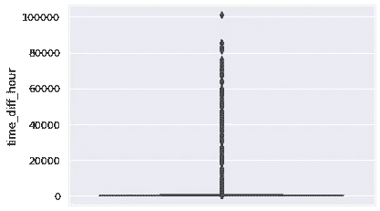
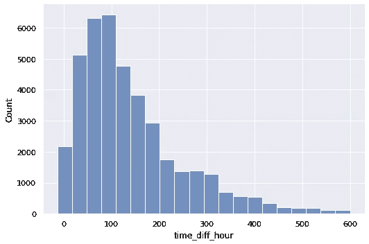
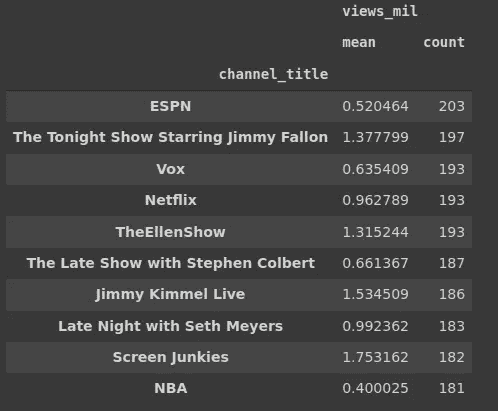
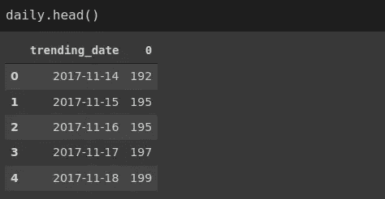
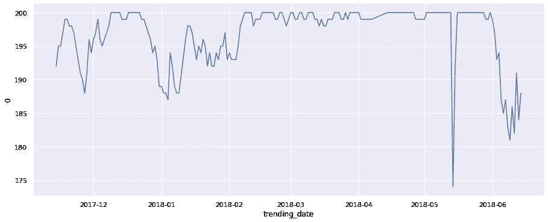

# 熊猫和海牛的 YouTube 趋势视频分析

> 原文：<https://towardsdatascience.com/youtube-trending-video-analysis-with-pandas-and-seaborn-c9903a0f811d?source=collection_archive---------38----------------------->

## 第 2 部分:数据分析和可视化


诺德伍德主题公司在 [Unsplash](https://unsplash.com/s/photos/youtube?utm_source=unsplash&utm_medium=referral&utm_content=creditCopyText) 上拍摄的照片

在本系列的[第一部分](/youtube-trending-video-analysis-with-pandas-and-seaborn-8eec48a5e2d9)中，我们对包含美国趋势视频统计数据的[数据集](https://www.kaggle.com/datasnaek/youtube-new?select=USvideos.csv)进行了数据清理和操作。在本文中，我们将对数据进行分析和可视化，以推断出有价值的见解。我们将使用熊猫和 Seaborn 图书馆进行数据分析和可视化。

在清理和一些预处理之后，数据集包含如下 13 列:

```
us.columnsIndex(['trending_date', 'title', 'channel_title', 'category_id',
'publish_time', 'tags', 'views', 'likes','dislikes','comment_count',
'comments_disabled', 'ratings_disabled', 'video_error_or_removed',
'time_diff'],
dtype='object')
```

time_diff 列表示视频发布和成为趋势之间的差异。我们先来算一下这一列的平均值。

```
us.time_diff.mean()
Timedelta('16 days 05:21:53.236220664')
```

平均时间 16 天 5 小时。这个值不能告诉我们太多关于时差的信息。例如，time diff 列可能包含大部分低值和一些非常高的值，这些值会提高平均值。

为了全面了解时差的分布情况，我们还需要计算其他描述性统计数据，如中位数和众数。另一个解决方案是可视化该列的分布，这样更容易理解。

time_diff 列的数据类型是 timedelta。我们需要把它转换成一个数字变量来绘制它的分布。一种方法是将 time_diff 列除以另一个 timedelta 间隔。例如，我们可以将它转换为小时，如下所示。

```
us['time_diff_hour'] = us['time_diff'] / pd.Timedelta('1 hour')us['time_diff_hour'].mean()
389.36us['time_diff_hour'].mean() / 24
16.22
```

当我们取平均值并除以 24 时，我们得到的值与 time_diff 列的平均值相同。

给我们提供分布概况的一种可视化形式是箱线图。

```
sns.boxplot(data=us, y='time_diff_hour')
```



时间差异小时的箱线图(图片由作者提供)

有些极值会扭曲分布图。该列的平均值是 389，但是我们观察到异常值高达 100000。让我们看看我们是否有能力消除异常值。

```
len(us)
40949len(us[us.time_diff_hour > 600])
588
```

时差超过 600 小时的行数为 588，与数据集中的总行数相比非常小。因此，我们可以丢弃这些异常值。

```
us = us[us.time_diff_hour <= 600]
```

我们已经剔除了大量的异常值。检查分布的另一种可视化方法是直方图，它将连续变量的值范围划分为离散的区间，并计算每个区间中的观察值数量。

Seaborn 的 displot 函数可用于创建如下直方图。

```
sns.displot(data=us, x='time_diff_hour', kind='hist',
aspect=1.5, bins=20)
```



(图片由作者提供)

大多数值都在 100 左右，所以它可能会在大约 4 天内成为趋势。

我想知道哪些频道有最热门的视频。使用熊猫的 value_counts 函数，我们可以很容易地看到前 10 名。

```
us.channel_title.value_counts()[:10]ESPN                                      203
The Tonight Show Starring Jimmy Fallon    197
TheEllenShow                              193
Vox                                       193
Netflix                                   193
The Late Show with Stephen Colbert        187
Jimmy Kimmel Live                         186
Late Night with Seth Meyers               183
Screen Junkies                            182
NBA                                       181
```

我们还可以比较这些频道发布的趋势视频的平均浏览量。检查平均观看次数的顺序是否与趋势视频计数的顺序相同是很有趣的。

具有多种聚合功能的熊猫按功能分组会给我们所需要的。

```
us['views_mil'] = us['views'] / 1000000us[['channel_title','views_mil']].groupby('channel_title')\
.agg(['mean','count'])\
.sort_values(by=('views_mil','count'), ascending=False)[:10]
```



(图片由作者提供)

屏幕瘾君子频道的平均收视率最高，约为每部视频 175 万。ESPN 的平均排名倒数第二，尽管它的热门视频数量最多。

我们还可以发现热门视频的数量如何随时间变化。第一步是按日期对观察结果(即行)进行分组。然后，我们将按日期对它们进行排序，以获得合适的时间序列。

```
daily = us[['trending_date']].value_counts().reset_index()\
.sort_values(by='trending_date').reset_index(drop=True)
```



(图片由作者提供)

每日数据帧包含日期和每个日期成为趋势的视频数量。我们现在可以根据每日数据框架生成一个线图。

```
sns.relplot(data=daily, x='trending_date', y=0,
kind='line', aspect=2.5)
```

我们使用 Seaborn 的 relplot 函数，并通过使用 kind 参数来选择线图。纵横比参数调整可视化的宽度和高度的比率。



(图片由作者提供)

我们观察到一个有趣的趋势。大部分数值在 190 到 200 之间，有几天例外。

我们还可以找到观看次数最高的热门视频。有多种方法可以完成这项任务。我们要做的是按照视图降序排列数据帧，并显示第一行的标题和视图。

```
us.sort_values(by='views', ascending=False)[['title','views']].iloc[0,:]title    childish gambino  this is america official video
views                                           217750076
```

就观看次数而言，最热门的视频已被观看超过 2 亿次。

## 结论

我们公布了一些关于 2017 年和 2018 年 Youtube 上发布的趋势视频的统计结果。自 2018 年以来，Youtube 的受欢迎程度进一步提高，因此现在的统计数据可能会有很大不同。

然而，这两篇文章的主要重点是用 Pandas 和 Seaborn 练习数据分析和可视化。当然，我们可以在这个数据集上做更多的事情。你可以自由探索，使用熊猫和海牛或者任何你喜欢的图书馆。

感谢您的阅读。如果您有任何反馈，请告诉我。