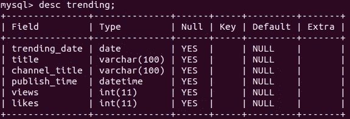
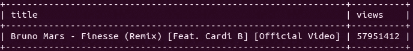
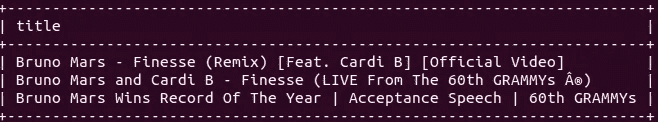
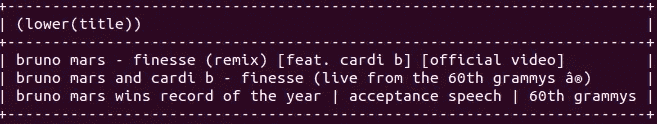
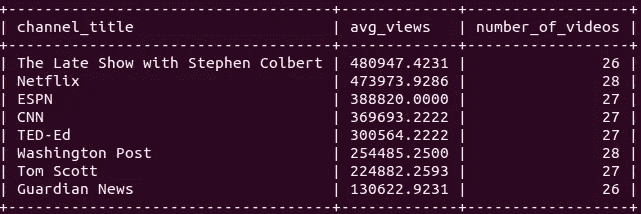

# 使用 SQL 进行 YouTube 趋势视频分析

> 原文：<https://towardsdatascience.com/youtube-trending-video-analysis-with-sql-b022993d0e94?source=collection_archive---------30----------------------->

## 如何将 SQL 用作数据分析工具


艾萨克·史密斯在 [Unsplash](https://unsplash.com/s/photos/analysis?utm_source=unsplash&utm_medium=referral&utm_content=creditCopyText) 上拍摄的照片

SQL 是一种用于管理关系数据库中的数据的语言，关系数据库以带有标签的行和列的表格形式存储数据。我们使用 SQL 的 select 语句从关系数据库中查询数据。就数据转换和过滤操作而言，select 语句具有高度的通用性和灵活性。

从这个意义上说，SQL 可以被认为是一种数据分析工具。使用 SQL 进行数据转换和过滤的好处是，我们只检索我们需要的数据。这比检索所有数据然后应用这些操作更加实用和高效。

在本文中，我们将使用 SQL 语句和函数来分析 YouTube 趋势视频统计数据。[数据集](https://www.kaggle.com/datasnaek/youtube-new?select=USvideos.csv)可在 Kaggle 上获得。我创建了一个 SQL 表，其中包含这个数据集的一小部分。

注意:我使用 MySQL 作为数据库管理系统。尽管所有数据库管理系统的 SQL 语法基本相同，但可能会有一些细微的差别。

该表称为“趋势”，其结构如下。



趋势表(作者图片)

我们有视频发布和成为热门的日期。我们还有视频的标题和频道。视图和喜欢是数据集包含的另外两个特征。

关于所有这些特征(即列)，我们可以进行一系列不同的操作。例如，一个简单的方法可以是根据趋势视频的数量找到前 5 个频道。

```
mysql> select channel_title, count(*) as number_of_videos
    -> from trending
    -> group by channel_title
    -> order by number_of_videos desc
    -> limit 5;+-----------------+------------------+
| channel_title   | number_of_videos |
+-----------------+------------------+
| Washington Post |               28 |
| Netflix         |               28 |
| ESPN            |               27 |
| TED-Ed          |               27 |
| CNN             |               27 |
+-----------------+------------------+
```

我们选择频道标题列并计算行数。“as”关键字用于为聚合列指定一个新名称。group by 子句用于根据频道对视频(即行)进行分组。最后，我们使用 order by 子句对结果进行降序排序，并显示前 5 个结果。

视频的数量似乎太低了，因为我只包括了 2018 年 1 月发布的视频。

我们可能想看看点击率最高的视频的标题。

```
mysql> select title, views 
    -> from trending
    -> where views = (select max(views) from trending);
```



(图片由作者提供)

上面的查询包含一个嵌套的 select 语句。它与 where 子句一起用于查找所需的条件，即视图列中的最大值。

这个表格中被观看次数最多的视频已经被观看了将近 6000 万次。

SQL 为过滤数据提供了许多不同的选项。在前面的例子中，我们发现观看次数最多的视频属于布鲁诺·马斯。我们可以过滤标题，只查看属于布鲁诺·马斯的视频。

```
mysql> select distinct(title)
    -> from trending
    -> where title like "%Bruno Mars%";
```



(图片由作者提供)

如果使用 like 关键字，我们不必为过滤提供确切的值。“%”代表任何字符，因此“%布鲁诺·马斯%”代表任何包含“布鲁诺·马斯”短语的值。distinct 关键字用于删除重复项。

如果我们不确定字符是小写还是大写，我们可以在过滤前将所有字符转换成小写或大写。

```
mysql> select distinct(lower(title))
    -> from trending
    -> where title like "%bruno mars%";
```



(图片由作者提供)

该数据集包含视频的发布日期以及它们成为趋势的时间。我们可以计算出一个视频成为热门的平均时间。

在计算差异之前，我们需要从发布时间列中提取日期部分，因为它包含日期和时间。

```
mysql> select trending_date, publish_time
    -> from trending
    -> limit 3;
+---------------+---------------------+
| trending_date | publish_time        |
+---------------+---------------------+
| 2018-01-02    | 2018-01-01 15:30:03 |
| 2018-01-02    | 2018-01-01 01:05:59 |
| 2018-01-02    | 2018-01-01 14:21:14 |
+---------------+---------------------+
```

date 函数提取日期部分，datediff 函数计算差值。因此，我们可以计算平均差异如下:

```
mysql> select avg(datediff(trending_date, date(publish_time)))
    -> as avg_diff
    -> from trending;+----------+
| avg_diff |
+----------+
|   3.9221 |
+----------+
```

datediff 函数采用由逗号分隔的两个日期，并计算其差值。一个视频成为热门平均需要 3.92 天。

我们还可以计算在特定时间段发布的视频的平均差异。我们只需要添加一个 where 子句进行过滤。

```
mysql> select avg(datediff(trending_date, date(publish_time))) as avg_diff
    -> from trending
    -> where hour(publish_time) > 20;+----------+
| avg_diff |
+----------+
|   4.4825 |
+----------+
```

我们从发布时间中提取小时值，并在 where 子句中使用它进行过滤。

SQL 提供了可以在 select 语句中实现的数据聚合函数。例如，我们可以计算网飞发布的视频的平均点赞率。

```
mysql> select avg(likes / views) 
    -> from trending
    -> where channel_title = "Netflix";+--------------------+
| avg(likes / views) |
+--------------------+
|         0.01816295 |
+--------------------+
```

平均值接近 0.02，因此网飞视频的点击率约为 2%。

让我们编写一个稍微复杂一点的查询，计算发布超过 25 个视频的频道的平均视频浏览量。我们还将根据平均值对结果进行降序排序。

```
mysql> select channel_title, avg(views) as avg_views,
    -> count(title) as number_of_videos
    -> from trending
    -> group by channel_title
    -> having number_of_videos > 25
    -> order by avg_views desc;
```



(图片由作者提供)

检索到的数据包含 3 列。一个是频道标题列，另外两个是聚合列。我们根据视频数量过滤频道。

您可能已经注意到，我们使用了“having”子句而不是“where”子句进行过滤。“having”子句用于根据聚合列进行筛选。

## 结论

我们做了一些例子来分析 YouTube 趋势视频统计。这些例子清楚地表明，SQL 也可以用作数据分析工具。

我认为 SQL 是数据科学家或分析师的必备技能。我们至少应该知道如何查询关系数据库。在检索数据时执行数据转换和操作操作的复杂查询有可能节省内存。它们也减轻了以后需要完成的任务。

感谢您的阅读。如果您有任何反馈，请告诉我。