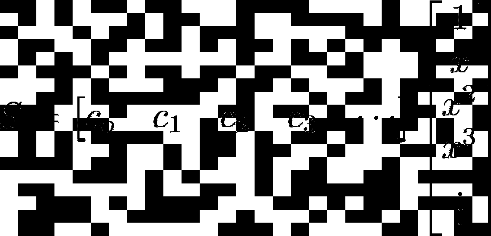

# 芝诺的不朽典范

> 原文：<https://towardsdatascience.com/zenos-illustrative-example-bb371b99f25a?source=collection_archive---------19----------------------->

## 2500 年后解决了一个争议，现在作为一个参考框架的起源，几何级数是改善数学教育的关键吗？


以利亚的芝诺展示了通往真理和谬误的大门。马德里[埃斯科里亚尔](https://en.wikipedia.org/wiki/El_Escorial)图书馆的壁画。(照片由佩莱格里诺·蒂巴尔迪拍摄——【https://commons.wikimedia.org/w/index.php?curid=8665907】http://web . madritel . es/personales 2/jcdc/presocraticos/pinac 06 _ zenon . htm、公共领域)

# 介绍

2500 年前，希腊数学家从一个地方走到另一个地方有一个问题。在身体上，他们能够像我们今天一样行走，甚至可能更好。然而，从逻辑上讲，他们认为每一个无限长的大于零的数字列表的总和都是无穷大。因此，当 Elea (约公元前 500 年)的[芝诺指出，为了从一个地方走到另一个地方，你首先必须走一半的距离，然后你必须走剩余距离的一半，然后你必须走剩余距离的一半，你继续无限次地将剩余距离减半，因为无论剩余距离有多小……你仍然必须走它的前半部分。在他的例子中，Elea 的 Zeno 将一小段步行距离转换成一个无限长的列表，剩余距离减半，所有距离都大于零。这就是问题所在:一个距离怎么能在直接测量时是短的，而在其无穷的一半余数列表上求和时又是无限的呢？这一悖论揭示了当时希腊数学家普遍持有的假设有问题，即每一个无限长的大于零的数字列表的总和为无穷大。](https://en.wikipedia.org/wiki/Zeno_of_Elea)

以利亚悖论的芝诺中使用的级数 1/2 + 1/4 + 1/8 + 1/16 + 1/32 + …，现在被称为[几何级数](https://en.wikipedia.org/wiki/Geometric_series)，形式为*a*+*ar*+*ar*+*ar*+*ar*⁴+…，其中 *a* 被称为[系数](https://en.wikipedia.org/wiki/Coefficient)将级数设置为等于总和 *S* 并使用几何级数
*s*=*a*+*ar*+*ar*+*ar*+*ar*⁴+…的规格化形式
*S* / *a*= 1+*r*+*r*+*r*+*r*⁴+…或其规格化向量形式
*s*/*a*=【1 1 1 1 1 1 1 1……】*r*r*r**r*⁴…]ᵀ或其规格化部分数列 *a*= 1+*r*+*r*+*r*+…+*r*ⁿ，其中 n 为部分和 *S* ₙ.包含的最后一项的幂(或次数)

在这篇文章中，我提出，2500 年前解决了希腊数学家争论的那个几何级数现在是改进今天数学教育的关键。根据杰夫·霍金斯在他的书《一千个大脑**—**—[一种新的智力理论](https://www.amazon.com/Thousand-Brains-New-Theory-Intelligence/dp/B08VWV2WDK/ref=sr_1_1?crid=2B1UXT4G47LB7&keywords=a+thousand+brains&qid=1638991469)》第 88 页中的说法，“成为专家主要是为了找到一个好的参考框架来安排事实和观察。”在这篇文章中，几何级数是一个拟议的参考框架的来源，用于安排关于数学知识主体的事实和观察。

根据维基百科的说法，短语“知识体”[的意思是“组成一个](https://en.wikipedia.org/wiki/Body_of_knowledge)[专业](https://en.wikipedia.org/wiki/Professional)领域的一整套概念、术语和活动”考虑到数学知识体系涵盖了如此多的概念，很难想象出一个“好的参考框架来安排事实和观察结果”关于数学的“一整套概念、术语和活动”。在这篇文章中，我建议用一个多层建筑的平面图作为类比。具体来说，我为正式称为[多项式向量空间](https://en.wikipedia.org/wiki/Examples_of_vector_spaces#Polynomial_vector_spaces)(即所有可能的[多项式](https://en.wikipedia.org/wiki/Polynomial)的集合)提出了一个平面图，然后我试图证明这个多项式向量空间应该是数学所有其他层面的底层入口点。


所有多项式函数空间的一个建议参考系。本文描述了标绘项目的列表及其在参考框架中的位置。

虽然这篇文章关注的是多项式向量空间作为数学知识主体的底层，但是在这个建筑物的类比中，当然还有许多其他的层，每一层都有自己的度量单位来测量距离。例如，也许一个好的二楼可以容纳所有与概率和统计相关的概念。或许[范畴理论](https://en.wikipedia.org/wiki/Category_theory)可以用来揭示许多不同楼层之间的相似之处。然而，本文的重点只是多项式向量空间底层，如上图所示，其中对数对数图的原点是几何级数，到其他多项式向量空间界标(例如，复傅立叶级数)的距离是作为远离几何级数的自由度来测量的。

假设是，提供一个好的数学知识体系的参考框架将显著增加每个人对数学的理解。当然，一个假设需要被检验以使它不仅仅是一个假设。因此，本文的结论提出了检验假设的方法。在得出这个结论之前，这篇文章在提出的参考框架中定位了大约十几个里程碑，偶尔还会提到在[神经科学](https://en.wikipedia.org/wiki/Neuroscience)和[心理学](https://en.wikipedia.org/wiki/Psychology)领域的发现。为了清楚起见，那些提到神经科学和心理学的地方用斜体表示，并在左边空白处用竖线突出显示，如下所示。

> 杰夫·霍金斯在他的书《一千个大脑**—**—[一种新的智力理论](https://www.amazon.com/Thousand-Brains-New-Theory-Intelligence/dp/B08VWV2WDK/ref=sr_1_1?crid=2B1UXT4G47LB7&keywords=a+thousand+brains&qid=1638991469)》的第 50 页写道，“……我们需要把新大脑皮层看作主要处理参考框架。大部分电路用于创建参考框架和跟踪位置。感官输入当然是必不可少的。正如我将在接下来的章节中解释的那样，大脑通过将感官输入与参照系中的位置相关联来构建世界模型。
> 
> 为什么参考系如此重要？大脑从拥有它们中获得了什么？首先，参照系可以让大脑学习某个东西的结构。咖啡杯之所以是一个东西，是因为它是由一组在空间上相对于彼此排列的特征和表面组成的。同样，脸是相对位置排列的鼻子、眼睛和嘴巴。你需要一个参照系来确定物体的相对位置和结构。
> 
> 第二，通过使用参考系定义一个对象，大脑可以一次性操纵整个对象。例如，一辆汽车有许多相互关联的特征。一旦我们学会了一辆车，我们可以想象它从不同的角度看起来是什么样子，或者在一个维度上被拉伸。为了完成这些壮举，大脑只需旋转或拉伸参考框架，汽车的所有功能都随之旋转和拉伸。
> 
> 第三，需要一个参照系来计划和创造动作。假设我的手指碰到了手机正面，我想按顶部的电源按钮。如果我的大脑知道我手指的当前位置和电源按钮的位置，那么它可以计算出将我的手指从当前位置移动到所需的新位置所需的移动。进行这种计算需要相对于电话的参考系。"

除了在数学知识主体的底层表示参考系原点之外，几何级数还可以作为数学中许多不同抽象层的一致介绍，这些抽象层就是本文的结构:

1.  数量，
2.  数字，
3.  代数，
4.  几何学，
5.  功能，
6.  向量空间，以及
7.  矩阵指数。

为了简洁，这篇文章没有说明超过七层的抽象，但是它可以。同样为了简洁，本文中使用的软件是附录中的可选读物。然而，在拉丁谚语[***Docendo discimus***](https://en.wikipedia.org/wiki/Docendo_discimus)中有很多真理，意思是“通过教学，我们学习”，软件是“教”计算机完成任务的一种形式，经常暴露教师的许多最初被忽视的误解。因此，快速浏览附录可能是一个很好的练习。扩展附录中的代码来“教”你自己的计算机一些新的东西会更好。

需要明确的是，我不是数学家、心理学家、教师或神经科学家。然而，作为一名软件工程师，我经常想知道为什么这么多人(包括我自己)觉得数学比其他学科更难学。如果学习数学的相对困难是由于它缺乏一个好的参考框架和/或它的许多抽象层，也许这篇文章提出的平面图类比及其在每个抽象层的介绍中使用几何级数作为一致和熟悉的立足点的方法可能是一个有助于学习数学的一般结构，特别是对于正在形成他们关于数学的心理模型的高中生。

理想情况下，这篇文章将吸引一些真正的数学家、心理学家、教师和神经科学家来测试这篇文章的假设(即，当向学生介绍数学概念时，一贯使用几何级数作为参照系原点将显著提高他们对这些主题的理解)是正确的...或者不是。然而，有历史证据表明持续的重复是有效的。

> 维基百科用这些例子描述了[虚幻的真理效应](https://en.wikipedia.org/wiki/Illusory_truth_effect#Examples):“虽然真理效应只是在最近几年才得到科学证明，但它是一种人们已经熟悉了几千年的现象。一项研究指出，罗马政治家[卡托](https://en.wikipedia.org/wiki/Cato_the_Elder)在每次演讲结束时都呼吁摧毁[迦太基](https://en.wikipedia.org/wiki/Carthage)，他知道重复会产生一致意见，而且[拿破仑](https://en.wikipedia.org/wiki/Napoleon)据说“说在修辞学中只有一个非常重要的数字，即重复”，由此重复的肯定在头脑中“以某种方式固定下来，最终被接受为被证明的真理”。其他利用了真相效应的还有[昆体良](https://en.wikipedia.org/wiki/Quintilian)、[罗纳德里根](https://en.wikipedia.org/wiki/Ronald_Reagan)、[比尔克林顿](https://en.wikipedia.org/wiki/Bill_Clinton)、[小布什](https://en.wikipedia.org/wiki/George_W._Bush)、[唐纳德川普](https://en.wikipedia.org/wiki/Donald_Trump)、[莎翁的](https://en.wikipedia.org/wiki/Shakespeare) [*朱利叶斯凯撒*](https://en.wikipedia.org/wiki/Julius_Caesar_(play)) 中的[阿非利加努斯·戈狄亚努斯二世](https://en.wikipedia.org/wiki/Marcus_Antonius)。重复关于产品的毫无根据的说法的广告可能会促进销售，因为一些观众可能会认为他们是从客观的来源听到这些说法的。新闻媒体也使用真相效应，这也是政治宣传的一个主要内容。”
> 
> 鉴于我们都倾向于相信熟悉的事物(不幸的是，即使这种熟悉是由于重复错误的陈述)，为什么不采用同样的偏见来鼓励数学学生的信心呢？将当前完全不同的数学概念与相同的几何级数联系起来，会增加对不熟悉的数学主题的熟悉程度。

# 抽象层 1:数量

在几何学中，当一个三角形的三个角与另一个三角形的三个角相同时，两个三角形[相似](https://en.wikipedia.org/wiki/Similarity_(geometry)#Similar_triangles)。这是通过用某个因子 *w* 缩放一个三角形的三个边长来计算另一个三角形的边长。因为三角形的面积是 *A* = *bh* /2，其中 *A* 、 *b* 和 *h* 分别是三角形的面积、底边和高，所以边长由 *w* 缩放的三角形的面积是*A*=(*WB*)(*wh*)/2 = .


图一。归一化几何级数(公比 r=1/2)的项，显示为重叠相似三角形的面积。最大的三角形(即系列中的第一项)的底边被设置为 2，使得代表第一项的三角形的面积等于其高度。

在本文中，几何级数的每一项都表示为相似三角形的面积。因此，在本文中，一系列相似的三角形都具有相同的三个角，并且具有按公比 *r* 递增的面积。为了用公比因子 *r* 来说明相似三角形面积渐进变化，相似三角形的边长必须以因子 **√** *r、*渐进变化，因为*rA*=*rbh*/2 =(*WB*)(*wh*)/2 =*w**BH*/2

虽然将数量表示为面积(例如，饼图的切片)并不罕见，但将数量表示为部分重叠(或遮挡)的面积却不常见。例如，在图 1 中，红色大三角形的面积为 1(归一化几何级数中第一项的值)，因为三角形的底边是 *b* =2，三角形的高度是 *h* =1，三角形的面积是 *A* = *bh* /2 = 2/2 =1，但只有该区域最右边的 1**-***r*可见。同样，下一个最大的(绿色)三角形的面积是 *r* (几何级数中第二项的值)因为三角形底是 2 **√** *r* ，三角形高是 **√** *r* ，三角形面积是*A*=*BH*/2 = 2**√***r*【t3t 继续，下一个最大的(蓝色)三角形的面积是 *r* (几何级数中第三项的值)因为三角形底是 2 *r* ，三角形高是 *r* ，三角形面积是*A*=*BH*/2 = 2*RR*/2 =*r*，但只有最右边的 *r 【T57 从最大到最小，每一个连续的几何相似三角形的面积以因子 *r* 减少，因为三角形的底和高都以因子**√***r*减少。同样，面积 *r* ⁿ与面积 *r* ⁿ⁺的重叠只留下最右边的*r*ⁿ*

***这篇文章使用重叠的相似三角形面积来表示几何级数项的值，乍一看似乎有些笨拙和不必要。然而，相似三角形的重叠是揭示几何级数的几个几何观点的基础。事实上，作为一个预览，这篇文章的其余部分基本上是关于操作这些重叠的相似三角形:***

*   ***改变那些三角形区域的形状(即去除重叠)，***
*   ***改变这些区域的方向(即，围绕基座旋转)，***
*   ***改变这些区域的高度(即改变系数)，以及***
*   ***为这些领域的总和提供了新的视角。***

> ***根据 Scott Johnson 在加州大学洛杉矶分校婴儿实验室的视觉感知发展<https://www.babylab.ucla.edu/wp-content/uploads/sites/8/2016/09/Johnson2010b.pdf>**中的高级综述，“……新生儿无法感知闭塞，这种闭塞感知在出生后的最初几个月出现。有趣的是，婴儿的所有这些效应都依赖于遮光器后面移动的被遮挡刺激，而不像成年人即使有静态图像也能感知遮挡。”Johnson 博士继续在一篇[发展心理学文章](https://www.ncbi.nlm.nih.gov/pmc/articles/PMC2562345/)中写道“……直到 6-8 个月之前，还没有观察到静态遮挡显示中的知觉完成。”*****
> 
> *****尽管这篇文章将几何级数的项表示为部分遮挡区域是不寻常的，但识别现实世界中部分遮挡物体的问题非常重要，足以保证这种能力的早期开发(例如，6-8 个月)。*****

# *****抽象层 2:数字*****

*****系数为 *a* =1/2，公比为 *r* =1/2 的 Elea 几何级数的齐诺是数字计算机中[分数](https://en.wikipedia.org/wiki/Binary_number#Fractions)的二进制编码[逼近的基础。具体来说，以其归一化向量形式书写的几何级数是*s*/*a*=【1 1 1 1 1 1……】【1】r rt20】rt22】r⁴…]ᵀ.保持基函数[1*r r*r*r*r*r*⁴…]ᵀ的列向量不变，但推广行向量[t30】[1 1 1 1 1……]使得每个条目可以是 0 或 1，这允许对任何分数进行近似编码。例如，值 *v* = 0.34375 被编码为
*v*/*a*=【0 1 0 1 1 0……】【1*r**r**r*⁴*r*⁵…]ᵀ其中系数 *a* = 1/2，公比*r*= 1/1 通常，行向量被写成更紧凑的二进制形式 *v* = 0.010110，即十进制的 0.34375。](https://en.wikipedia.org/wiki/Binary_number)*****

*****同样，系数 *a* =1，公比 *r* =2 的部分几何级数是数字计算机中二进制编码整数的基础。还是那句话，用其归一化向量形式写成的几何级数是*s*/*a*=
【1 1 1 1 1 1……】【1】r r*r**r*⁴…]ᵀ.保持基函数的列向量
【1*r r**r**r*⁴…]ᵀ不变，但是将行向量[1 1 1 1 1 1……]一般化，使得每个条目可以是 0 或 1，从而允许任何整数的编码。例如:值 *v* = 151 编码为
v/*a*=【1 1 1 0 1 0 1 0 0 1 0……】【1*r*t31】rt33】r⁴*r*⁵*r*⁶*r*⁷*r*⁸…]ᵀ凡通常情况下，行向量以相反的顺序书写(因此最高有效位在前)，采用更紧凑的二进制形式 *v* = …010010111 = 10010111，即十进制的 151。*****

**********

*****图 2a。根据 IEEE 754 标准对 32 位浮点数进行编码的位字段。*****

*****如下图所示，32 位浮点数字的标准二进制编码是一个二进制编码的整数和一个二进制编码的分数的组合，从最高有效位开始*****

*   *****符号位，后面是*****
*   *****8 位整数指数字段，假设偏移量为 127(因此值 127 表示指数值为 0)，基数为 2，表示指数值指定分数字段的位移，其后是*****
*   *****一个 23 位的分数字段，假定但未编码为 1，作为分数的最高有效非零位，如果被编码，它将位于第 23 位。*****

*****基于具有二进制编码 0.010110 的 0.34375 的先前示例，浮点编码(根据 IEEE 754 标准)0.34375 是*****

*   *****符号位为 0，因为数字不是负数，*****
*   *****8 位整数指数字段，其必须指定对 2 位左移进行计数以获得从 0.010110 到 1.0110 的原始二进制编码的移位，并且恢复原始二进制编码的计数器移位是由指数值 125 指定的 2 位右移(因为 125**-**127 =-2 是 2 位右移)，其在二进制中是 0111 1101，*****
*   *****一个 23 位的分数字段:. 0110 0000 0000 0000 0000 000 000。*****

*****虽然像这样手工编码浮点数是可能的，但让计算机来做更容易，也不容易出错。以下 Julia 代码确认了数字 0.34375 的手算浮点编码:*****

```
*****julia> bitstring(Float32(0.34375))
"00111110101100000000000000000000"*****
```

*****[具有持续不断的重复模式的十进制分数](https://en.wikipedia.org/wiki/Decimal#Decimal_fractions)(例如，0.3333…或 0.09090909…或 0.12341234…)只能在编码为浮点数时进行近似，但它们总是可以精确地定义为两个整数的比率，并且这些整数可以使用几何级数进行计算。诀窍是使用几何级数的封闭形式即 S =*a*/(1***r*)当| *r* | < 1 时。几何级数的封闭形式将在本文对抽象层 3(代数)的讨论中导出，并在抽象层 4(几何)的讨论中再次导出。然而，即使在这些推导之前，你也可以确认 s/*a*= 1/(1**-t14】r)= 1+*r*+*r*+*r*+*r*⁴+…当| *r* | < 1 除以 1(1**-t28)***********

***举个用几何级数确定分子分母的例子，有理数 0.3333…可以写成几何级数*S*= 0.3+0.3(1/10)+0.3(1/10)+0.3(1/10)+…其中系数 *a* = 0.3，公比 *r* = 1/10。因此，| *r* | < 1 和*S*=*a*/(1**-**-*r*)=(3/10)/(1**-**(1/10))=(3/10)/(9/10)= 3/9 = 1/3 = 0.333…同样，0.09090909…可以写成几何级数 S = 0.09+0.09(1/100)+0.09(1/100)+0.09(1/100)+…其中系数 *a* = 0.09，公比 *r* = 1/100，从而得到闭合形式 S =*a*/(1**-*****

***图 2b。图 1 所示的相同几何级数(系数 a=1，公比=1/2)，但公比 r 乘以 exp(i *θ)* ，导致几何级数(现在是一个复杂的几何级数)的各项以基频的整数倍旋转。(该动画的帧由附录 c 中列出的 Julia 代码生成。)***

***除了能够计算出[有理数](https://en.wikipedia.org/wiki/Rational_number)的精确分子和分母，并且是大多数计算机使用的二进制编码的核心，几何级数还有另一个技巧:它的项可以以[谐波](https://en.wikipedia.org/wiki/Harmonic)频率旋转。如相邻动画所示，通过设置公比 ***r*** 为复数***r***= |***r***|eⁱᶿ，可以将几何级数扩展为[复数](https://en.wikipedia.org/wiki/Complex_number)的集合，其中| ***r*** |为该复数的幅值，θ为其在[复平面](https://en.wikipedia.org/wiki/Complex_plane)中的方向角。使公比 *r* 变得复杂，通过添加一个在图 1 中指向屏幕外、在图 2b 中指向上的虚拟数字[的 z 轴，将图 1 从二维扩展到三维，从而 yz 平面是一个复平面。图 1 所示的量围绕图 2b 中的 x 轴旋转。使这种旋转特别有用的是，代表复杂几何级数项的相似三角形区域以不同的速度旋转，具体来说是以某个](https://en.wikipedia.org/wiki/Imaginary_number)[基频](https://en.wikipedia.org/wiki/Fundamental_frequency)的整数倍旋转。每一个复几何级数的所有旋转项之和总是描出一个正圆，只要| *r* | < 1。***

> ***人们思考各种各样的话题，从深奥的话题，如编码数字，到对思维机制本身的普遍好奇。在人类大脑中，[新皮层](https://en.wikipedia.org/wiki/Neocortex)是[大脑皮层](https://en.wikipedia.org/wiki/Cerebral_cortex)最外层和最大的部分，而[大脑](https://en.wikipedia.org/wiki/Cerebrum)是大脑最外层和最大的部分。大脑的进化在旧的部分上增加了新的部分，它们都相互影响。按体积计算，新大脑皮层约占人脑的 70%。如果拉直，新大脑皮层只有大约 2.5 毫米(0.10 英寸)厚，但它有许多折叠和折痕，可以将更多的自己装入头骨。***

# ***抽象层 3:代数***

***除了前面提到的几何级数的规范化形式和部分级数形式之外，封闭形式非常实用，因为它们大大减少了计算级数所需的运算次数。众所周知的几何级数封闭形式的推导减去了许多内部项，如下所示:***

***sₙ/*a*= 1+*r*+*r*+*r*+…+*r*ⁿ⁻+*r*ⁿ，
*r*sₙ/*a*=*r*+*r*+*r*+…+*r *sₙ/*a****r*sₙ/*a*= 1***r*ⁿ⁺、
(1***r*)sₙ/*a*= 1**r***************ⁿ⁺、
sₙ/*a***********

******当 *r* < 0 时，部分级数的内项用加法而不是减法抵消。代入*p*=**-**-r-0(其中 *p* 代表正值)有助于跟踪符号。******

****sₙ/*a*= 1***p*+*p***-***p*+…**-**pⁿ⁻+*p*ⁿ(n 为偶数时)、
*p*sₙ/*a*=*p***—*p*+*p***—**…+*p*ⁿ⁻**—***p*ⁿ*+p*ⁿ⁺(n 为偶数时)
Sₙ/ *a*
sₙ/*a*=(1+*p*ⁿ⁺)/(1**+***p*)(当 n 为偶数时)
sₙ/*a*=(1**-***r*ⁿ⁺)/(1**-***r*)(图********

**同样的，**

**sₙ/*a*= 1***p*+*p***-*p*+**+***p*ⁿ⁻**-***p*ⁿ(n 为奇数时)、
*p*sₙ/*a*=*p***—**—t101】p+*p***—**…**—**—t109】pⁿ⁻*+p*ⁿ**—**—t115】p【t111
sₙ/*a*=(1**-***p*ⁿ⁺)/(1**+***p*)(n 为奇数时)，
sₙ/*a*=(1**-***r*ⁿ⁺)/(1******

****方便地说，sₙ/*a*=(1**-**-*r*ⁿ⁺)/(1**-**-*r*)是相同的结果****

*   *****r*0 为偶数或奇数 n、****
*   *****r*0 为偶数 n，且****
*   *****r*0 为奇数 n。****

****要将部分和 Sₙ/ *a* 扩展到全和 S/ *a* ，请注意，当 n 趋近于无穷大时， *r* ⁿ⁺趋近于 0 当且仅当| *r* | < 1。那么，几何级数的封闭形式是****

****s/*a*= 1/(1**-**-r)*，*但仅限于范围| *r* | < 1 内。****

****当公比 *r* 为复数时，该封闭形式(及其证明)仍然适用。****

> ****虽然新皮层约占大脑体积的 70%,但另外 30%是至关重要的，经常支配你的新皮层。例如，你的大脑皮层可能会说服你屏住呼吸。然而，对大多数人来说，大约一分钟后，脑干的自主呼吸功能就会显示出来，并让你的新大脑皮层停止让你屏住呼吸的想法。****
> 
> ****[STEM](https://en.wikipedia.org/wiki/Science%2C_technology%2C_engineering%2C_and_mathematics) 老师通常专注于训练学生的新皮层，而忽略了大脑中古老但至关重要的 30%部分，它并不是新皮层。相比之下，广告商往往完全关注大脑古老的 30%，操纵我们的偏见和情绪，以及我们对不寻常或意想不到的事物的迷恋。因此，大多数广告商比大多数 STEM 教师更有吸引力。****

# ****抽象层 4:几何****

********

****图 4a。系数 a = 4/9，公比 r = 1/9 的几何级数的几何透视。****

****从稍微不同的角度观察一个数学问题偶尔会神奇地简化解决方案。比如，系数 *a* = 4/9，公比 *r* = 1/9 的几何级数 4/9 + 4/9 + 4/9 + 4/9⁴ + …，从级数的展开形式看，有一个和并不明显。但是，使用代数推导的几何级数闭合形式公式当| *r* | < 1 时，4/9 + 4/9 + 4/9 + 4/9⁴ + …之和很容易计算为
s =*a*/(1**-***r*)=(4/9)/(1–1/9)=(4/9)/(8/9)= 1/2。下图将该几何级数的每一项的值表示为一个紫色正方形的面积，展示了一个使 4/9 + 4/9 + 4/9 + 4/9⁴ + …之和更容易计算的透视图。具体地，通过观察单位正方形由无限个 L 形区域组成，每个区域具有等量的紫色和黄色区域(即，每个 L 形区域中有 4 个紫色正方形和 4 个黄色正方形)，无限个紫色区域的总和必须是单位正方形面积的一半，即 1/2(1) = 1/2。尽管图 4a 的几何透视有助于快速揭示系数为 *a* = 4/9 且公比为 *r* = 1/9 的特定几何级数的和，但几何级数闭合形式公式本身的几何透视将有助于可视化每个收敛的几何级数。为此，我们抛开正方形，回到几何级数项的类似三角形面积表示。****

****去除图 1 所示的相似三角形之间的所有重叠，揭示了接近几何级数闭合形式的几何部分级数的简单几何解释:随着部分级数中的项数接近无穷大，表示级数和的面积接近三角形的面积。具体地说，每一项都可以表示为一个梯形的面积，这些梯形聚集成一个更大的梯形，随着更多项的增加，这个梯形收敛成一个三角形。学习几何级数封闭形式的几何解释有几个好处:****

*   ****梯形转化为三角形是对众所周知的几何级数收敛的代数解释的一种令人耳目一新的几何解释。****
*   ****能够将聚集梯形末端的收缩三角形尖端视为部分几何级数近似误差(即，s**-**Sₙ，这是部分级数 sₙ少于完整级数 s 的量)也很好。****
*   ****能够从几何学上解释众所周知的几何级数的封闭形式，就像终于能够将一张脸与一个人的名字联系起来。****

********

****图 4b。举例说明 0****

****In the adjacent figure, the common ratio is in the range 0<*r*1 的情况下，几何级数的封闭形式的三步几何证明。这个几何级数封闭形式的几何推导有三个主要步骤:****

1.  ****(顶部曲线)将 *S* ₙ/ *a* 的前 n+1 项表示为重叠的类似直角三角形的区域，如图 1 所示。****
2.  ****(中间图)按照从大到小的顺序，删除每个三角形的重叠区域，该区域始终是其面积的一小部分 *r* ，并按 1/(1***r*的比例缩放该三角形的剩余 1***r*非重叠区域，这样以前重叠的三角形的面积(现在是非重叠梯形的面积)保持不变。********
3.  ******(底部绘图)将生成的 n+1 个非重叠梯形聚合成一个非重叠梯形，并计算其面积。聚合梯形的面积表示部分序列的值。那个面积等于最外面的三角形减去空三角形尖:
    sₙ/*a*=(1**-**t23】rⁿ⁺)/(1**-**-*r*)简化为 s/*a*= 1/(1**-**r)当 n 趋近于无穷大时| *r* | 【T38******

********

****图 4c。-1****

****当公比在范围**1<*r*<0 内时，类似的三角形区域在正负区域之间交替变化，如下图所示。将所有正面积相加得到一个公比为 *r* 的几何级数。类似地，合计所有负面积也会产生一个具有公比 *r* 的几何级数，但该级数也会按 *r* 进行缩放。将针对 0<*<1 的情况导出的 S/*a*= 1/(1**-**-r)应用于这两个具有公比 *r* 的几何级数，得到 S/*a*= 1/(1**-**-r【T25)+*r*/(的总面积 =(1**+***r*)/(1**-***r*)= 1/(1**-***r*)对于**-**1<*r*<0 的情况，与 0<*r*<1】1 的情况结果相匹配。 因此几何推导确认了几何级数的封闭形式的代数推导:*S*/*a*= 1/(1**-**-r)当| *r* | < 1。顺便说一句，在几何推导中，当| *r* |≥1 时，代表部分数列的聚合梯形不再收敛于固定面积三角形。*******

**********

*****图 4d。放大收敛的几何级数的项，表示为重叠的相似三角形的面积，或者等价地，非重叠的梯形的面积。*****

*****如邻图所示，几何级数的项表示为重叠相似三角形的面积，或者等价地，非重叠梯形的面积，放大后具有无限重复的[自相似性](https://en.wikipedia.org/wiki/Self-similarity)。换句话说，连续放大表示几何级数项的区域会发现，收敛的几何级数的较小项与较大项具有相同的形状(但比例不同)。*****

*****图 4e。系数 a=1 和公比 r=eⁱᶿ/2.的复几何级数*****

*****有了先前的几何证明，即重叠的相似三角形的区域(例如，图 1)可以被变换成不重叠的梯形的区域(例如，图 4b)，图 2b 的旋转相似三角形可以被变换成相邻图 4d 中的旋转梯形。注意，图 4d 中梯形的高度按 0.5 的比例缩放，使得旋转梯形符合图 2b 的相同绘图界限。因此，图 4e 中旋转梯形的高度实际上是图 2b 中旋转三角形高度的两倍。当然，旋转三角形和旋转梯形的面积是相同的，因为它们都表示复几何级数的相同项。*****

*****随着更多项的增加，图 2b 中旋转三角形的面积之和以及图 4e 中旋转梯形的面积之和描绘出更接近于正圆形的形状。[反演几何](https://en.wikipedia.org/wiki/Inversive_geometry)是一种优雅的方法，用来展示每个复杂的几何级数，*S*/*a*= 1/(1**-***r*)，当项数接近无穷大， *r* 是复数，| *r* | < 1 时，都描绘了一个完美的圆。*****

**********

*****图 4f。半径为 1 的反转圆(显示为红色)、以 1+i0 为中心的半径为 1/2 的圆(显示为绿色)以及该偏移圆的反转圆(显示为蓝色)的反转几何图。根据反演几何的定义，| OP | | OP ' | = | OQ | | OQ ' | = | OR | | OR ' | = 1。请注意，倒圆中样本的不均匀间距(蓝色所示)与图 4c 中的动画一致，其中手臂完全伸展时移动最快。*****

*****在上图 4e 中，根据几何级数闭合形式公式，*s*/*a*= 1/(1**-**)eⁱᶿ/2).分母(即 1**—**eⁱᶿ/2)清楚地描绘了一个半径为 1/2 的圆(下图中显示为绿色圆),当θ从 0 到 2π变化时，该圆以 1+i0 为中心。逆几何证明那个(绿色)圆的逆也是圆(下图蓝色的圆)。在这种情况下，倒圆就是单位圆(下图中的红色圆)。非正式地说，反转将(红色)反转圆圈的内容翻转过来，*****

*   *****将红色圆圈外的点(例如，点 P)映射到红色圆圈内的点(例如，点 P’是点 P 逆的简称)，*****
*   *****将红色圆圈内的点(例如，点 Q)映射到红色圆圈外的点(例如，点 Q’是点 Q 逆的简称)，以及*****
*   *****将红色圆圈上的点(例如，点 R)映射到它们自身，*****

*****其中映射被约束为| OP | | OP ' | = | OQ | | OQ ' | = | OR | | OR ' | = 1。注意，这个约束是针对反转圆的归一化形式的。一般情况下，约束条件写成| op | | op ' | = | OQ | | OQ ' | = | or | | or ' | =*r*ᵢₙᵥ其中 *r* ᵢₙᵥ是反演圆的半径。还要注意，圆内反演的映射约束是几何平均的一种形式，可以表示为几何序列的一部分。例如，参考图 4f，递增序列|OQ|， *r* ᵢₙᵥ，|OQ'|可以写成 *r* ᵢₙᵥ/α， *r* ᵢₙᵥ，α *r* ᵢₙᵥ其中α > 1 等于比率|OQ'|/ *r* ᵢₙᵥ，并且是该部分序列中的公比。为了简洁，这篇文章不包括逆几何的定理和证明。总的来说，那些由 Kozai 和 Libeskind 的[这篇论文](http://jwilson.coe.uga.edu/MATH7200/InversionCompanion/inversion/inversionSupplement.pdf)彻底涵盖的定理和证明，具有反复出现的主题[相似三角形](https://en.wikipedia.org/wiki/Similarity_(geometry)#Similar_triangles)和[内切角](https://en.wikipedia.org/wiki/Inscribed_angle)。*****

> *****这篇文章总体上强调几何级数的视觉几何解释，尽管可能有人更喜欢几何级数的代数解释，也可能有人视觉敏锐度较低。杰夫·霍金斯在他的新书《一千个大脑》**—**—[《智力新理论》](https://www.amazon.com/Thousand-Brains-New-Theory-Intelligence/dp/B08VWV2WDK/ref=sr_1_1?crid=2B1UXT4G47LB7&keywords=a+thousand+brains&qid=1638991469)第 157 页中写道:“大脑皮层的大小因人而异。例如，V1 区域，主要的视觉区域，在某些人中可能是其他人的两倍大。每个人的 V1 厚度都是一样的，但是面积，也就是柱子的数量会有所不同。一个 V1 相对较小的人和一个 V1 相对较大的人都具有正常的视力，并且两个人都没有意识到这种差异。然而，这是有区别的；V1 大的人有更高的敏锐度，这意味着他们能看到小东西。例如，如果你是一名钟表匠，这可能会很有用。”*****
> 
> *****即使对于视力很差或没有视力的人来说，重叠的相似三角形转化为不重叠的梯形的概念在学习几何级数时也是一个有用的视角。*****

**********

*****图 4g。数学知识体系的参考框架中的前几点。*****

*****现在，我们已经讨论了编码数、几何级数和复几何级数，可以开始填充本文提出的数学知识体系的参考框架了，如下图所示。请注意，封闭形式是系列的约束版本。具体地，几何级数和复杂几何级数的闭合形式都要求| *r* | < 1，并且该图通过在表示级数的圆内绘制表示闭合形式的三角形来指示该约束。该图的图例描述了绘制的四个项目。连同它们标绘的位置，这四个项目在概念上类似于现实世界的地标，我们的大脑通过使用大脑[海马](https://en.wikipedia.org/wiki/Hippocampus)中的[位置细胞](https://en.wikipedia.org/wiki/Place_cell)来建模。与我们的大脑通过使用大脑[内嗅皮层](https://en.wikipedia.org/wiki/Entorhinal_cortex)中的[网格细胞](https://en.wikipedia.org/wiki/Grid_cell)来模拟真实世界的距离不同，图 4g 中的“距离”测量的是自由度。例如，几何级数的公比与复几何级数的公比相隔一个自由度的“距离”，因为几何级数的公比可以是来自实数线的任何数(即一个自由度或 D.O.F .)，而复几何级数的公比可以是来自实数线的任何数和来自虚数线的任何数的组合(即两个自由度)。大脑如何模拟一种新型的距离？*****

> *****在第 62 页的 [一千个大脑](https://www.amazon.com/Thousand-Brains-New-Theory-Intelligence/dp/B08VWV2WDK/ref=sr_1_1?crid=2B1UXT4G47LB7&keywords=a+thousand+brains&qid=1638991469)**[一种新的智能理论](https://www.amazon.com/Thousand-Brains-New-Theory-Intelligence/dp/B08VWV2WDK/ref=sr_1_1?crid=2B1UXT4G47LB7&keywords=a+thousand+brains&qid=1638991469)中，杰夫·霍金斯写道，“……为了学习一个事物的完整模型，你需要网格细胞和位置细胞。网格单元创建一个参考框架来指定位置和计划移动。但是您还需要由位置单元表示的感测信息，以便将感测输入与参考系中的位置相关联。*******
> 
> *******新大脑皮层中的映射机制并不是旧大脑中映射机制的精确复制。证据表明，新大脑皮层使用相同的基本神经机制，但在几个方面有所不同。这就好像大自然将海马体和内嗅皮层剥离到最小的形式，复制成千上万份，并将它们并排排列在皮层列中。成为了新大脑皮层。"*******

# *******抽象层 5:函数*******

*******作为对本文到目前为止所涵盖的要点的快速回顾，*******

*   *******几何级数*a*+*ar*+*ar*+*ar*+*ar*⁴+…完全由两个参数规定:系数 *a* 和公比 *r* ，*******
*   *******对于几何透视，几何级数的项可以被绘制为重叠的相似三角形的区域，*******
*   *******那些重叠的相似三角形可以被转换成不重叠的梯形，当几何级数项的数量增加时，这些不重叠的梯形总体上汇聚成一个三角形，*******
*   *******使公比 *r* 成为复数以谐波频率旋转复几何级数的项，*******
*   *******这些旋转项可被绘制为重叠的相似三角形或围绕其底边旋转的不重叠的梯形，并且*******
*   *******假设| *r* | < 1，当 *r* 的角度(在复平面中)从 0 度到 360 度移动时，表示复几何级数的项的那些有向和旋转面积的总和描绘出一个完美的圆。*******

*******通过对几何级数的所有这些扩展，系数 *a* 没有被扩展...直到现在。允许几何级数的每一项的系数独立于其他系数而变化将几何级数变成了一个[幂级数](https://en.wikipedia.org/wiki/Power_series)并且可以写成*a*₀+*a*₁*r*+*a*₂*r*+*a*₃*r*+*a*₄*r*⁴+…*******

*******从几何学上讲，幂级数的各项仍然可以被认为是几何级数的重叠的相似三角形或非重叠的梯形，只是现在每一项的面积在高度上按其自己的系数缩放。对于复几何级数的情况，能够改变项系数允许复幂级数描绘比正圆更多的形状。请注意，如果所有项都以相同的速度旋转，即使系数不同，它们的总和仍然会描绘出一个完美的圆，但是，因为这些项以某个基频的整数倍旋转，所以复幂级数可以描绘出更多的圆，但不能描绘出任何任意形状。非正式地说，一个复杂的幂级数所能描绘的形状是蓬松的、云状的，当然包括圆形，当所有的系数都相同时，幂级数又变成了几何级数。*******

*******需要扩展什么以使复幂级数可以追踪任意形状的问题可以归结为需要扩展什么以使复幂级数可以追踪直线段的问题。答案就在[欧拉公式](https://en.wikipedia.org/wiki/Euler%27s_formula#Relationship_to_trigonometry)中:*******

*******eⁱᶿ = cosθ + i sinθ，
e⁻ⁱᶿ= cosθ**—**I sinθ，
eⁱᶿ + e⁻ⁱᶿ = 2cosθ，
cosθ = (eⁱᶿ + e⁻ⁱᶿ)/2.*******

*****从几何学的角度来看，欧拉公式表明，两个相同的反向旋转的矢量之和描绘了一条线段。基本上，反向旋转抵消了复平面中运动的一个维度。移除所有项必须以相同方向旋转的约束以及移除所有项必须以相同方向(或相位)开始旋转的约束，使得复幂级数能够扩展到复傅立叶级数，该复傅立叶级数能够描绘任意二维闭合图形(即，在同一点开始和结束的图形)。*****

*****代数上把复幂级数*a*₀+*a*₁*r*+*a*₂*r*+*a*₃*r*+*a*₄*r*⁴+…推广到复傅立叶级数 f(θ， **c**)=…c₋₄e⁻ⁱ⁴ᶿ+c₋₃e⁻ⁱᶿ+c₋₂e⁻ⁱᶿ+c₋₁e⁻ⁱᶿ+c₀+*【c₁eⁱᶿ+c₂eⁱᶿ+*【c₃eⁱᶿ+c】允许项在任一方向上旋转，并允许系数为复数，以便它们可以指定每个项旋转的起始方向或相位。 这些项的和可以写成 f(θ， **C** )来表示一个[函数](https://en.wikipedia.org/wiki/Function_(mathematics)) f，它根据旋转变量θ和变量 **C** 映射到某个单值，变量**C**是可能的复系数的向量。因为 f(θ， **C** )在变量θ的每一次 360 度旋转中重复自身，所以 f(θ， **C** )是一个[周期函数](https://en.wikipedia.org/wiki/Periodic_function)。*******

**************

*******图 5a。周期 T=1 的复傅立叶级数方程。上面的等式描述了如何计算复函数 f(t ),方法是对在基频的所有谐波(正负)下旋转的无限个复数加权向量求和。下面的等式描述了如何计算这些系数(即复数权重)。*******

*******该复傅立叶级数以稍微不同的符号写在相邻图的顶部等式中。先将复傅立叶级数 f(θ，**c**)=…c₋₄e⁻ⁱ⁴ᶿ+c₋₃e⁻ⁱᶿ+c₋₂e⁻ⁱᶿ+c₋₁e⁻ⁱᶿ+c₀+*c₁eⁱᶿ+c₂eⁱᶿ+*c₃eⁱᶿ+c‖e‖t+…的展开形式缩短为∑[求和](https://en.wikipedia.org/wiki/Summation)记数法。第二，函数的输入是 t 而不是θ，但是θ等于 2π *f* ₀t，并且缩放后的输入对函数的输出没有影响。最后，为了稍微简化函数的[参数化](https://en.wikipedia.org/wiki/Parametrization_(geometry))及其积分，周期 t 被任意设置为 1，这意味着 *f* ₀ (=1/T)也是 1。通过将展开形式的复傅立叶级数 f(t)代入积分，并注意到所有旋转项积分为零，仅留下从时间 0 到 1 的常数 cₙ的积分，即 cₙ.，可以确认图 5a 的底部方程为真这个 [3blue1brown 视频](https://youtu.be/r6sGWTCMz2k?t=991)很好地说明了旋转项积分为零。*********

******图 5b。绘制字母“e”(代表指数)的复杂傅立叶级数的动画。附录 B 包含生成该动画的帧(和音频)的 Julia 代码列表。******

******作为复傅立叶级数追踪任何二维闭合形状的能力的示例，相邻的动画显示了复傅立叶级数收敛到字母“e”(代表指数)的图形。所有逆时针方向旋转的项，根据右手法则是正方向，聚合成一个右“臂”(延伸右“手”法则解剖学比喻)。类似地，所有顺时针方向旋转的术语都聚合到一个左臂中。右臂端点和左臂端点之和是复傅立叶级数的近似值，如动画中的符号“+”所示。从原点到“+”符号点的中途也是右臂端点和左臂端点之间的中途。双中点被绘制为符号“o ”,就像一只蜘蛛包裹着一个最近的受害者，动画的左臂和右臂围绕着“o”旋转。******

******让两只手臂绘制图 5b 中的复傅立叶级数似乎是让一只手臂绘制图 4e 中的复几何级数的自然延伸。如图 5b 的后平面所示，将许多旋转向量聚集到两个臂中的替代方法是将它们聚集到单个臂中，其中相邻的段以之字形在顺时针旋转和逆时针旋转之间交替。双臂动画提供了一种透视，揭示了协调运动的内在顺序。例如，图 5b 中动画的参数化以逆时针方向穿过大的内弧，然后以顺时针方向穿过大的外弧。在逆时针方向穿过大的内弧时，左臂(负责顺时针旋转)保持静止。类似地，在顺时针方向穿过大的外弧时，右臂(负责逆时针旋转)保持静止。******

************

******图 5c。线性最小二乘误差拟合复傅立叶级数系数的幅度的对数，以从复傅立叶级数系数中提取“幻象”公比 r。******

******尽管复傅立叶级数的双臂动画可能看起来像是复几何级数的单臂动画的自然延伸，但复几何级数具有公比 *r* ，而复傅立叶级数没有公比(即，在图 5a 中的复傅立叶级数方程中没有提到公比，并且公比定义了图 5b 中的旋转梯形区域的形状)。然而，如相邻图所示，通过对复傅立叶级数系数数据执行几何级数模型 *ar* ⁿ的最小平方误差拟合，可以计算复傅立叶级数的“虚公比”,不包括指定字母“e”任意位置的常数项的系数。这种扩展的回报是，它使单个 3D 图能够显示空间数据(字母“e”的轨迹)和频率数据(以不同速度旋转的梯形的高度)以及相位数据(这些旋转梯形的起始方向)的共享上下文。******

> ******观察图 5b 中所有错综复杂的协调运动，会惊奇地发现所有的协调都是由图 5a 中的两个简单方程来解释和定义的。同样，在你的大脑中有许多复杂的协调工作:你的大脑大约有 150，000 个皮质柱，每个都由数百个“微柱”组成，每个微柱都包含略多于一百个神经元，每个神经元都有数千个，有时是数万个突触连接到其他神经元。然而对于人类大脑来说，我们还没有找到简单的原理来解释和定义这种复杂的协调。******
> 
> ******根据杰夫·霍金斯在他的书《一千个大脑》的第 39 页所说，“人们常说大脑是宇宙中最复杂的东西。他们由此得出结论，对于它是如何工作的，不会有一个简单的解释，或者说，也许我们永远也不会理解它。科学发现的历史表明他们是错误的。重大发现几乎总是以令人困惑的复杂观察为先导。有了正确的理论框架，复杂性并没有消失，但它似乎不再令人困惑或望而生畏。”******

************

******图 5d。将复傅立叶级数“地标”添加到数学知识主体的建议参考系“景观”中。******

******将复傅立叶级数“landmark”添加到本文提出的数学知识体系的参考框架中，相邻的图显示复傅立叶级数是距离复几何级数 4n+1 的自由度“距离”,其中 n 是部分复傅立叶级数中某项的最高幂。4n+1 的自由度“距离”是因为复几何级数的系数是从实数行中选取的单个实数(即一个选择自由度)。相比之下，复傅立叶级数有 2n+1 项:n 项正向旋转，n 项负向旋转，一项根本不旋转。由于能够为每一项指定任何初始旋转相位，这 2n+1 项中的每一项都可以具有复系数，从而导致系数选择的 2*(2n+1)个自由度。差值为 2 *(2n+1)**1 = 4n+1。********

# ********抽象层 6:向量空间********

********(待办事项)********

****************

********图 6a。归一化几何级数的向量形式********

********如几何级数的归一化向量形式的邻图所示，列向量的项是与归一化的[几何序列](https://en.wikipedia.org/wiki/Geometric_progression)的项相匹配的基函数。与函数非常相似，行向量将多个输入量(列向量条目)映射到单个输出量(总和)。********

****************

********图 6b。幂级数的向量形式。********

********去掉所有系数必须相同的约束，几何级数概括为下图中向量形式所示的幂级数，其中列向量变量从 *r* 变为 *x* ，因为该级数不再是具有公比 *r* 的几何级数。任何多项式函数都可以用列向量中这些基函数的正确线性组合来指定。换句话说，图 6b 所示级数的函数空间是所有多项式函数的空间。一些函数在这个函数空间中，即使它们不具有多项式函数的典型外观(例如，3 *x* +2 *x* +7)。例如，定义函数 eˣ的方法之一是使用多项式函数 eˣ = 1 + *x* /1！+ *x* /2！+ *x* /3！+ *x* ⁴/4！+ … .然而，许多函数(例如，sin(x))不在该函数空间中，并且只能由多项式函数来近似。因此可能存在两个维度的近似:第一个维度是近似整个序列 s 的部分序列 Sₙ，第二个维度是近似实际函数 f 的多项式函数空间( *x* )。泰勒级数通过定义如何设置幂级数的系数以使多项式函数逼近实际函数 f(x)来处理第二维近似。********

********要计算一个函数的泰勒级数系数，首先用多项式 f(*x*)≈*c*₀+*c*₁*x*+*c*₂*x*+*c*₃*x*+…)的展开形式来逼近该函数，并设置 *x* =0 来确定 *c 【T19 然后取一阶导数 f⁽⁾(*x*)≈*c*₁+2*c*₂*x*+3*c*₃*x*+…，设 *x* =0 确定 *c* ₁≈f⁽ ⁾(0).然后取二阶导数 f⁽⁾(*x*)≈2*c*₂+3！ *c* ₃ *x* + …，设置 *x* =0 来确定 *c* ₂≈f⁽ ⁾(0)/2.然后取三阶导数 f⁽ ⁾( *x* ) ≈ 3！ *c* ₃ + 4！ *c* ₄ *x* …，设置 *x* =0 确定 *c* ₃≈f⁽ ⁾(0)/3！。然后取四阶导数 f⁽⁴⁾( *x* ) ≈ 4！*₄+5！ *c* ₅ *x* …，设置 *x* =0 确定 *c* ₄≈f⁽⁴⁾(0)/4！。假设函数 f(x)足够平滑，以使导数存在，以这种方式继续到 k 阶导数，以确定 *c* ₖ ≈ f⁽ᵏ⁾(0)/k！这是泰勒级数系数公式，用于逼近以 *x* =0 为中心的 f( *x* )的一部分。**********

******从技术上讲，这些系数被称为 Maclaurin 级数系数，因为它们近似 f( *x* )的一部分，该部分以 *x* =0 为中心。很快，近似的中心点将移动到 *x* ₀，这些系数将被恰当地称为泰勒级数系数。但在此之前，以下是推导这些马克劳林级数系数的另一种方法。替代方法证明了导数和积分是多项式函数(即行向量中的系数)上的线性算子(即矩阵乘数)。******

************

******图 6c。导数 d 和反导数 D⁻的幂级数和线性算子的向量形式。将 eˣ的系数乘以 d，以确认结果与 eˣ.的系数相同，这是一项很有意义的工作******

******下图中最上面的等式显示了线性运算符 L 如何乘以行向量中的系数。接下来的两个方程是导数矩阵 d 和反导数矩阵 D⁻。线性算子 l 可以是 d，或者可以是 D⁻，或者可以是它们或其他线性算子的某种组合。例如，L = D⁻ D = I 是单位矩阵。当然，L = DD = D 是二阶导数，L = D⁻ D⁻ = D⁻是二阶反导数，通常称为二阶积分。请注意，不定整数常数的生成是行向量前加 1、列向量前加 0 的原因。还要注意，冒着引起混淆的风险，但按照惯例，不定积分常数用大写字母 C 表示，幂级数系数用小写字母 C 表示。******

************

******图 6d。几种导数的线性算子的向量形式。******

******类似于前面所示的 Maclaurin 级数系数的推导，从用幂级数的展开形式近似的函数开始，下面的矢量形式推导也是计算导数的练习。相邻图像中显示了几个导数运算符，它们是矩阵乘法的结果。将图 6c 的上等式中带有前缀 1 的行向量称为 **R** ，将带有前缀 0 的列向量称为 **X** ，Maclaurin 级数系数的向量求导的起点是近似 f( *x* )≈ **RX** ，在 *x* =0 处计算得到 c₀≈f(0).一阶导数 f⁽ ⁾( *x* )≈ **RDX** 在 *x* =0 处计算得出 *c* ₁≈f⁽ ⁾(0).二阶导数 f⁽⁾(*x*)≈**rd****x**在 *x* =0 处计算得出 *c* ₂≈f⁽ ⁾(0)/2.三阶导数 f⁽⁾(*x*)≈**rd****x**在 *x* =0 处求值得出 *c* ₃≈f⁽ ⁾(0)/6=f⁽ ⁾(0)/3！。四阶导数 f⁽⁴⁾(*x*)≈**rd**⁴**x**在 *x* =0 处求值得到*c*₄≈f⁽⁴⁾(0)/24=f⁽⁴⁾(0)/4！。再一次，假设函数 f(x)足够平滑以至于导数存在，以这种方式继续到第 k 阶导数 f⁽ᵏ⁾(*x*)≈**rd**ᵏ**x**以确定 *c* ₖ≈f⁽ᵏ⁾(0)/k！在 *x* =0 时进行评估。******

********

****图 6e。关于点 x= *x* ₀.的泰勒级数近似的向量形式****

****为了近似 f(x)的一部分，而不是以 *x* = *x* ₀为中心，定义一个新的函数 g( *x* ，它等价于 f( *x* )，但是沿着 *x* 轴移动，使得它的原点在 f(*x*=*x*₀): g(*x*)= f(*x*+重复现在熟悉的计算多项式导数的练习，但是现在对于 g( *x* )，结果是 cₖ≈g⁽ᵏ⁾(0)/k！但是 g(0)=f( *x* ₀)所以 cₖ≈f⁽ᵏ⁾( *x* ₀)/k！。与 Maclaurin 级数一样，泰勒级数中的多项式变量是距近似值中心点的距离，但是由于中心点向 *x* = *x* ₀的移动，泰勒级数距中心点的距离是*x***-***x*₀，而不是 *x* 。因此，矢量形式的泰勒级数近似是图 6e 中的方程。****

****(2021 年 12 月 11 日注:这篇文章的其余部分正在变化，我希望在这个月的某个时候完成编辑……在今年年底。)****

****图 4c。收敛到封闭形式的几何级数。****

****虽然几何级数的闭合形式(即*S*/*a*= 1/(1**-**-*r*)可以用代数和几何推导，但几何推导提供了收敛速度随公比 *r* 变化的更好视角。下图中的动画显示了五个归一化的几何级数(公比*r*=**-**0.74，0.37，0，0.37，0.74)随着部分级数中项数的增加而收敛到闭合形式。不出所料，公比 *r* =0 的几何级数只需要一项就能收敛。正如所料，梯形随着| *r* |的增加而变细，这增加了收敛所需的项数。然而，鉴于动画中青色曲线*S*/*a*= 1/(1**-**-r)的不对称性，关于收敛速度的 *r* =0 的完美对称可能会令人惊讶。代数上，(s**-**sₙ)/s =*r*ⁿ⁺，当 n 是奇数时，不管 *r* 的符号是什么，都是一样的。一种思考方式是，在接近 *r* =1 时，这些项(幅度均小于 1)构成一个无穷大的和，而在接近*r*=**-**1 时，这些项(幅度也均小于 1)构成一个无穷大的斜率。在 n 值较大的动画中，Sₙ/ *a* 太大，在 *r* =1 附近不可见，但在*r*=**-**1 sₙ/*a*附近继续可见，您可以看到小尾巴来回翻转，越来越接近无限斜坡。****

****尽管行向量乘以列向量形式的求和(例如，图 6a)暗示了向量空间，并且具有无限数量的基函数的向量空间(例如，所有多项式函数的空间)比仅具有几个数字的基向量的向量空间稍微神秘一些，但是向量空间的固有神秘是由于定义根本没有指定任何特定的基。相反，向量空间需要满足八个公理:****

1.  ****向量加法是结合式的(例如**u**+(**v**+**w**)=(**u**+**v**)+**w**)，****
2.  ****向量加法是可交换的(如**u**+**v**=**v**+**u**)，****
3.  ****向量加法有单位元(如**v**+**0**=**v**)，****
4.  ****向量加法具有逆元素(例如，**v**+(**v**)=**0**)，****
5.  ****标量和场乘法兼容(例如，*a*(*b*v)=(*ab*)**v**)，****
6.  ****标量乘法有单位元(如 1 **v** = **v** )，****
7.  ****标量乘法相对于向量加法是分布式的(例如，*a*(**u**+**v**)=*a***u**+*a***v**)，****
8.  ****标量乘法相对于场加法是分布式的(例如，(*a*+*b*)**v**=*a***v**+*b***v**)。****

****作为大量可能的向量空间的一个例子，我目前正试图设计一个类别向量空间，作为一种新型字典的一部分。现在判断这次尝试是否会成功还为时过早。****

> ****根据杰夫·霍金斯在他的书《一千个大脑》第 88 页中的说法，“成为专家主要是为了找到一个好的参考框架来安排事实和观察。阿尔伯特·爱因斯坦从和他同时代的人一样的事实出发。然而，他发现了一种更好的方法来排列它们，一种更好的参考框架，这使他能够看到相似之处并做出令人惊讶的预测。爱因斯坦与狭义相对论有关的发现最吸引人的是，他用来制作这些发现的参照系是日常用品。他想到了火车、人和手电筒。他从科学家的经验观察入手，比如绝对光速，用日常参考系推导狭义相对论的方程。正因为如此，几乎任何人都可以遵循他的逻辑，理解他是如何做出发现的。相比之下，爱因斯坦的广义相对论需要基于称为场方程的数学概念的参考系，而场方程不容易与日常物体联系起来。爱因斯坦和几乎所有其他人一样，觉得这很难理解。”****

********

# ****抽象层 7:矩阵指数****

****(待办事项)****

# ****结论****

********

****图 8。展示数学知识体系参考框架的课堂海报。教师可能希望在海报上找到当前的课程，在便利贴上有一个“我们在这里”的箭头。****

****在 1974 年加州理工学院[的毕业典礼演讲](https://calteches.library.caltech.edu/3043/1/CargoCult.pdf)，[理查德·费曼](https://en.wikipedia.org/wiki/Richard_Feynman)(1965 年诺贝尔物理学奖获得者)谈到了[货物邪教科学](https://en.wikipedia.org/wiki/Cargo_cult_science)，他用这个短语来描述一个关于伪科学的故事。**“在南海有一群崇拜货物的人。在战争期间，他们看到飞机带着许多好材料着陆，他们希望同样的事情现在也能发生。所以他们安排做一些像跑道一样的东西，沿着跑道边生火，做一个供一个人坐的木头小屋，在他的头上有两个像耳机一样的木头，竹条像天线一样伸出来——他是控制器——他们等待飞机着陆。他们做得很好。形式很完美。它看起来和以前一模一样。但是不管用。没有飞机降落。所以我称这些东西为货物崇拜科学，因为它们遵循所有明显的规则和科学调查的形式，但它们遗漏了一些本质的东西，因为飞机没有着陆。******

******[……]我注意到货物崇拜科学中有一个普遍缺失的特征。[……]这是一种科学的完整性，一种与完全诚实相对应的科学思想原则——一种向后倾斜。例如，如果你正在做一个实验，你应该报告你认为可能使它无效的所有事情——不仅仅是你认为它是正确的:可能解释你的结果的其他原因；以及你认为已经通过其他实验消除的东西，以及它们是如何工作的——确保其他人能够知道它们已经被消除了。******

****如果你知道的话，必须给出可能会对你的解释产生怀疑的细节。你必须尽你所能——如果你知道任何事情是错误的，或者可能是错误的——去解释它。例如，如果你提出一个理论，并宣传它，或者把它公布于众，那么你也必须写下所有不同意它的事实，以及同意它的事实。”****

****“但后来我开始想，我们还相信什么？(然后我想到了巫医，通过发现没有任何东西真正起作用来检查他们是多么容易。)所以我发现了更多人相信的东西，比如我们有一些如何教育的知识。阅读方法和数学方法有很大的流派，等等，但是如果你注意的话，你会发现阅读分数一直在下降——或者几乎没有上升——尽管事实上我们一直在用同样的人来改进方法。[…]****

******然而这些东西据说是科学的。我们研究它们。而且我觉得有常识性想法的普通人都被这种伪科学吓倒了。一个对如何教她的孩子阅读有一些好主意的老师被学校系统强迫用其他方法去做——或者甚至被学校系统愚弄，认为她的方法不一定是好方法。”******

****在这篇文章中，我提出了一个让数学更容易学习的方法。这个方法可能好，也可能不好。鉴于我们甚至还不了解大脑，每一项教育改进的提议都应该受到质疑。那么，如何测试这种提议的方法，以证明它确实有效，而不是又一个货物崇拜科学的例子呢？我认为调查它有两个要求:****

1.  ******不干涉。**让参与调查的数学教师选择是否使用所提出的方法。提供一张大海报，展示数学知识体系的参考地图，张贴在教室的一侧，远离教师通常在课堂上讲话的地方。每当老师站在偏僻的海报旁边，智能手机就会自动录制被转录的视频。****
2.  ******说明人的可变性。学生的能力范围很广。老师也是。为了建立教师和学生能力的统计基线，只有在同一所学校的同一个班级有至少五年教学经验的教师才应被纳入调查。然后将学生数学考试成绩的变化与建议参考图的参考数量(在转录的视频中)相关联。换句话说，拟议的调查将生成一个剂量反应图，就像药物调查一样，但这里的剂量是对拟议参考图的参考，而反应是数学测试的分数。******

# ****附录****

****编写或探索实现数学概念的算法通常会导致对该概念的更好理解。下面的附录列出了生成本文中的图形和动画帧的源代码。我最初使用 GNU Octave 来生成动画帧，源代码在附录 a 中。但是，为了利用其最先进的 LLVM 编译器的效率，该编译器生成动画帧的速度提高了四倍(例如，30 分钟而不是 120 分钟)， 我将 GNU Octave 应用程序移植到 Julia，用于生成复杂傅立叶级数动画帧的 Julia 源代码(使用 Julia 版本 1.7.0 测试)在附录 b 中。用于生成复杂几何级数动画帧的 Julia 源代码在附录 c 中。将复杂傅立叶级数动画帧生成分配到六个 CPU 内核的小 Julia 代码片段在附录 d 中。(这种并行处理将生成动画帧的时间减少到 11.1 分钟，是 GNU Octave 生成类似动画帧所用时间的十分之一。 )用于生成各种图(例如，几何级数自相似动画和数学知识体系的参考框架的图形)的 Julia 源代码在附录 e 中。用于生成二次和三次贝塞尔曲线的动画的 Julia 源代码在附录 f 中。****

## ****附录 A. GNU Octave 源代码****

****下面的 GNU Octave 代码为字母“e”的复傅立叶级数绘制动画生成帧。****

```
**% define some plotting parameters 
nT = 801    % number of Time samples
nTM = nT - 1;   % number of Time sample Midpoints
T = linspace(0, 1, nT); % Time samples
nT4 = nTM/4;
dT = 1/nTM;    % difference between Time samples
TM = T(1:end-1) + dT/2; % Time sample Midpoints
THETAM = 2*pi*TM;  % angle samples
XZ = zeros(1,nT);  % X Zeros
CT = ['r'; 'g'; 'b'; 'y'; 'w'; 'k']; % Color TabletrapScale = 0.5;  % trapezoid scale
dCross = 0.15;   % diameter of '+' cross-hair
yOffset = 0.5;   % y offset of F(t)
nAng = 15;
ANGDOT = linspace(0,2*pi,nAng);
XDOT = zeros(1,nAng);
YDOT = dCross/pi*cos(ANGDOT); 
ZDOT = dCross/pi*sin(ANGDOT);% define parameterized trapezoid
wChar = 0.1; 
rInner = 0.5;
rOuter = rInner+wChar;
cy = 0.4;
thetaChar = 7*pi/4;
F = zeros(1, 2*nT); % left half real, right half imaginary
M = zeros(2,1); % slope (Re and Im)P = zeros(1,7); % Perimeter segments
P(1) = cy + rInner;
P(2) = rInner * thetaChar;
P(3) = wChar;
P(4) = rOuter * thetaChar;
P(5) = wChar;
P(6) = cy + rOuter;
P(7) = wChar;
pSum = sum(P);
TS = P/pSum; % Time Segments
TSC = cumsum(TS); % Time Segments CumulativeV = zeros(2, 7); % Vertices
V(1,1) = cy + rInner;
V(2,1) = 0;
V(1,2) = -rInner + rInner * cos(thetaChar);
V(2,2) = rInner * sin(thetaChar);
V(1,3) = wChar * cos(thetaChar);
V(2,3) = wChar * sin(thetaChar);
V(1,4) = -rOuter * cos(thetaChar) + rOuter; 
V(2,4) = -rOuter * sin(thetaChar);
V(1,5) = 0;
V(2,5) = -wChar;
V(1,6) = -cy - rOuter;
V(2,6) = 0;
V(1,7) = 0;
V(2,7) = wChar;
VC = cumsum(V, 2); % Vertices CumulativeiSegment = 1;
i0 = 1;
tOffset = 0;
nTS = 1 + floor(TS(1)/dT);
i1 = i0 + nTS - 1;
M = V(:,1) ./ TS(1);
F(i0:i1) = M(1) * T(i0:i1);
F(nT+i0:nT+i1) = 0;++iSegment; % 2
i0 = i1 + 1;
tOffset = T(i0) - TSC(1);
nTS = 1 + floor((TS(2) - tOffset)/dT);
i1 = i0 + nTS - 1;
period = 8*TS(2)/7;
THETA = 2*pi/period*(T(i0:i1) - TSC(1));
F(i0:i1) = cy + rInner*cos(THETA);
F(nT+i0:nT+i1) = rInner*sin(THETA);++iSegment; % 3
i0 = i1 + 1;
tOffset = T(i0) - TSC(2);
nTS = 1 + floor((TS(3) - tOffset)/dT);
i1 = i0 + nTS - 1;
M = V(:,3) ./ TS(3);
F(i0:i1) = VC(1, 2) + M(1) * ...
 (T(i0:i1) - TSC(2)); 
F(nT+i0:nT+i1) = VC(2, 2) + M(2) * ...
 (T(i0:i1) - TSC(2));++iSegment; % 4
i0 = i1 + 1;
tOffset = T(i0) - TSC(3);
nTS = 1 + floor((TS(4) - tOffset)/dT);
i1 = i0 + nTS - 1;
period = 8*TS(4)/7;
THETA = thetaChar - 2*pi/period*(T(i0:i1) - TSC(3));
F(i0:i1) = cy + rOuter*cos(THETA);
F(nT+i0:nT+i1) = rOuter*sin(THETA);++iSegment; % 5
i0 = i1 + 1;
tOffset = T(i0) - TSC(4);
nTS = 1 + floor((TS(5) - tOffset)/dT);
i1 = i0 + nTS - 1;
M = V(:,5) ./ TS(5);
F(i0:i1) = VC(1, 4); 
F(nT+i0:nT+i1) = VC(2, 4) + M(2) * ...
 (T(i0:i1) - TSC(4));++iSegment; % 6
i0 = i1 + 1;
tOffset = T(i0) - TSC(5);
nTS = 1 + floor((TS(6) - tOffset)/dT);
i1 = i0 + nTS - 1;
M = V(:,6) ./ TS(6);
F(i0:i1) = VC(1, 5) + M(1) * ...
 (T(i0:i1) - TSC(5)); 
F(nT+i0:nT+i1) = VC(2, 5);++iSegment; % 7
i0 = i1 + 1;
tOffset = T(i0) - TSC(6);
nTS = 1 + floor((TS(7) - tOffset)/dT);
i1 = i0 + nTS - 1;
M = V(:,7) ./ TS(7);
F(i0:i1) = VC(1, 6);
F(nT+i0:nT+i1) = VC(2, 6) + M(2) * ...
 (T(i0:i1) - TSC(6));% apply y offset shift then take midpoints
F(1:nT) += yOffset;
FM = [ ...
 (F(1:nT-1) + F(2:nT))/2 ...
 (F(nT+1:end-1) + F(nT+2:end))/2 ];% integrate complex coefficient
NTERM = [1:8, 12:4:24];
nTerm = size(NTERM,2)
nTermMax = NTERM(end)
FEM = zeros(1, 2*nTM);
CR = zeros(5, 2*nTermMax+1); % coefficient Real component
CI = zeros(5, 2*nTermMax+1); % coefficient Imag component
iA = 0;
for iTerm=-nTermMax:nTermMax
 iA++;
 EM = [cos(-iTerm*THETAM) sin(-iTerm*THETAM)];
 FEM(1:nTM) =  ... 
  FM(1:nTM) .* EM(1:nTM) - ...
  FM(nTM+1:end) .* EM(nTM+1:end);
 FEM(nTM+1:end) =  ... 
  FM(1:nTM) .* EM(nTM+1:end) + ...
  FM(nTM+1:end) .* EM(1:nTM);
 V = reshape(FEM .* dT, nTM, 2);
 VR = reshape(V(:,1),nT4,4);
 CR(1:4,iA) = (sum(VR))';
 VI = reshape(V(:,2),nT4,4);
 CI(1:4,iA) = (sum(VI))';
endfor;
CR(5,:) = sum(CR(1:4,:));
CI(5,:) = sum(CI(1:4,:));% calculate common ratio r that best fits coefficients
A = zeros(2, 1); % [a ccw terms; a cw terms]
R = zeros(2, 1); % [r ccw terms; r cw terms]
I_CMAG4 = zeros(2*nTermMax+1,5); % columns 3 thru 5 are for testing
I_CMAG4(:,1) = -nTermMax:nTermMax;
I_CMAG4(:,2) = sqrt(CR(5,:).^2 + CI(5,:).^2);
X = [ones(nTermMax,1) I_CMAG4(nTermMax+2:end,1)];
Y = log(I_CMAG4(nTermMax+2:end,2));
PHI = (X'*X) \ (X'*Y); % is faster than PHI = inv(X'*X)*X'*Y
EPHI = exp(PHI);
A(1) = EPHI(1);
R(1) = EPHI(2);
X(:,2) = abs(I_CMAG4(1:nTermMax,1));
Y = log(I_CMAG4(1:nTermMax,2));
PHI = (X'*X) \ (X'*Y); % is faster than PHI = inv(X'*X)*X'*Y
EPHI = exp(PHI);
A(2) = EPHI(1);
R(2) = EPHI(2);
Rclf;
figure(1);
plot(I_CMAG4(nTermMax+2:end,1), ...
 log(A(1)*R(1).^I_CMAG4(nTermMax+2:end,1)), ...
 'k-');
box off;
grid on;
hold on;
plot(I_CMAG4(1:nTermMax,1), ... 
 log(A(2)*R(2).^abs(I_CMAG4(1:nTermMax,1))), ... 
 'k-');
ICOLOR = mod(abs(I_CMAG4(:,1)),3) == 0;
plot(I_CMAG4(ICOLOR,1), log(I_CMAG4(ICOLOR,2)), ...
 'ko', ...
 'markerfacecolor', 'r', ...
 'markersize', 5);
ICOLOR = mod(abs(I_CMAG4(:,1)),3) == 1;
plot(I_CMAG4(ICOLOR,1), log(I_CMAG4(ICOLOR,2)), ...
 'ko', ...
 'markerfacecolor', 'g', ...
 'markersize', 5);
ICOLOR = mod(abs(I_CMAG4(:,1)),3) == 2;
plot(I_CMAG4(ICOLOR,1), log(I_CMAG4(ICOLOR,2)), ...
 'ko', ...
 'markerfacecolor', 'b', ...
 'markersize', 5);
xlabel("coefficient index n");
ylabel("ln(coefficient magnitude)");
strTitle1 = "LSE fit to coefficient magnitude data";
strTitle2 = sprintf("+ index common ratio r = %.4f", R(1));
strTitle3 = sprintf("- index common ratio r = %.4f", R(2));
title({strTitle1, strTitle2, strTitle3});
hold off;
print("-dpng", "-r400", "-Farial:10", '_pco.png');% plot coefficient magnitudes as trapezoids
SMB = zeros(2, 1); % Sum M*B; dims 1: +/- coefficients
SB = zeros(2, 1); % Sum B; dims 1: +/- coefficients
TH = zeros(2, nTermMax+1); % Trapezoid Height; dims 1: +/- coefficients; dims2: trapezoid height (1-based coefficient index)
X = zeros(2, 2); % dims 1: +/- coefficients; dims 2: x of tall/short height
M = zeros(2, 1); % trapezoid slope; dims 1: +/- coefficients
B = zeros(2, 1); % trapezoid base width; dims 1: +/- coefficientsX(:,2) = 2 * (1 .- R .^ 0.5);
TH(:,1) = [I_CMAG4(nTermMax+1,2); I_CMAG4(nTermMax+1,2)] / 2; % split DC component into +/- coefficients
TH(:,1) = TH(:,1) ./ (1 .- R); % trapezoid height: dims 1: +/- coefficients
XTRAP = [ ...
 X(1,1); X(1,1); X(1,2); X(1,2); X(1,1); ...
 NaN; ...
 -X(2,1); -X(2,1); -X(2,2);, -X(2,2); -X(2,1)];
YTRAP = [ ...
 0; TH(1,1); TH(1,1)*R(1)^0.5; 0; 0; ...
 NaN; ...
 0; TH(2,1); TH(2,1)*R(2)^0.5; 0; 0];
I_CMAG4(nTermMax+1,3) = sum(TH(:,1) .* (1 .- R), 1);xlim([-2,2]);
set(gca, 'xtick', -2:2:2);
plot(XTRAP, YTRAP, 'r-');box off;
grid on;
hold on;
for jTerm=1:nTermMax
 iColor = mod(jTerm,3) + 1; X(:,1) = X(:,2);
 X(:,2) = 2 * (1 .- R .^ ((jTerm+1)/2));
 B = abs(diff(X, 1, 2));
 TH(:,jTerm+1) = [ ...
  I_CMAG4(nTermMax+1+jTerm,2); ...
  I_CMAG4(nTermMax+1-jTerm,2)] ./ ...
  (R .^ (jTerm/2) .* (1 .- R));
 M = TH(:,jTerm+1) .* (R .- 1) ./ B;
 XTRAP = [ ...
  X(1,1); X(1,1); X(1,2); X(1,2);, X(1,1);
  NaN;
  -X(2,1); -X(2,1); -X(2,2); -X(2,2); -X(2,1)];
 YTRAP = [ ...
  0; TH(1,jTerm+1); TH(1,jTerm+1)*R(1)^0.5; 0; 0;
  NaN;
  0; TH(2,jTerm+1); TH(2,jTerm+1)*R(2)^0.5; 0; 0];
 plot(XTRAP, YTRAP, CT(iColor)); 
 SB += B;
 SMB += M .* B;

 I_CMAG4(nTermMax+1+jTerm,3) = TH(1,jTerm+1) * R(1)^(jTerm/2) * (1 - R(1));
 I_CMAG4(nTermMax+1-jTerm,3) = TH(2,jTerm+1) * R(2)^(jTerm/2) * (1 - R(2));
endMWA = SMB ./ SB % M (i.e., slope) Weighted Average
X = [0; 2; NaN; 0; -2];
Y = [-MWA(1)*2; 0; NaN; -MWA(2)*2; 0];
plot(X, Y, ...
 'color', [1.0, 0.65, 0]);
hold off;
print("-dpng", "-r400", "-Farial:10", '_pto.png');
XMWA = [0, 2, NaN, 0, -2];
YMWA = [-trapScale*MWA(1)*2, 0, NaN, -trapScale*MWA(2)*2, 0];
ZMWA = [0, 0, NaN, 0, 0];% calculate partial series terms
PS = zeros(2*nTermMax+1, 2*nTM); % Partial Sum
iTerm0 = nTermMax + 1;
PS(1,1:nTM) = CR(5,iTerm0); % DC component doesn't rotate
PS(1,nTM+1:end) = CI(5,iTerm0); % DC component doesn't rotate
for jTerm=1:nTermMax
 iPS = 2 * jTerm;
 iTerm = iTerm0 + jTerm;
 EM = [cos(jTerm*THETAM)' sin(jTerm*THETAM)']; % nTM x 2
 PS(iPS,1:nTM) = ...
  CR(5,iTerm) .* EM(:,1) - ...
  CI(5,iTerm) .* EM(:,2);
 PS(iPS,nTM+1:end) = ...
  CI(5,iTerm) .* EM(:,1) + ...
  CR(5,iTerm) .* EM(:,2); iPS = 2 * jTerm + 1;
 iTerm = iTerm0 - jTerm;
 EM = [cos(jTerm*THETAM)' sin(-jTerm*THETAM)']; % nTM x 2
 PS(iPS,1:nTM) = ...
  CR(5,iTerm) .* EM(:,1) - ...
  CI(5,iTerm) .* EM(:,2);
 PS(iPS,nTM+1:end) = ...
  CI(5,iTerm) .* EM(:,1) + ...
  CR(5,iTerm) .* EM(:,2);
endfor;
PSC = cumsum(PS, 1);% split terms according to direction of rotation
PSP = zeros(nTermMax+1, 2*nTM); % Partial Sum Positive rotation
PSP(1,:) = PS(1,:) / 2;
PSP(2:end,:) = PS(2:2:2*nTermMax+1,:);
PSPC = cumsum(PSP); % Partial Sum Positive rotation Cumulative
PSN = zeros(nTermMax+1, 2*nTM); % Partial Sum Negative rotation
PSN(1,:) = PS(1,:) / 2;
PSN(2:end,:) = PS(3:2:2*nTermMax+1,:);
PSNC = cumsum(PSN); % Partial Sum Negative rotation Cumulative
PST = PSP + PSN; % Partial Sum Total
PSTC = cumsum(PST, 1); % Partial Sum Total Cumulative% test PSP and PSN in column 4 of I_CMAG4
kTM = 50;  % test should work for any value of kTM where 1<=kTM<=nTM
I_CMAG4(nTermMax+1,4) =  (PSP(1,kTM)^2 + PSP(1,kTM+nTM)^2)^0.5;
I_CMAG4(nTermMax+1,4) += (PSN(1,kTM)^2 + PSN(1,kTM+nTM)^2)^0.5;
for jTerm=2:nTermMax+1
 I_CMAG4(nTermMax+jTerm,4) =   (PSP(jTerm,kTM)^2 + PSP(jTerm,kTM+nTM)^2)^0.5;
 I_CMAG4(nTermMax+2-jTerm,4) = (PSN(jTerm,kTM)^2 + PSN(jTerm,kTM+nTM)^2)^0.5;
end% animate
figure(3, 'position', [600 400 800 450]);
FRAME0 = nTM/2 * ones(nTerm, 1);
FRAME0(1) = 0;
FRAME0(9) *= 2;
FRAME0 = cumsum(FRAME0, 1);
iTerm = 0;
for kTerm=NTERM
 iTerm++;
 iFrame = FRAME0(iTerm);
 for iTM=1:nTM % occasionally skip every other frame for speed
  if ((kTerm!=8) && (kTerm!=24))
   if (mod(iTM,2)==0)
    continue;
   endif;
  endif;

  % setup plot figure
  clf;
  figure(3, 'position', [600 400 800 450]);
  daspect([0.5 0.4 4]);
  xlim([-2 2]);
  ylim([-1 2]);
  zlim([-1 1]);
  set(gca, "fontsize", 12);
  set(gca, 'xtick', -2:2:2);
  set(gca, 'ytick', -1:2);
  set(gca, 'ztick', -1:1);
  grid on;
  hold on;
  xlabel('trapezoid baseline');
  ylabel('Re {\bfS_n}');
  zlabel('Im {\bfS_n}');
  axis('equal');
  view([72.5 20]);
  strTitle1 = sprintf( ...
   "complex Fourier series drawing of 'e'");
  strTitle2 = sprintf( ...
   "(trapezoid scale=%.2f, t=%.4f, n=+/-%d)", ...
   trapScale, iTM/nTM, kTerm);
  title({strTitle1,strTitle2}); % plot 'e' (closed form) in x=-2 plane
  plot3(XZ-2, F(1:nT), F(nT+1:end), 'c-'); % plot weighted average trapezoid slopes (MWA)
  plot3(XMWA, YMWA, ZMWA, ':', ...
   'color', [1.0, 0.65, 0]); % plot zigzag aggregated vectors (x=-2 plane)
  XVEC = [-2 -2];
  YVEC = [0 PS(1,iTM)];
  ZVEC = [0 PS(1,iTM+nTM)];
  plot3(XVEC, YVEC, ZVEC, CT(1), ...
   'linewidth', 1);
  XVEC = [-2, -2, -2];
  for iPS=2:2:2*kTerm
   iColor = mod(floor(iPS/2),3) + 1;
   YVEC = [PSC(iPS-1,iTM), PSC(iPS,iTM), PSC(iPS+1,iTM)];
   ZVEC = [PSC(iPS-1,iTM+nTM), PSC(iPS,iTM+nTM), PSC(iPS+1,iTM+nTM)];
   plot3(XVEC, YVEC, ZVEC, CT(iColor), ...
    'linewidth', 1);
  endfor; % plot axes
  plot3(xlim(), [0 0], [0 0], '-', ...
   'color', 0.85+[0  0 0]);
  plot3([2 2], ylim(), [0 0], '-', ...
   'color', 0.85+[0  0 0]);
  plot3([2 2], [0 0], zlim(), '-', ...
   'color', 0.85+[0  0 0]); % plot trapezoids
  for iPS=1:kTerm+1
   iColor = mod(iPS-1,3) + 1;
   S = R .^ ((iPS-1)/2) .* (1 .- R); % plot trapezoids (mid planes)
   XTRAP = [ ...
    2*(1-R(1)^((iPS-1)/2));
    2*(1-R(1)^((iPS-1)/2));
    2*(1-R(1)^(iPS/2));
    2*(1-R(1)^(iPS/2));
    2*(1-R(1)^((iPS-1)/2));
    NaN;
    -2*(1-R(2)^((iPS-1)/2));
    -2*(1-R(2)^((iPS-1)/2));
    -2*(1-R(2)^(iPS/2));
    -2*(1-R(2)^(iPS/2));
    -2*(1-R(2)^((iPS-1)/2))];
   YTRAP = [ ...
    0;
    trapScale*PSP(iPS,iTM)/S(1);
    trapScale*PSP(iPS,iTM)/S(1) * R(1);
    0;
    0;
    NaN;
    0;
    trapScale*PSN(iPS,iTM)/S(2);
    trapScale*PSN(iPS,iTM)/S(2) * R(2);
    0;
    0];
   ZTRAP = [ ...
    0;
    trapScale*PSP(iPS,iTM+nTM)/S(1);
    trapScale*PSP(iPS,iTM+nTM)/S(1) * R(1);
    0;
    0;
    NaN;
    0;
    trapScale*PSN(iPS,iTM+nTM)/S(2);
    trapScale*PSN(iPS,iTM+nTM)/S(2) * R(2);
    0;
    0];
   plot3(XTRAP, YTRAP, ZTRAP, CT(iColor), ...
    'linewidth', 0.3);

   % fill test column 5 of I_CMAG4
   if ((kTerm == nTermMax) && (iTM == 1))
    B = 2 .* R.^(iPS-1) .* (1 .- R.^0.5);
    I = [2; 8];
    H = ((YTRAP(I).^2 + ZTRAP(I).^2).^0.5) ./ trapScale;
    if (iPS > 1)
     I = [nTermMax+iPS; nTermMax+2-iPS];
     I_CMAG4(I,5) = H .* R .^ ((iPS-1)/2) .* (1 .- R);
    else
     SDC = H .* B .* (1 .+ R.^0.5) ./ 2;
     I_CMAG4(nTermMax+1,5) = sum(SDC);
    end
   end
  endfor; % plot 'e' (closed form) in x=2 plane
  plot3(XZ+2, F(1:nT), F(nT+1:end), 'c-'); % plot dotted trail of partial sum
  if ((kTerm >= 1) && (kTerm <= 10))
   YVEC = PSTC(kTerm, 1:nTM);
   ZVEC = PSTC(kTerm, nTM+1:end);
   alpha = 0.8;
   plot3(XZ(1:nTM)-2, YVEC, ZVEC, ':', ...
    'color', [0 0 0]+alpha);
   plot3(XZ(1:nTM)+2, YVEC, ZVEC, ':', ...
    'color', [0 0 0]+alpha);
  endif;
  YVEC = PSTC(kTerm+1, 1:iTM);
  ZVEC = PSTC(kTerm+1, nTM+1:nTM+iTM);
  plot3(XZ(1:iTM)-2, YVEC, ZVEC, 'k:');
  plot3(XZ(1:iTM)+2, YVEC, ZVEC, 'k:'); % plot aggregated vectors (x=2 plane)
  XVEC = [2 2 NaN 2 2];
  for iPS=1:kTerm+1
   iColor = mod(iPS-1,3) + 1; YVEC = [ ...
    PSPC(iPS,iTM),
    PSPC(iPS,iTM)-PSP(iPS,iTM),
    NaN,
    PSNC(iPS,iTM),
    PSNC(iPS,iTM)-PSN(iPS,iTM)];
   ZVEC = [ ...
    PSPC(iPS,iTM+nTM),
    PSPC(iPS,iTM+nTM)-PSP(iPS,iTM+nTM),
    NaN,
    PSNC(iPS,iTM+nTM),
    PSNC(iPS,iTM+nTM)-PSN(iPS,iTM+nTM)];
   plot3(XVEC, YVEC, ZVEC, CT(iColor), ...
    'linewidth', 2);
  endfor; % plot '+' vector addition cross-hair
  iPS = kTerm + 1;
  YVEC = [ ...
   PSTC(iPS,iTM)-dCross/2,
   PSTC(iPS,iTM)+dCross/2,
   NaN,
   PSTC(iPS,iTM),
   PSTC(iPS,iTM)];
  ZVEC = [ ...
   PSTC(iPS,iTM+nTM),
   PSTC(iPS,iTM+nTM),
   NaN,
   PSTC(iPS,iTM+nTM)-dCross/2,
   PSTC(iPS,iTM+nTM)+dCross/2];
  plot3(XVEC-4, YVEC, ZVEC, 'k-', ...
   'linewidth', 1);
  plot3(XVEC, YVEC, ZVEC, 'k-', ...
   'linewidth', 1);
  plot3( ...
   XDOT+2, ...
   YDOT+PSTC(iPS,iTM)/2, ...
   ZDOT+PSTC(iPS,iTM+nTM)/2, ...
   'k-', ...
   'linewidth', 1); % print scene's frames
  hold off;
  fname = sprintf("./cfsanim3B/frame%05d.png", ...
   iFrame);
  print("-dpng", "-r400", "-Farial:10", fname);
  iFrame++;
 endfor; % iT=1:nT
endfor; % for kTerm=NTERM% plot _pceo.png (wher PCEO is Plot Coefficient Error in Octave)
figure(4);
X = I_CMAG4(:,1);
Y = diff(I_CMAG4(:,2:5), 1, 2); % diff of 1 in horizontal direction
plot(X, Y);
print("-dpng", "-r400", "-Farial:10", "_pceo.png");
I_CMAG4(nTermMax-4:nTermMax+6,:)% print 3 seconds of trailer still frames
for i=1:60
 fname = sprintf("./cfsanim3B/frame%05d.png", ...
  iFrame);
 print("-dpng", "-r400", "-Farial:10", fname);
 iFrame++;
endfor;% get final snapshot of side view
PV = view(); % Plot View
view([0 0]);
drawnow();
print("-dpng", "-r400", "-Farial:10", 'cfs3b3.png');
view(PV);% /tool/ffmpeg-4.3.1/bin/ffmpeg -f image2 -i frame%05d.png -vf scale=1080:-2,setsar=1:1 -f mp4 -q:v 0 -vcodec mpeg4 -r 20 _cfs3b.mp4
% /tool/ffmpeg-4.3.1/bin/ffmpeg -i _cfs3b.mp4 -c:v libvpx-vp9 -crf 30 -b:v 4M  cfs3b.webm
% see [https://trac.ffmpeg.org/wiki/Encode/VP9](https://trac.ffmpeg.org/wiki/Encode/VP9)**
```

## ****附录 B. Julia 源代码****

****下面的 Julia 代码为描绘字母“e”的复傅立叶级数的动画生成帧。****

```
**# file: cfse.jl (complex Fourier series tracing 'e')
# import Pkg; Pkg.add("Plots"); Pkg.add("PyPlot")
using Plots, Printf
pyplot()# cfse: Complex Fourier Series animation tracing the letter 'e'
# - media_mask bit 0: set to disable generation of frames as .png images
# - media_mask bit 1: set to disable generation of audio  as .wav file(s)
# - iProc: 1-based index of CPU core
# - nProc: number of CPU cores
# example: cfse(1) # skips image frame generation
function cfse(media_mask::Int64=0, iProc=1, nProc=1)

 # define some plotting parameters 
 nT = Int32(801)   # number of Time samples
 nTM = nT - 1   # number of Time sample Midpoints
 T = range(0, stop=1, length=nT) # Time samples
 nT2 = Int32(nTM/2)
 nT4 = Int32(nTM/4)
 dT = 1/nTM    # difference between Time samples
 TM = T[1:nTM] .+ dT/2 # Time sample Midpoints
 THETAM = 2*pi*TM  # angle samples
 XZ = zeros(nT,1)  # X Zeros
 CSEQ = [:red, :green, :blue, :yellow, :white, :black] # Color SEQuence

 trapScale = 0.5   # trapezoid scale
 dCross = 0.15   # diameter of '+' cross-hair
 yOffset = 0.5   # y offset of F(t)
 nAudioBuf = 3530
 nAng = 15
 ANGDOT = range(0, stop=2*pi, length=nAng)
 XDOT = zeros(nAng, 1)
 YDOT = dCross/pi*cos.(ANGDOT) 
 ZDOT = dCross/pi*sin.(ANGDOT)

 # parameterize function F for drawing letter 'e' 
 wChar = 0.1
 rInner = 0.5
 rOuter = rInner+wChar
 cy = 0.4
 thetaChar = 7*pi/4
 F = zeros(1, 2*nT)  # left half real, right half imaginary
 M = zeros(2,1)   # slope (Re and Im)

 P = zeros(1,7)   # Perimeter segments
 P[1] = cy + rInner
 P[2] = rInner * thetaChar
 P[3] = wChar
 P[4] = rOuter * thetaChar
 P[5] = wChar
 P[6] = cy + rOuter
 P[7] = wChar
 pSum = sum(P)
 TS = P/pSum     # Time Segments
 TSC = cumsum(TS, dims=2)  # Time Segments Cumulative

 V = zeros(2, 7)    # Vertices
 V[1,1] = cy + rInner
 V[2,1] = 0
 V[1,2] = -rInner + rInner * cos.(thetaChar)
 V[2,2] = rInner * sin.(thetaChar)
 V[1,3] = wChar * cos.(thetaChar)
 V[2,3] = wChar * sin.(thetaChar)
 V[1,4] = -rOuter * cos.(thetaChar) + rOuter 
 V[2,4] = -rOuter * sin.(thetaChar)
 V[1,5] = 0
 V[2,5] = -wChar
 V[1,6] = -cy - rOuter
 V[2,6] = 0
 V[1,7] = 0
 V[2,7] = wChar
 VC = cumsum(V, dims=2)   # Vertices Cumulative

 iSegment = 1    # segment 1
 i0 = Int32(1)
 tOffset = 0
 nTS = 1 + Int32(floor(TS[1]/dT))
 i1 = i0 + nTS - 1
 M = V[:,1] ./ TS[1]
 F[i0:i1] = M[1] * T[i0:i1]
 F[nT+i0:nT+i1] .= 0

 iSegment += 1     # segment 2
 i0 = i1 + 1
 tOffset = T[i0] - TSC[1]
 nTS = 1 + Int32(floor((TS[2] - tOffset)/dT))
 i1 = i0 + nTS - 1
 period = 8*TS[2]/7
 THETA = 2*pi/period*(T[i0:i1] .- TSC[1])
 F[i0:i1] = cy .+ rInner*cos.(THETA)
 F[nT+i0:nT+i1] = rInner*sin.(THETA)

 iSegment += 1     # segment 3
 i0 = i1 + 1
 tOffset = T[i0] - TSC[2]
 nTS = 1 + Int32(floor((TS[3] - tOffset)/dT))
 i1 = i0 + nTS - 1
 M = V[:,3] ./ TS[3]
 F[i0:i1] = VC[1, 2] .+ M[1] .* (T[i0:i1] .- TSC[2]) 
 F[nT+i0:nT+i1] = VC[2, 2] .+ M[2] * (T[i0:i1] .- TSC[2]) 

 iSegment += 1     # segment 4
 i0 = i1 + 1
 tOffset = T[i0] - TSC[3]
 nTS = 1 + Int32(floor((TS[4] - tOffset)/dT))
 i1 = i0 + nTS - 1
 period = 8*TS[4]/7
 THETA = thetaChar .- 2*pi/period*(T[i0:i1] .- TSC[3])
 F[i0:i1] = cy .+ rOuter*cos.(THETA)
 F[nT+i0:nT+i1] = rOuter*sin.(THETA)

 iSegment += 1     # segment 5
 i0 = i1 + 1
 tOffset = T[i0] - TSC[4]
 nTS = 1 + Int32(floor((TS[5] - tOffset)/dT))
 i1 = i0 + nTS - 1
 M = V[:,5] ./ TS[5]
 F[i0:i1] .= VC[1, 4] 
 F[nT+i0:nT+i1] = VC[2, 4] .+ M[2] * (T[i0:i1] .- TSC[4]) 

 iSegment += 1     # segment 6
 i0 = i1 + 1
 tOffset = T[i0] - TSC[5]
 nTS = 1 + Int32(floor((TS[6] - tOffset)/dT))
 i1 = i0 + nTS - 1
 M = V[:,6] ./ TS[6]
 F[i0:i1] = VC[1, 5] .+ M[1] * (T[i0:i1] .- TSC[5]) 
 F[nT+i0:nT+i1] .= VC[2, 5]

 iSegment += 1     # segment 7
 i0 = i1 + 1
 tOffset = T[i0] - TSC[6]
 nTS = 1 + Int32(floor((TS[7] - tOffset)/dT))
 i1 = i0 + nTS - 1
 M = V[:,7] ./ TS[7]
 F[i0:i1] .= VC[1, 6]
 F[nT+i0:nT+i1] = VC[2, 6] .+ M[2] * (T[i0:i1] .- TSC[6])

 # apply y offset shift then take midpoints
 F[1:nT] .+= yOffset
 FM = [(F[1:nT-1]+F[2:nT])/2 (F[nT+1:end-1]+F[nT+2:end])/2]

 # integrate complex coefficient
 NTERM = [1:10; 12:2:22]
 nTerm = size(NTERM,1)
 nTermMax = last(NTERM)
 FEM = zeros(1, 2*nTM);
 CR = zeros(5, 2*nTermMax+1)
 CI = zeros(5, 2*nTermMax+1)
 for iTerm=-nTermMax:nTermMax
  iA = iTerm + nTermMax + 1
  EM = [cos.(-iTerm*THETAM) sin.(-iTerm*THETAM)]
  FEM[1:nTM] = FM[1:nTM] .* EM[1:nTM] - 
   FM[nTM+1:end] .* EM[nTM+1:end]
  FEM[nTM+1:end] = FM[1:nTM] .* EM[nTM+1:end] + 
   FM[nTM+1:end] .* EM[1:nTM]
  V = reshape(FEM .* dT, (nTM, 2))
  VR = reshape(V[:,1], (nT4, 4))
  CR[1:4,iA] = sum(VR, dims=1)'
  VI = reshape(V[:,2], (nT4, 4))
  CI[1:4,iA] = sum(VI, dims=1)'
 end
 CR[5,:] = sum(CR[1:4,:], dims=1)
 CI[5,:] = sum(CI[1:4,:], dims=1)
 if (iProc == 1)
  fp = open("ecoeff.dat", "w")
  write(fp, CR[5,:])
  write(fp, CI[5,:])
  close(fp)
 end

 # calculate common ratio r that best fits coefficients
 A = zeros(2, 1) # (a ccw terms; a cw terms)
 R = zeros(2, 1) # [r ccw terms, r cw terms]
 I_CMAG4 = zeros(2*nTermMax+1, 5) # columns 3 thru 5 are for testing
 I_CMAG4[:,1] .= -nTermMax:nTermMax
 I_CMAG4[:,2] .= (CR[5,:].^2 + CI[5,:].^2).^0.5
 X = [ones(nTermMax,1) I_CMAG4[nTermMax+2:end,1]]
 Y = log.(I_CMAG4[nTermMax+2:end,2])
 PHI = (X'*X) \ (X'*Y) # is faster than PHI = inv(X'*X)*X'*Y
 EPHI = exp.(PHI)
 A[1] = EPHI[1]
 R[1] = EPHI[2]
 X = [ones(nTermMax,1) abs.(I_CMAG4[1:nTermMax,1])]
 Y = log.(I_CMAG4[1:nTermMax,2])
 PHI = (X'*X) \ (X'*Y) # is faster than PHI = inv(X'*X)*X'*Y
 EPHI = exp.(PHI)
 A[2] = EPHI[1]
 R[2] = EPHI[2]
 if (nProc == 1)
  display("R"); display(R)
 end

 # plot L.S.E. fit to natural log of coefficient magnitudes
 plot(I_CMAG4[nTermMax+2:end,1], 
  log.(A[1]*R[1].^I_CMAG4[nTermMax+2:end,1]), 
  color = :black);
 plot!(I_CMAG4[1:nTermMax,1], 
  log.(A[2]*R[2].^abs.(I_CMAG4[1:nTermMax,1])), 
  color = :black);
 ICOLOR = mod.(abs.(I_CMAG4[:,1]),3) .== 0;
 plot!(I_CMAG4[ICOLOR,1], 
  log.(I_CMAG4[ICOLOR,2]), 
  seriestype = :scatter,
  markersize = 8,
  color = :red);
 ICOLOR = mod.(abs.(I_CMAG4[:,1]),3) .== 1;
 plot!(I_CMAG4[ICOLOR,1], 
  log.(I_CMAG4[ICOLOR,2]), 
  seriestype = :scatter,
  markersize = 8,
  color = :green);
 ICOLOR = mod.(abs.(I_CMAG4[:,1]),3) .== 2;
 plot!(I_CMAG4[ICOLOR,1], 
  log.(I_CMAG4[ICOLOR,2]), 
  seriestype = :scatter,
  markersize = 8,
  color = :blue);
 strTitleCoefficient = [@sprintf](http://twitter.com/sprintf)(
  "%s\n+ index common ratio r = %.4f\n- index common ratio r = %.4f",
  "LSE fit to coefficient magnitude data",
  R[1], 
  R[2]);
 plot!(legend = false,
  xlabel = "coefficient index n", 
  ylabel = "ln(coefficient magnitude)", 
  title = strTitleCoefficient);
 savefig("_pc.png")

 # plot coefficient magnitudes as trapezoids
 SMB = zeros(2, 1) # Sum M*B; dims 1: +/- coefficients
 SB = zeros(2, 1) # Sum B; dims 1: +/- coefficients
 TH = zeros(2, nTermMax+1) # Trapezoid Height; dims 1: +/- coefficients; dims2: trapezoid height (1-based coefficient index)
 X = zeros(2, 2) # dims 1: +/- coefficients; dims 2: x of tall/short height
 M = zeros(2, 1) # trapezoid slope; dims 1: +/- coefficients
 B = zeros(2, 1) # trapezoid base width; dims 1: +/- coefficients

 X[:,2] = 2 .* (1 .- R .^ 0.5)
 TH[:,1] = [I_CMAG4[nTermMax+1,2], I_CMAG4[nTermMax+1,2]] ./ 2 # split DC component into +/- coefficients
 TH[:,1] = TH[:,1] ./ (1 .- R) # trapezoid height: dims 1: +/- coefficients
 XTRAP = [
  X[1,1], X[1,1], X[1,2], X[1,2], X[1,1],
  NaN,
  -X[2,1], -X[2,1], -X[2,2], -X[2,2], -X[2,1]]
 YTRAP = [
  0, TH[1,1], TH[1,1]*R[1]^0.5, 0, 0,
  NaN,
  0, TH[2,1], TH[2,1]*R[2]^0.5, 0, 0]
 plot(XTRAP, YTRAP, 
  color = CSEQ[1], # coefficient 0
  legend = false,
  xlims = (-2,2),
  xticks = -2:2:2)

 # SB += B        # intentionally skip inclusion of DC component
 # SMB += M .* B  # in calculation of weighted average slope
 I_CMAG4[nTermMax+1,3] = sum(TH[:,1] .* (1 .- R), dims=1)[1]

 for jTerm=1:nTermMax
  iColor::Int16 = mod(jTerm,3) + 1;

  X[:,1] = X[:,2]
  X[:,2] = 2 .* (1 .- R .^ ((jTerm+1)/2))
  B = abs.(diff(X, dims=2))
  TH[:,jTerm+1] = [
   I_CMAG4[nTermMax+1+jTerm,2];
   I_CMAG4[nTermMax+1-jTerm,2]] ./
   (R .^ (jTerm/2) .* (1 .- R))
  M = TH[:,jTerm+1] .* (R .- 1) ./ B
  XTRAP = [
   X[1,1], X[1,1], X[1,2], X[1,2], X[1,1],
   NaN,
   -X[2,1], -X[2,1], -X[2,2], -X[2,2], -X[2,1]]
  YTRAP = [
   0, TH[1,jTerm+1], TH[1,jTerm+1]*R[1]^0.5, 0, 0,
   NaN,
   0, TH[2,jTerm+1], TH[2,jTerm+1]*R[2]^0.5, 0, 0]
  plot!(XTRAP, YTRAP, 
   color = CSEQ[iColor]) # coefficient +/- jTerm
  SB += B
  SMB += M .* B

  I_CMAG4[nTermMax+1+jTerm,3] = TH[1,jTerm+1] * R[1]^(jTerm/2) * (1 - R[1])
  I_CMAG4[nTermMax+1-jTerm,3] = TH[2,jTerm+1] * R[2]^(jTerm/2) * (1 - R[2])
 end

 MWA = SMB ./ SB # M (i.e., slope) Weighted Average
 plot!(
  [0, 2, NaN, 0, -2],
  [-MWA[1]*2, 0, NaN, -MWA[2]*2, 0],
  linestyle = :dot,
  color = :orange)
 savefig("_pt.png")
 if (nProc == 1)
  display("MWA"); display(MWA)
 end

 # calculate partial series terms
 PS = zeros(2*nTM, 2*nTermMax+1) # Partial Sum
 iTerm0 = nTermMax + 1
 PS[1:nTM,1] .= CR[5,iTerm0]
 PS[nTM+1:end,1] .= CI[5,iTerm0]
 for jTerm=1:nTermMax
  iPS = 2 * jTerm
  iTerm = iTerm0 + jTerm
  EM = [cos.(jTerm*THETAM) sin.(jTerm*THETAM)] # nTM x 2
  PS[1:nTM,iPS] = 
   CR[5,iTerm] .* EM[:,1] - 
   CI[5,iTerm] .* EM[:,2]
  PS[nTM+1:end,iPS] = 
   CI[5,iTerm] .* EM[:,1] + 
   CR[5,iTerm] .* EM[:,2]iPS = 2 * jTerm + 1
  iTerm = iTerm0 - jTerm
  EM = [cos.(jTerm*THETAM) sin.(-jTerm*THETAM)] # nTM x 2
  PS[1:nTM,iPS] = 
   CR[5,iTerm] .* EM[:,1] - 
   CI[5,iTerm] .* EM[:,2]
  PS[nTM+1:end,iPS] = 
   CI[5,iTerm] .* EM[:,1] + 
   CR[5,iTerm] .* EM[:,2]
 end
 PSC = cumsum(PS, dims=2);

 # split terms according to direction of rotation
 PSP = zeros(2*nTM, nTermMax+1) # Partial Sum Positive rotation
 PSP[:,1] = PS[:,1] ./ 2
 PSP[:,2:end] = PS[:,2:2:2*nTermMax+1]
 PSPC = cumsum(PSP, dims=2) # Partial Sum Positive rotation Cumulative
 PSN = zeros(2*nTM, nTermMax+1) # Partial Sum Negative rotation
 PSN[:,1] = PS[:,1] ./ 2
 PSN[:,2:end] = PS[:,3:2:2*nTermMax+1]
 PSNC = cumsum(PSN, dims=2) # Partial Sum Negative rotation Cumulative
 PST = PSP + PSN # Partial Sum Total
 PSTC = cumsum(PST, dims=2) # Partial Sum Total Cumulative

 # test PSP and PSN in column 4 of I_CMAG4
 kTM = 100  # test should work for any value of kTM where 1<kTM<=nTM
 I_CMAG4[nTermMax+1,4] =  (PSP[kTM,1]^2 + PSP[kTM+nTM,1]^2)^0.5
 I_CMAG4[nTermMax+1,4] += (PSN[kTM,1]^2 + PSN[kTM+nTM,1]^2)^0.5
 for jTerm=2:nTermMax+1
  I_CMAG4[nTermMax+jTerm,4] =   (PSP[kTM,jTerm]^2 + PSP[kTM+nTM,jTerm]^2)^0.5
  I_CMAG4[nTermMax+2-jTerm,4] = (PSN[kTM,jTerm]^2 + PSN[kTM+nTM,jTerm]^2)^0.5
 end

 # calculate frame offsets where new terms are added to partial series
 FRAMEOFFSET = nTM/2 * ones(Int32, nTerm+1, 1)
 FRAMEOFFSET[1] = 0
 FRAMEOFFSET[nTerm+1] *= 2 # n=24 is slow motion
 FRAMEOFFSET = cumsum(FRAMEOFFSET, dims=1)

 # generate audio tracks
 # [https://isip.piconepress.com/projects/speech/software/tutorials/production/fundamentals/v1.0/section_02/s02_01_p05.html](https://isip.piconepress.com/projects/speech/software/tutorials/production/fundamentals/v1.0/section_02/s02_01_p05.html)
 if ((media_mask&0x2==0) && (iProc==1))
  io = open("./ez2armst/_ez2armst.wav", "w")

  # write 44 byte .WAV header
  write(io, "RIFF")    # RIFF tag (4 bytes)
  uival::UInt32 = 0  # (to be completed after writing of audio data)
  write(io, uival) +  # tag block size (4 bytes)
  write(io, "WAVE") +  # WAVE tag (4 bytes)
  write(io, "fmt ")  # format description header (4 bytes)
  uival = 16
  write(io, uival)  # tag block size (4 bytes)
  usval::UInt16 = 1
  write(io, usval)  # specify PCM encoding (2 bytes)
  usval = 2
  write(io, usval)  # specify stereo sampling (2 bytes)
  uival = 44100
  write(io, uival)  # specify sampling rate (4 bytes)
  uival *= 4
  write(io, uival)  # specify bytes/second (4 bytes)
  usval = 4
  write(io, usval)  # specify  block alignment (2 bytes)
  usval = 16
  write(io, usval)  # specify bits per sample (2 bytes)
  write(io, "data")   # data description header (4 bytes)
  uival = 0    # (to be completed after writing of audio data)
  write(io, uival)  # specify # bytes of audio data (4 bytes)

  # write audio track data (subtracting off DC offset in PSC[1,:]
  AUDIO = zeros(Int16, nT4, 2)
  AUDIO2 = zeros(Int16, nT4, 2)
  maxPSC = maximum(abs.(PSC - repeat(PSC[:,1], outer=(1,2*nTermMax+1))))
  if (nProc == 1)
   display(maxPSC)
  end
  I = 1:4:nTM
  J = 1:2:nT2
  for iTerm = 1:nTerm
   kTerm = NTERM[iTerm]
   iPS = 2*kTerm + 1 # +1 to skip DC component in PS
   if (iTerm != nTerm)
    AUDIO[:,1] = Int16.(round.((PSC[I,iPS]-PSC[I,1]) .* 
     (0x7fff*0.8/maxPSC)))
    AUDIO[:,2] = Int16.(round.((PSC[I.+nTM,iPS]-PSC[I.+nTM,1]) .* 
     (0x7fff*0.8/maxPSC)))
    for iBuf=1:nAudioBuf
     write(io, AUDIO'[:])
    end
   else
    AUDIO[:,1] = Int16.(round.((PSC[J,iPS]-PSC[J,1]) .* 
     (0x7fff*0.8/maxPSC)))
    AUDIO[:,2] = Int16.(round.((PSC[J.+nTM,iPS]-PSC[J.+nTM,1]) .* 
     (0x7fff*0.8/maxPSC)))
    AUDIO2[:,1] = Int16.(round.((PSC[J.+nT2,iPS]-PSC[J.+nT2,1]) .* 
     (0x7fff*0.8/maxPSC)))
    AUDIO2[:,2] = Int16.(round.((PSC[J.+(nTM+nT2),iPS]-PSC[J.+(nTM+nT2),1]) .* 
     (0x7fff*0.8/maxPSC)))
    for iBuf=1:nAudioBuf
     write(io, AUDIO'[:])
     write(io, AUDIO2'[:])
    end
   end
  end # for iTerm=1:nTerm

  # complete .WAV file header and close file
  fsize::UInt32 = position(io)
  seek(io, 4)
  write(io, fsize - UInt32(8))
  seek(io, 40)
  write(io, fsize - UInt32(44))
  close(io)
 end

 # animate
 if (media_mask&0x1 == 0)
  if (nProc == 1)
   print("generating 3D animation frames ") # start progress report line
  end
  iTerm1 = 1 + div((iProc-1)*nTerm, nProc, RoundNearest)
  iTerm2 = div(iProc*nTerm, nProc, RoundNearest)
  if (nProc > 1)
   str = [@sprintf](http://twitter.com/sprintf)("partition %d:%d ", iTerm1, iTerm2)
   print(str)
  end
  for iTerm = iTerm1:iTerm2 # partitioned loop
#  for iTerm = 1:nTerm   # original unpartitioned loop
   print(".") # progress report: one '.' for each processed term in NTERM
   kTerm = NTERM[iTerm]
   iFrame::Int32 = FRAMEOFFSET[iTerm]
   for iTM = 1:nTM

    # typically skip every other frame for speed
    if (iTerm != nTerm)
     if (mod(iTM,2)==0)
      continue;
     end
    end

    # restore background plot but with new title
    X = 2*ones(nT, 1);
    plot(X,F[1:nT],F[nT+1:2*nT], 
     color = :cyan)
    plot!( # M (i.e., slope) Weighted Average
     [0, 2, NaN, 0, -2],
     [-trapScale*MWA[1]*2, 0, NaN, -trapScale*MWA[2]*2, 0],
     [0, 0, NaN, 0, 0],
     color = :orange,
     linestyle = :dot,
     linewidth = 0.5);
    strTitle = [@sprintf](http://twitter.com/sprintf)("%s\n(%s=%.2f, %s=%4d,\nt=%.4f, n=+/-%d)",
     "complex Fourier series tracing letter 'e'",
     "trapezoid height scale",
     trapScale,
     "sound frequency scale",
     nAudioBuf,
     iTM/nTM,
     kTerm)
    plot!(background=:white,
     camera = (73, 20),
     xlabel = "trapezoid baseline     ", 
     ylabel = "Re Sn", 
     zlabel = "\n\nIm Sn",
     title = strTitle);
    plot!(legend = false,
     xlims = (-2,2),
     ylims = (-0.99,1.99),
     zlims = (-1,1),
     xticks = 0:2:2,
     yticks = -1:1:2,
     zticks = -1:1:1,
     figsize = (800,450))
    plot!([-2, 2], [0, 0], [0, 0], 
     color = RGB(0.82,0.82,0.82))
    plot!(-X,F[1:nT],F[nT+1:2*nT], color="cyan")

    # plot zigzag aggregated vectors (x=-2 plane)
    XVEC = [-2, -2]
    YVEC = [0, PS[iTM,1]]
    ZVEC = [0, PS[iTM+nTM,1]]
    plot!(XVEC, YVEC, ZVEC, 
     color = CSEQ[1], 
     linewidth = 1);
    XVEC = [-2, -2, -2]
    for iPS=2:2:2*kTerm
     iColor::Int16 = mod(floor(iPS/2),3) + 1;
     YVEC = [PSC[iTM,iPS-1], PSC[iTM,iPS], PSC[iTM,iPS+1]]
     ZVEC = [PSC[iTM+nTM,iPS-1], PSC[iTM+nTM,iPS], PSC[iTM+nTM,iPS+1]]
     plot!(XVEC, YVEC, ZVEC, 
      color = CSEQ[iColor], 
      linewidth = 1);
    end

    # plot axes
    plot!(xlims(), [0, 0], [0, 0], 
     color = :gray85);
    plot!([2, 2], [0, ylims()[2]], [0, 0], 
     color = :gray85);

    # plot trapezoids
    for iPS=1:kTerm+1
     iColor::Int16 = mod(iPS-1,3) + 1;
     S = R .^ ((iPS-1)/2) .* (1 .- R)

     # plot trapezoids (mid planes)
     XTRAP = [
      2*(1-R[1]^((iPS-1)/2)),
      2*(1-R[1]^((iPS-1)/2)),
      2*(1-R[1]^(iPS/2)),
      2*(1-R[1]^(iPS/2)),
      2*(1-R[1]^((iPS-1)/2)),
      NaN,
      -2*(1-R[2]^((iPS-1)/2)),
      -2*(1-R[2]^((iPS-1)/2)),
      -2*(1-R[2]^(iPS/2)),
      -2*(1-R[2]^(iPS/2)),
      -2*(1-R[2]^((iPS-1)/2))]
     YTRAP = [
      0,
      trapScale*PSP[iTM,iPS]/S[1],
      trapScale*PSP[iTM,iPS]/S[1] * R[1]^0.5,
      0,
      0,
      NaN,
      0,
      trapScale*PSN[iTM,iPS]/S[2],
      trapScale*PSN[iTM,iPS]/S[2] * R[2]^0.5,
      0,
      0]
     ZTRAP = [
      0,
      trapScale*PSP[iTM+nTM,iPS]/S[1],
      trapScale*PSP[iTM+nTM,iPS]/S[1] * R[1]^0.5,
      0,
      0,
      NaN,
      0,
      trapScale*PSN[iTM+nTM,iPS]/S[2],
      trapScale*PSN[iTM+nTM,iPS]/S[2] * R[2]^0.5,
      0,
      0]
     plot!(XTRAP, YTRAP, ZTRAP, 
      color = CSEQ[iColor],
      linewidth = 0.3);

     ## fill test column 5 of I_CMAG4 ##
     # left edge of trapezoid is
     # x(i) = 2*(1 - r^(i/2))
     #
     # width of trapezoid base is
     # b(i) = x(i+1) - x(i)
     #      = 2*r^(i/2)*(1 - r^(1/2))
     #
     # given lefth height (h(i)), right height of trapezoid is
     # h(i+1) = h(i)*r^(1/2)
     #
     # trapezoid area is
     # |C| = h(i)*b(i) - 1/2(h(i) - h(i+1))*b(i)
     #     = h(i)*r^(i/2)*(1 - r)
     #
     # where h is trapezoid height, r is common ratio,
     # and i is the power of the term represented by
     # the trapezoid area
     if ((kTerm == nTermMax) && (iTM == 1))
      I = [2; 8]
      H = ((YTRAP[I].^2 + ZTRAP[I].^2).^0.5) ./ trapScale
      if (iPS > 1)
       I = [nTermMax+iPS; nTermMax+2-iPS]
       I_CMAG4[I,5] = H .* R .^ ((iPS-1)/2) .* (1 .- R)
      else
       ADC = H .* (1 .- R) # Area of DC trapezoids
       I_CMAG4[nTermMax+1,5] = sum(ADC, dims=1)[1]
      end
     end
    end

    # plot dotted trail of partial sum
    if ((kTerm >= 1) && (kTerm <= 10))
     YVEC = PSTC[1:nTM,kTerm]
     ZVEC = PSTC[nTM+1:end,kTerm]
     plot!(XZ[1:nTM] .- 2, YVEC, ZVEC, 
      linestyle = :dot,
      color = :gray80)
     plot!(XZ[1:nTM] .+ 2, YVEC, ZVEC, 
      linestyle = :dot,
      color = :gray80)
    end
    YVEC = PSTC[1:iTM,kTerm+1]
    ZVEC = PSTC[nTM+1:nTM+iTM,kTerm+1]
    plot!(XZ[1:iTM] .- 2, YVEC, ZVEC, 
     linestyle = :dot,
     color = :black)
    plot!(XZ[1:iTM] .+ 2, YVEC, ZVEC, 
     linestyle = :dot,
     color = :black)

    # plot 2-arm aggregated vectors (x=2 plane)
    XVEC = [2, 2, NaN, 2, 2]
    for iPS=1:kTerm+1
     iColor::Int16 = mod(iPS-1,3) + 1

     YVEC = [PSPC[iTM,iPS],
      PSPC[iTM,iPS]-PSP[iTM,iPS],
      NaN,
      PSNC[iTM,iPS],
      PSNC[iTM,iPS]-PSN[iTM,iPS]]
     ZVEC = [PSPC[iTM+nTM,iPS],
      PSPC[iTM+nTM,iPS]-PSP[iTM+nTM,iPS],
      NaN,
      PSNC[iTM+nTM,iPS],
      PSNC[iTM+nTM,iPS]-PSN[iTM+nTM,iPS]]
     plot!(XVEC, YVEC, ZVEC, 
      color = CSEQ[iColor], 
      linewidth = 2)
    end

    # plot '+' vector addition cross-hair
    iPS = kTerm + 1
    YVEC = [
     PSTC[iTM,iPS]-dCross/2,
     PSTC[iTM,iPS]+dCross/2,
     NaN,
     PSTC[iTM,iPS],
     PSTC[iTM,iPS]]
    ZVEC = [
     PSTC[iTM+nTM,iPS],
     PSTC[iTM+nTM,iPS],
     NaN,
     PSTC[iTM+nTM,iPS]-dCross/2,
     PSTC[iTM+nTM,iPS]+dCross/2];
    plot!(XVEC .- 4, YVEC, ZVEC, 
     color = :black,
     linewidth = 1);
    plot!(XVEC, YVEC, ZVEC, 
     color = :black,
     linewidth = 1);
    plot!(XDOT .+ 2, 
     YDOT .+ PSTC[iTM,iPS]/2,
     ZDOT .+ PSTC[iTM+nTM,iPS]/2, 
     color = :black, 
     linewidth = 1);

    # print scene's frames
    iFrame += 1
    fname = [@sprintf](http://twitter.com/sprintf)("./ez2armst/frame%05d.png", iFrame);
    savefig(fname)
    # print("-dpng", "-r400", "-Farial:10", fname);
   end # iT=1:nT
  end # for kTerm=NTERM
  print("\n") # end progress report line
 end # if (media_mask&0x1 == 0)

 # plot _pce.png (where PCE is Plot Coefficient Error) to show 
 #    consistency of calculated coefficient magnitude |C| values in I_CMAG4
 if (nProc == 1)
  print("plotting (_pce.png) the numerical (e.g., trig approximation) errors in coefficient calculations ...\n")
  X = I_CMAG4[:,1]
  Y = diff(I_CMAG4[:,2:5], dims=2)
  plot(X, Y)
  savefig("_pce.png")
 # display("I_CMAG4[nTermMax+1-5:nTermMax+1+5,:]"); display(I_CMAG4[nTermMax+1-5:nTermMax+1+5,:])
 end

 # /tool/ffmpeg-4.3.1/bin/ffmpeg -f image2 -i frame%05d.png -i _ez2armst.mp3 -vf scale=1080:-2,setsar=1:1 -f mp4 -q:v 0 -vcodec mpeg4 -r 20 _ez2armst.mp4
 # /tool/ffmpeg-4.3.1/bin/ffmpeg -f image2 -i frame%05d.png -vf scale=1080:-2,setsar=1:1 -f mp4 -q:v 0 -vcodec mpeg4 -r 20 _ez2armst.mp4
 # /tool/ffmpeg-4.3.1/bin/ffmpeg -i _ez2armst.mp4 -c:v libvpx-vp9 -crf 30 -b:v 4M  _ez2armst.webm
 # see [https://trac.ffmpeg.org/wiki/Encode/VP9](https://trac.ffmpeg.org/wiki/Encode/VP9)
end**
```

## ****附录 C. Julia 源代码****

****下面的 Julia 代码生成复杂几何级数的动画帧。****

```
**# import Pkg; Pkg.add("Plots"); Pkg.add("PyPlot")
using Plots, Printf
pyplot()# cgs: Complex Geometric Series 
# isTrapezoid: 0/1 flag for rotating triangles/trapezoids
# a: coefficient
# r: common ratio
# n: power of last term in partial series
# nAudioBuf: audio buffer count per animated fundamental period
# example: cgs() 
function cgs(isTrapezoid::Int64=0,
 a::Float64=1.0, 
 r::Float64=0.5, 
 n::Int64=10, 
 nAudioBuf::Int64=3530)

 # define some plotting parameters 
 nT = Int32(400)   # # of non-repeated Time samples
 nT1 = nT + 1   # # of Time samples
 T = range(0, stop=1, length=nT1) # Time samples
 nT2 = Int32(nT/2)
 THETA = 2*pi*T   # angle samples of plot's 'o' symbol
 NTERM = 1:n
 nTerm = size(NTERM,1)
 nTermMax = last(NTERM)
 maxSum = a/(1-abs(r)) # for setting plot limits
 maxRadius = a*abs(r)/(1-r^2)
 dCross = 0.15   # diameter of '+' symbol
 trapScale = 0.5   # trapezoid scale
 CSEQ = [:red, :green, :blue, :yellow, :white, :black] # Color SEQuence

 # calculate partial series terms
 PS = zeros(2*nT, nTermMax+1) # Partial Sum
 PS[1:nT,1] .= a
 for jTerm=1:nTermMax
  EM = [ sin.(jTerm*THETA)] # nT x 2
  PS[1:nT,jTerm+1] = (a * r^jTerm) .* 
   cos.(jTerm*THETA[1:end-1])
  PS[nT+1:end,jTerm+1] = (a * r^jTerm) .*
   sin.(jTerm*THETA[1:end-1])
 end
 PSC = cumsum(PS, dims=2);

 # calculate frame offsets where new terms are added to partial series
 FRAMEOFFSET = nT * ones(Int32, nTerm+1, 1)
 FRAMEOFFSET[1] = 0
 FRAMEOFFSET = cumsum(FRAMEOFFSET, dims=1)

 # generate audio tracks
 io = open("./cgs/cgs.wav", "w")

 # write 44 byte .WAV header
 write(io, "RIFF")    # RIFF tag (4 bytes)
 uival::UInt32 = 0  # (to be completed after writing of audio data)
 write(io, uival) +  # tag block size (4 bytes)
 write(io, "WAVE") +  # WAVE tag (4 bytes)
 write(io, "fmt ")  # format description header (4 bytes)
 uival = 16
 write(io, uival)  # tag block size (4 bytes)
 usval::UInt16 = 1
 write(io, usval)  # specify PCM encoding (2 bytes)
 usval = 2
 write(io, usval)  # specify stereo sampling (2 bytes)
 uival = 44100
 write(io, uival)  # specify sampling rate (4 bytes)
 uival *= 4
 write(io, uival)  # specify bytes/second (4 bytes)
 usval = 4
 write(io, usval)  # specify  block alignment (2 bytes)
 usval = 16
 write(io, usval)  # specify bits per sample (2 bytes)
 write(io, "data")   # data description header (4 bytes)
 uival = 0    # (to be completed after writing of audio data)
 write(io, uival)  # specify # bytes of audio data (4 bytes)

 # write audio track data (subtracting off DC offset in PSC[1,:]
 AUDIO = zeros(Int16, nT2, 2)
 I = 1:2:nT
 for iTerm = 1:nTerm
  kTerm = NTERM[iTerm]
  if (mod(iTerm,2) == 0)  # if power of last term is even
   minmaxmid = a*(1 - (abs(r))^(kTerm+2)) / (1 - (abs(r))^2)
  else      # else power of last term is odd
   minmaxmid = a*(1 - (abs(r))^(kTerm+1)) / (1 - (abs(r))^2)
  end
  AUDIO[:,1] = Int16.(round.((PSC[I,kTerm+1] .- minmaxmid) .* 
   (0x7fff*0.8/maxRadius)))
  AUDIO[:,2] = Int16.(round.(PSC[I.+nT,kTerm+1] .* 
   (0x7fff*0.8/maxRadius)))
  for iBuf=1:nAudioBuf
   write(io, AUDIO'[:])
  end
 end # for iTerm=1:nTerm

 # complete .WAV file header and close file
 fsize::UInt32 = position(io)
 seek(io, 4)
 write(io, fsize - UInt32(8))
 seek(io, 40)
 write(io, fsize - UInt32(44))
 close(io)

 # define circle traced by complex geometric series
 ycenter = a / (1 - r^2)
 zcenter = 0
 TH = range(0, stop=2*pi, length=nT1)
 XCIRC = 2*ones(nT1, 1)
 YCIRC = ycenter .+ maxRadius .* cos.(TH)
 ZCIRC = zcenter .+ maxRadius .* sin.(TH)

 # animate
 print("generating 3D animation frames ") # start progress report line
 PO = Vector{Plots.Plot{Plots.PyPlotBackend}}(undef,nTerm) # Plot Objects
 for iTerm = 1:nTerm
  print(".") # progress report: one '.' for each processed term in NTERM
  kTerm = NTERM[iTerm]
  iFrame::Int32 = FRAMEOFFSET[iTerm]
  for iT = 1:nT

   # restore background plot but with new title
   if (isTrapezoid > 0)
    strTitle = [@sprintf](http://twitter.com/sprintf)(
     "%s\n(%s=%.2f, %s=%.2fexp(iθ),\n%s=%.2f, %s=%d,\nt=%.4f, n=%d)",
     "complex geometric series",
     "coefficient a", a,
     "common ratio r", r,
     "trapezoid scale", trapScale,
     "sound frequency scale", nAudioBuf,
     (iT-1)/nT, 
     kTerm)
   else
    strTitle = [@sprintf](http://twitter.com/sprintf)(
     "%s\n(%s=%.2f, %s=%.2fexp(iθ),\n%s=%d,\nt=%.4f, n=%d)",
     "complex geometric series",
     "coefficient a", a,
     "common ratio r", r,
     "sound frequency scale", nAudioBuf,
     (iT-1)/nT, 
     kTerm)
   end
   PO[iTerm] = plot(background=:white,
    camera = (73, 20),
    xlabel = "x", 
    ylabel = "y", 
    zlabel = "z",
    title = strTitle)
   plot!(legend = false,
    xlims = (0,2),
    ylims = (-0.5,2.0),
    zlims = (-0.85,0.85),
    xticks = 0:2:2,
    yticks = 0:1:2,
    zticks = -1:1:1,
    figsize = (800,450))

   # plot axes
   plot!([2, 2], [0, ylims()[2]], [0, 0], 
    color = :gray85);

   # plot trapezoids or triangles
   if (isTrapezoid > 0)
    # plot trapezoids
    for iPS=1:kTerm+1
     s = r ^ ((iPS-1)/2) * (1 - r)
     iColor::Int16 = mod(iPS-1,3) + 1;
     XTRAP = [
      2*r^((iPS-1)/2),
      2*r^((iPS-1)/2),
      2*r^(iPS/2),
      2*r^(iPS/2),
      2*r^((iPS-1)/2)]
     YTRAP = [
      0,
      trapScale*PS[iT,iPS]/s,
      trapScale*PS[iT,iPS]/s * r^0.5,
      0,
      0]
     ZTRAP = [
      0,
      trapScale*PS[iT+nT,iPS]/s,
      trapScale*PS[iT+nT,iPS]/s * r^0.5,
      0,
      0]
     plot!(XTRAP, YTRAP, ZTRAP, 
      color = CSEQ[iColor],
      linewidth = 0.3);
    end
   else
    # plot triangles
    for iPS=1:kTerm+1
     iColor::Int16 = mod(iPS-1,3) + 1;
     XTRI = [
      0,
      2*r^((iPS-1)/2),
      2*r^((iPS-1)/2),
      0]
     YTRI = [
      0,
      0,
      2*PS[iT,iPS]/XTRI[3],
      0]
     ZTRI = [
      0,
      0,
      2*PS[iT+nT,iPS]/XTRI[3],
      0]
     plot!(XTRI, YTRI, ZTRI, 
      color = CSEQ[iColor],
      linewidth = 0.3);
    end
   end
   plot!(XCIRC, YCIRC, ZCIRC, color="cyan")

   # plot dotted trail of partial sum
   if ((kTerm >= 1) && (kTerm <= 10))
    YVEC = PSC[1:nT,kTerm]
    ZVEC = PSC[nT+1:end,kTerm]
    plot!(XCIRC[1:nT], YVEC, ZVEC, 
     linestyle = :dot,
     color = :gray80)
   end
   YVEC = PSC[1:iT,kTerm+1]
   ZVEC = PSC[nT+1:nT+iT,kTerm+1]
   plot!(XCIRC[1:iT], YVEC, ZVEC, 
    linestyle = :dot,
    color = :black)

   # plot 1-arm aggregated vectors (x=2 plane)
   XVEC = [2, 2]
   for iPS=1:kTerm+1
    iColor::Int16 = mod(iPS-1,3) + 1
    YVEC = [
     PSC[iT,iPS],
     PSC[iT,iPS]-PS[iT,iPS]]
    ZVEC = [
     PSC[iT+nT,iPS],
     PSC[iT+nT,iPS]-PS[iT+nT,iPS]]
    plot!(XVEC, YVEC, ZVEC, 
     color = CSEQ[iColor], 
     linewidth = 2)
   end

   # print scene's frames
   iFrame += 1
   fname = [@sprintf](http://twitter.com/sprintf)("./cgs/frame%05d.png", iFrame);
   savefig(fname)
  end # iT=1:nT
 end # for kTerm=NTERM
 print("\n") # end progress report line

 # /tool/ffmpeg-4.3.1/bin/ffmpeg -f image2 -i frame%05d.png -i cgs.mp3 -vf scale=1080:-2,setsar=1:1 -f mp4 -q:v 0 -vcodec mpeg4 -r 20 cgs.mp4
 # /tool/ffmpeg-4.3.1/bin/ffmpeg -f image2 -i frame%05d.png -vf scale=1080:-2,setsar=1:1 -f mp4 -q:v 0 -vcodec mpeg4 -r 20 cgs.mp4
 # /tool/ffmpeg-4.3.1/bin/ffmpeg -i cgs.mp4 -c:v libvpx-vp9 -crf 30 -b:v 4M  cgs.webm
 # see [https://trac.ffmpeg.org/wiki/Encode/VP9](https://trac.ffmpeg.org/wiki/Encode/VP9)
end**
```

## ****附录 D. Julia 源代码****

****下面的 Julia 代码将复杂的傅立叶级数动画帧生成分发到六个 CPU 内核，并在 11.1 分钟内完成，比 GNU Octave 生成动画帧所需的 120 分钟快 10 倍。****

```
**# file: cfsed.jl (complex Fourier series tracing 'e' distributed)
# import Pkg.add("Distributed")
using Distributedaddprocs(4, exeflags="--project=.")
[@everywhere](http://twitter.com/everywhere) begin
 include("cfse.jl")
endnProc = 8
pmap(1:nProc) do i
 cfse(0, i, nProc)
end**
```

## ****附录 E. Julia 源代码****

****下面是 Julia 代码，它生成各种图形，包括几何级数自相似动画和一个几何级数图形，作为数学知识主体的参考系的原点。****

```
**# file: some1.jl (miscellaneous code for Summer Of Math Exposition #1)
# import Pkg; Pkg.add("Plots"); Pkg.add("PyPlot")
using Measures, Printf, LaTeXStrings, Plots
pyplot(dpi=600)function tstplt6()
 a = 1:3
 b = [1, 2, 7]
 plot(a, b, 
  label = "randData", 
  xlabel = "numbers", 
  ylabel = "Rand data",
  color = :red, 
  legend = :topleft,
  tick_direction = :in,
  grid = :on,
  left_margin=2cm, right_margin=8cm, top_margin=2cm)
 p = twinx()
 plot!(p, a, log.(a), 
  label = "log(x)", 
  ylabel = "The right Y label",
  color = :green,
  legend = :topright,
  tick_direction = :out,
#  grid = :on,
  left_margin=2cm, right_margin=8cm, top_margin=2cm,
  box = :on)
 savefig("tstplt6.png")
endfunction tstplt7()
 a = 1:3
 b = [1, 2, 7]
 plot(a, b, 
  label = "randData", 
  xlabel = "numbers", 
  ylabel = "Rand data",
  color = :red, 
  legend = :topleft,
  grid = :on, left_margin=2cm, right_margin=8cm, top_margin=2cm)
 plot!(twinx(), a, log.(a), 
  label = "log(x)", 
  ylabel = "The right Y label",
  color = :green,
  legend = :bottomright,
        grid = :on, left_margin=2cm, right_margin=8cm, top_margin=2cm)
 savefig("tstplt7.png")
end# bok: Body Of Knowledge
# iPoint: index specifying last point to plot
# example: bok() 
function bok(iPoint::Int64=13)

 # initialize
 n = 12
 xmax = div(n^2,10,RoundUp) * 10
 ymax = div(4*n+2,10,RoundUp) * 10
 plot(seriestype = :scatter,
  xaxis = :log10,
  yaxis = :log10,  
  xlims = (0.4, 180),
  ylims = (0.8, 120),
  xticks = ([0.5, 1, 2, 10, 100, n^2],
   [latexstring(L"-\infty"),
   latexstring(L"10^0"),
   "2",
   latexstring(L"10^1"),
   latexstring(L"10^2"),
   latexstring(L"n^2")]),
  xlabel = latexstring("common ratio ", L"r", "\ndegrees of freedom"), 
  ylabel = latexstring("coefficient ", L"a", "\ndegrees of freedom"),
  grid = :on,
  left_margin=2cm, right_margin=8cm, top_margin=2cm) 
 plot!(twinx(),
  seriestype = :scatter,
  xaxis = :log10,
  yaxis = :log10,  
  xlims = (0.4, 180),
  ylims = (0.8, 120),
  yticks = ([1, 6, 8, 10, n+1, 4*n+2, 100], 
   ["", 
   "6", 
   "8", 
   "", 
   latexstring(L"n+1"), 
   latexstring(L"4n+2"), 
   ""]),
  grid = :on,
  left_margin=2cm, right_margin=8cm, top_margin=2cm)# geometric series
 A = [1]
 R = [1]
 plot!(R, A,
  marker = :circle,
  markersize = 16,
  color = :white,
  markerstrokecolor = :red,
  label = "geometric series")

 # geometric series closed form
 A = [1]
 R = [1]
 plot!(R, A,
  xaxis = :log10,
  yaxis = :log10,  
  marker = :utriangle,
  markersize = 10,
  color = :red,
  linecolor = :white,
  label = "geometric series closed form")
 if (iPoint <= 2)
  [@goto](http://twitter.com/goto) printplot
 end

 # complex geometric series
 A = [1]
 R = [2]
 plot!(R, A,
  marker = :circle,
  markersize = 16,
  color = :white,
  markerstrokecolor = :green,
  label = "complex geometric series")

 # complex geometric series closed form
 A = [1]
 R = [2]
 plot!(R, A,
  marker = :utriangle,
  markersize = 10,
  color = :green, 
  linecolor = :white,
  label = "complex geometric series closed form")
 if (iPoint <= 4)
  [@goto](http://twitter.com/goto) printplot
 end

 # Laurent series
 A = [4*n+2]
 R = [2]
 plot!(R, A,
  marker = :circle,
  markersize = 16,
  color = :white,
  markerstrokecolor = :red,
  label = "Laurent series")

 # complex Fourier series
 A = [4*n+2]
 R = [2]
 plot!(R, A,
  marker = :pentagon,
  markersize = 10,
  color = :red,
  linecolor = :white,
  label = "complex Fourier series")
 if (iPoint <= 6)
  [@goto](http://twitter.com/goto) printplot
 end

 # power series
 A = [n+1]
 R = [1]
 plot!(R, A,
  marker = :circle,
  markersize = 16,
  color = :white,
  markerstrokecolor = :blue,
  label = "power series")

 # Taylor series
 A = [n+1]
 R = [1]
 plot!(R, A,
  marker = :square,
  markersize = 10,
  color = :blue,
  linecolor = :white,
  label = "Taylor series")
 if (iPoint <= 8)
  [@goto](http://twitter.com/goto) printplot
 end

 # binary encoded numbers
 A = [n+1]
 R = [0.5]
 plot!(R, A,
  marker = :circle,
  markersize = 12,
  color = :white,
  markerstrokecolor = :black,
  markerstrokewidth = 3,
  label = "binary encoded numbers")
 annotate!(0.65, 0.8, # impose text white background
  text("█", 
   :white,
   :center))
 annotate!(0.65, 0.8, # denote axis split
  text("/ /",
   :black,
   :center))
 if (iPoint <= 9)
  [@goto](http://twitter.com/goto) printplot
 end# Bezier curves
 A = [6]
 R = [1]
 plot!(R, A,
  marker = :utriangle,
  markersize = 12,
  color = :white,
  markerstrokecolor = :black,
  markerstrokewidth = 3,
  label = "quadratic Bezier curves")
 A = [8]
 R = [1]
 plot!(R, A,
  marker = :square,
  markersize = 12,
  color = :white,
  markerstrokecolor = :black,
  markerstrokewidth = 3,
  label = "cubic Bezier curves")
 if (iPoint <= 11)
  [@goto](http://twitter.com/goto) printplot
 end

 # matrix polynomials
 A = [1]
 R = [n^2]
 plot!(R, A,
  marker = :circle,
  markersize = 16,
  color = :white,
  markerstrokecolor = :green,
  label = "matrix polynomials")

 # matrix exponentials
 A = [1]
 R = [n^2]
 plot!(R, A,
  marker = :hexagon,
  markersize = 10,
  color = :green,
  linecolor = :white,
  label = "matrix exponentials")

[@label](http://twitter.com/label) printplot
 if (iPoint < 13)
  fname = [@sprintf](http://twitter.com/sprintf)("bok%02d.png", iPoint)
 else
  fname = "bok.png"
 end
 savefig(fname)
endrectangle(w, h, x, y) = Shape(x .+ [0,w,w,0], y .+ [0,0,h,h])function fp32()
 # initialize
 nBit = 32
 x0 = 1
 x1 = 15
 y0 = 3
 y1 = 4
 plot(legend = false,
  showaxis = false,
  size = (800, 300),
  ticks = false,
  xlims = (0, 16),
  ylims = (0, 6),
  title = "binary32 IEEE 754 standard\n" *
   "single-precision floating point number format")

 # color bit fields
 plot!(rectangle(23*(x1-x0)/nBit,1, x1-23*(x1-x0)/nBit,y0), 
  opacity = 0.3,
  color = :red)
 plot!(rectangle(8*(x1-x0)/nBit,1, x0+(x1-x0)/nBit,y0), 
  opacity = 0.3,
  color = :green)
 plot!(rectangle((x1-x0)/nBit,1, x0,y0), 
  opacity = 0.3,
  color = :blue)

 # draw bit boundaries
 plot!([x0; x1], [y0; y0],
  color = :black)
 plot!([x0; x1], [y1; y1],
  color = :black)
 for iBit=0:nBit
  x = x1 - iBit*(x1-x0)/nBit
  plot!([x; x], [y0; y1], color = :black)
  if (iBit < nBit)
   annotate!(x-(x1-x0)/(2*nBit), y1+0.5, 
    text(string(mod(iBit,10)), :black, :hcenter))
  end
  if (mod(iBit,10) == 0)
   annotate!(x-(x1-x0)/(2*nBit), y1+1.2, 
    text(string(div(iBit,10)), :black, :hcenter))
  end 
 end

 # write labels
 annotate!(x0, y1+0.8, text("bit #:", :black, :right))
 annotate!(x1-23/2*(x1-x0)/nBit, y0-0.5, text("fraction (23 bits)", :black, :hcenter))
 annotate!(x0+(1+8/2)*(x1-x0)/nBit, y0-0.5, text("exponent (8 bits)", :black, :hcenter))
 annotate!(x0+(x1-x0)/(2*nBit), y0-0.7, text("sign", :center, rotation = 90))

 fname = "fp32.png"
 savefig(fname)
endtrapezoid(x0, y0, x1, y1) = Shape([x0,x0,x1,x1], [0,y0,y1,0])function selfsim()
 print("selfsim")

 # initialize
 CSEQ = [:red, :green, :blue] # Color SEQuence
 nTrap::Int32 = 25
 nFrame::Int32 = 80
 xmaxmax = 2.0
 xmaxmin = 1.0
 dgrid = 0.5
 r = (1/2)^(2/3)

 # for each animation frame
 for iFrame = 0:nFrame-1

  # display progress
  if (mod(iFrame+1,10) == 0)
   print(".")
  end

  # start plot of new frame
  xmax = xmaxmax - (xmaxmax-xmaxmin)*iFrame/nFrame
  # print("\n", xmax, ">")
  plot(legend = false,
   box = true,
   ticks = false,
   aspect_ratio = :equal,
   xlims = (0, xmax),
   ylims = (0, 1.5*xmax))

  # prepare first (smallest) trapezoid
  x0 = 2*r^(nTrap/2)
  y0 = r^(nTrap/2)/(1-r)
  x1 = 2*r^((nTrap-1)/2)
  y1 = r^((nTrap-1)/2)/(1-r)

  # for each trapezoid
  for iTrap = nTrap-1:-1:0
   iColor::Int16 = mod(iTrap,3) + 1;

   # color trapezoid area
   plot!(trapezoid(x0,y0, x1,y1),  
    opacity = 0.3,
    color = CSEQ[iColor])

   # prepare next trapezoid
   x0 = x1
   y0 = y1
   x1 = 2*r^((iTrap-1)/2)
   y1 = r^((iTrap-1)/2)/(1-r)
  end
  fname = [@sprintf](http://twitter.com/sprintf)("./selfsim/frame%05d.png", iFrame);
  savefig(fname)
 end
 print("\n")

 # /tool/ffmpeg-4.3.1/bin/ffmpeg -i _selfsim.mp4 -r 12 _selfsim.gif
 # /tool/ffmpeg-4.3.1/bin/ffmpeg -f image2 -i frame%05d.png -vf scale=1080:-2,setsar=1:1 -f mp4 -q:v 0 -vcodec mpeg4 -r 20 _selfsim.mp4
 # see [https://trac.ffmpeg.org/wiki/Encode/VP9](https://trac.ffmpeg.org/wiki/Encode/VP9)
end# tsa: Taylor Series Approximation 
# nDegree: degree of last term in partial series
# example: tsa() 
function tsa(nDegree::Int64=19)

 # define coefficients (1-based index)
 C = [
  0, 1/factorial(1),
  0, -1/factorial(3),
  0, 1/factorial(5),
  0, -1/factorial(7),
  0, 1/factorial(9),
  0, -1/factorial(11),
  0, 1/factorial(13),
  0, -1/factorial(15),
  0, 1/factorial(17),
  0, -1/factorial(19)]
 if (nDegree >= length(C))
  [@printf](http://twitter.com/printf)("error: nDegree cannot be more than %d\n",
   length(C)-1)
  return
 end

 # define sin function
 nPoint = 201 
 X = LinRange(-1.0, 1.0, nPoint)
 F = sin.(X)

 # define Taylor series approximation
 TSF = zeros(nPoint, nDegree+1)
 for iDegree = 0:nDegree
  TSF[:,iDegree+1] = C[iDegree+1] .* X .^ iDegree
 end
 TSFC = cumsum(TSF, dims=2)

 # show Taylor series approximation error
 p1 = plot(X, F,
  legend = false)
 p2 = plot(X, TSFC[:,end] - F,
  legend = false)
 M = maximum(abs.(TSFC-repeat(F,1,nDegree+1)), dims=1)
 display(M)
 p3 = plot(M',
  legend = false,
  yaxis = :log)
 plot(p1, p2, p3, layout=(3,1))
end**
```