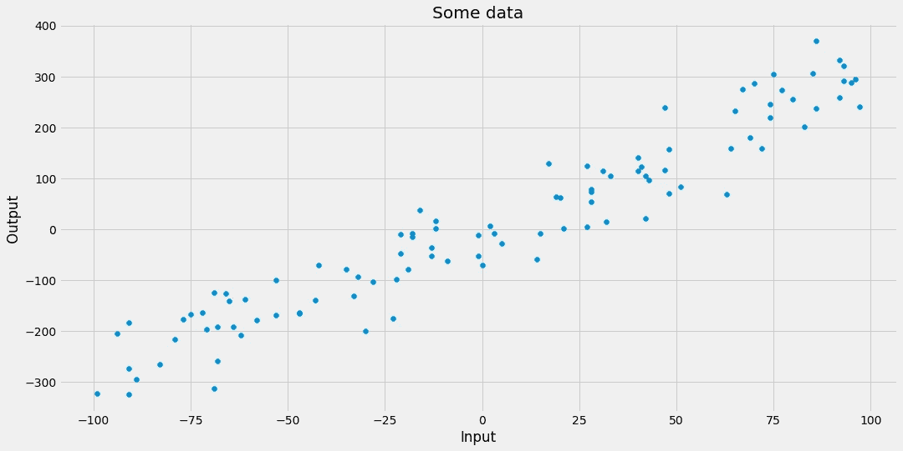
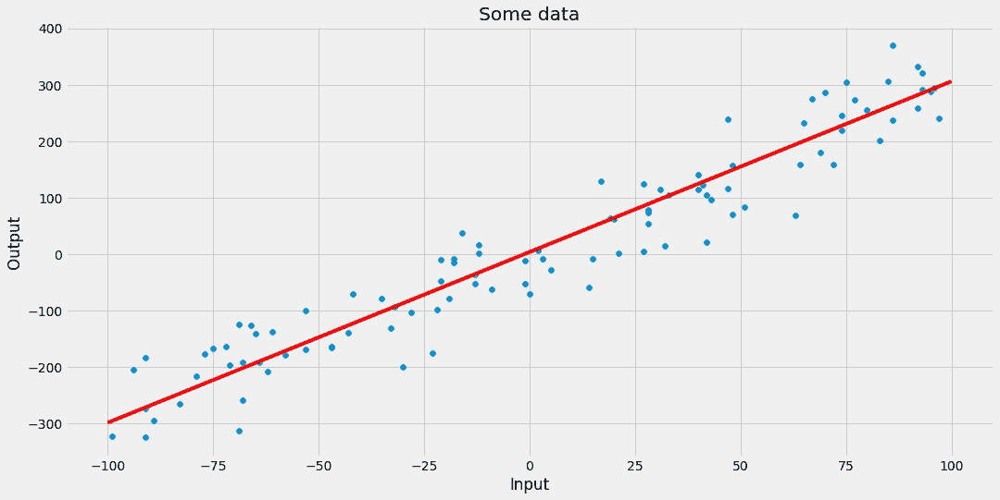
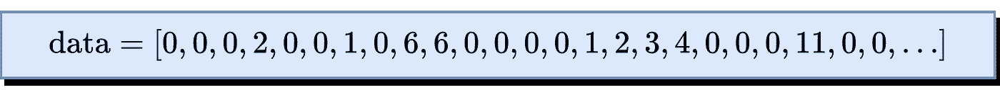
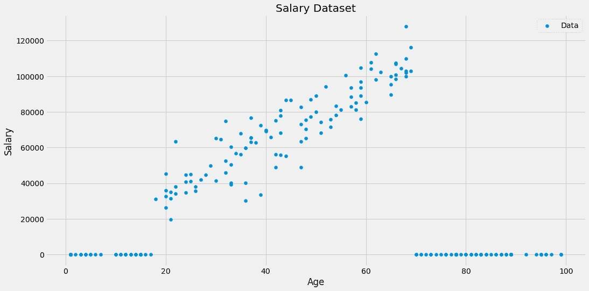
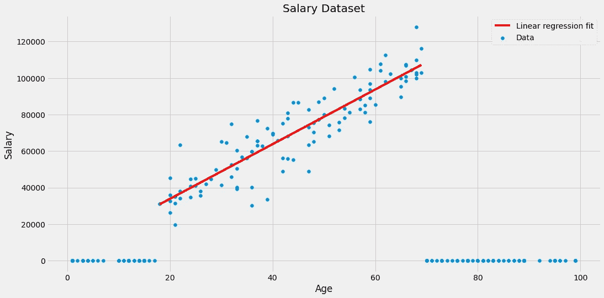
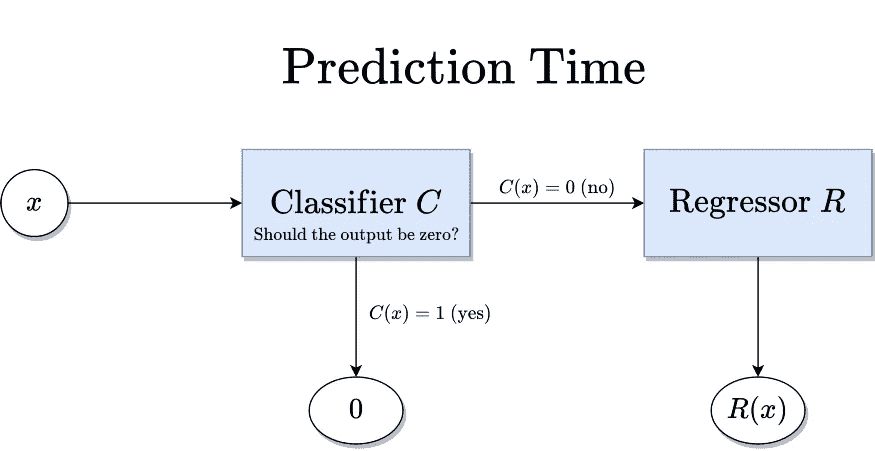
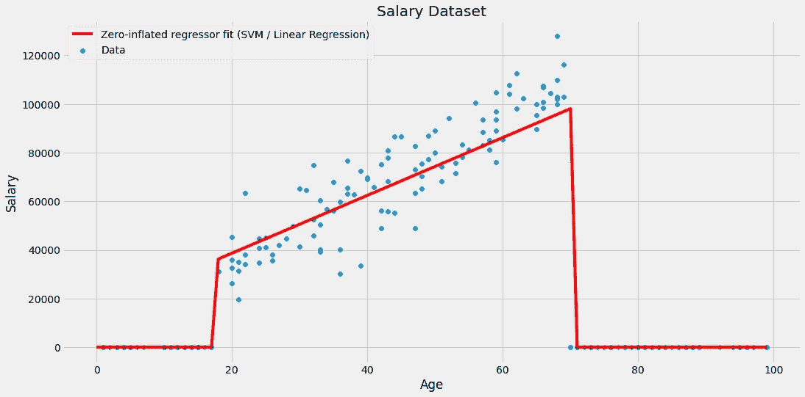
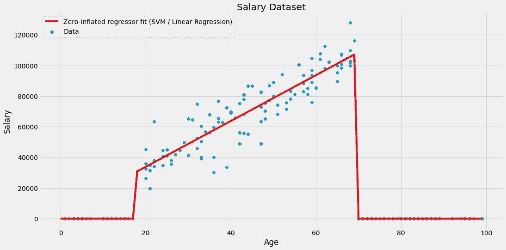
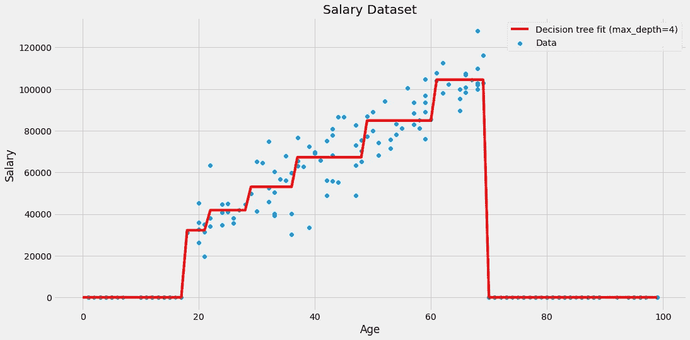

# 零膨胀回归

> 原文：<https://towardsdatascience.com/zero-inflated-regression-c7dfc656d8af?source=collection_archive---------11----------------------->

## [实践教程](https://towardsdatascience.com/tagged/hands-on-tutorials)

## 教你的回归器如何输出零


由[迈克尔·泽兹奇](https://unsplash.com/@lazycreekimages?utm_source=medium&utm_medium=referral)在 [Unsplash](https://unsplash.com?utm_source=medium&utm_medium=referral) 上拍摄的照片

# 零膨胀数据

在处理回归问题时，通常会有在某个范围内连续均匀分布的目标值。让我来说明我的意思。考虑以下数据集二维数据集:



图片由作者提供。

在这种情况下，目标值都分散在大约-300 到 400 的范围内。应用线性回归，我们最终得到以下模型:



图片由作者提供。

没有新意，没有花哨。

然而，有些数据集中有非常多的零目标。这就是我们所说的零膨胀数据集。



图片由作者提供。

这种行为的例子是以稀有事件计数为目标的数据集。这包括以下金额

*   制造中的缺陷，
*   特定日期和地点的龙卷风或其他自然灾害，或
*   一些街区的犯罪。

常见的模式是，通常不会发生任何不好的事情，即目标为零。但偶尔，例如当一台制造机器出现几个小时的故障时，这个数字会飙升。在这种情况下，模型实际上必须预测不同于零的值。

# 零膨胀数据的问题是

许多模型可能会被这种行为分散注意力，其中包括线性回归、支持向量机以及神经网络。**这些模型中的一个输出零的机会非常小。**

例如，以一个简单的线性回归为例，其中一个特征如上所述。该算法的输出是一条线，该线恰好一次取值为零**。这个问题在更高维度中也依然存在。或者回想一下，神经网络可以被表达为一个复杂的嵌套公式——如果你插入随机数，你很可能不会得到零输出。**

但是，让我们用一个玩具数据集来形象化这个问题，而不是谈论假设的场景。



图片由作者提供。

该数据集由两列组成:

*   一个人的特征*年龄*和
*   该人员的目标*工资* *来源于工作*。

在这个虚构的数据集中，我们可以看到儿童和青少年没有收入。从某个年龄开始，赚钱就开始了。人们获得了更多的经验，因此薪水会随着年龄的增长而增加。最后，人们退休了，不再挣工资了。*人生的故事。*

显而易见，简单的线性回归在这里并不适用。无论如何让我们做它。😎


图片由作者提供。

不太适合。一条线不能捕捉数据中的所有变化，但是请注意，如果我们将一条线拟合到大约 20 岁到 70 岁之间的数据，那么在这个区间内的拟合将会很好。



图片由作者提供。

但这仅仅解决了问题的一部分。我们想要一个通用的模型，它也能够为年轻人和老年人做出预测。除了基于树的方法，让我们看看一个简单而有效的方法来解决这个问题。

# 零膨胀回归量

我们现在将定义一个估计器来解决与零膨胀数据集相关的问题。之后，我们在工资数据集上使用它的一个已经实现的版本。

## 定义

这个想法很简单。考虑以下两步方法:

1.  训练一个**分类器** **C** 告诉我们回归输出是否为零。
2.  在具有非零目标的数据部分上训练一个**回归量** **R** 。

如果数据点进入模型，分类器首先检查输出是否应该为零。如果是，输出零。否则，输出该数据点的回归结果。



图片由作者提供。

这就是我们所说的**元模型**，即由其他模型组成的模型。最棒的是你可以插入任何你喜欢的分类器和回归器。

## 使用模型

让我们回到我们的工资数据集。


图片由作者提供。

我们看到分类器必须捕获年龄轴两端的零目标。简单的逻辑回归无法做到这一点(*想想为什么！*)，但是具有 RBF 核的 SVM 分类器可能就足够了。

问题是我们现在必须实现这个元回归器。虽然我相信您可以自己完成这项工作，但我想向您介绍一个非常棒的[*，它已经可以实现这种方法。*](https://github.com/koaning/scikit-lego/blob/main/sklego/meta/zero_inflated_regressor.py)

> *注意:我是这个实现的创建者，因此对它有偏见。*

*这是你们每个人都应该知道的神话般的“sci kit-Lego”项目的一部分。这个库包含许多有用的 scikit-learn 兼容扩展，比如估计器、转换器和更多的构建模块(因此得名)。让我引用一下该项目的 [Github 页面](https://github.com/koaning/scikit-lego):*

> *“它是由 [Matthijs Brouns](https://www.mbrouns.com/) 和 [Vincent D. Warmerdam](https://koaning.io) 发起的，作为一个教人们如何为开源做贡献的工具。”*

*向文森特和马特希斯大喊！所以，把它放在心上，看看这个项目，想想你是否也能贡献点什么。我已经做了。*

*现在让我们最终编码。*

```
*import pandas as pd
import numpy as np
from sklearn.svm import SVC
from sklearn.linear_model import LinearRegression
from sklego.meta import ZeroInflatedRegressor

# Create the salary dataset.
np.random.seed(0)
dataset = pd.DataFrame({'Age': np.random.randint(1, 100, size=200)})
dataset['Salary'] = np.where((dataset.Age > 17) & (dataset.Age < 70), 1500*dataset.Age + 5000 + 10000*np.random.randn(200), 0).round()

# Instantiate the zero-inflated regressor.
zir = ZeroInflatedRegressor(
    classifier=SVC(),
    regressor=LinearRegression()
)

# Easy fit!
zir.fit(dataset[['Age']], dataset.Salary)*
```

*我们现在可以画出结果:*

**

*图片由作者提供。*

*这正是我们想要看到的行为！*

*唯一的问题是，我们必须扣除一些分数，因为 SVM 在 70 岁时没有实现零产出。这反过来为线性回归创建了一个异常值，然后将线向下倾斜了一点。幸运的是，我们还可以在一些超参数优化中使用`ZeroInflatedReressor`。*

```
*from sklearn.model_selection import GridSearchCV

grid = GridSearchCV(
    estimator=zir,
    param_grid={
        'classifier__C': range(1, 10)
    }
)

grid.fit(dataset[['Age']], dataset.Salary)*
```

*你可以通过`grid.best_params_`得到最佳的 SVM 参数 C，在我们的例子中是 4。结果是:*

**

*图片由作者提供。*

# *结论*

*我们研究了以大量零为目标的回归数据集——零膨胀数据。这可能会扰乱许多回归，如支持向量机以及神经网络。*

*为了解决这个问题，我们引入了零膨胀回归器，这是一个由基本分类器和基本回归器组成的元模型。分类器检查基础回归器是否必须工作，或者预测值是否应该为零。否则，基本回归器将接管并输出一个数字。当然，这个数字也可以是零，但通常情况下，它不是。*

> *从某种意义上说，分类器使回归者的生活变得更容易，因为它使回归者的头脑摆脱了混乱。*

*最后，你可能会问:*“你提到了基于树的模型。他们怎么了？他们也应该能够处理零膨胀数据集。”是的，他们可以！让我们在同一个数据集上训练一个深度为 4 的决策树。**

**

*图片由作者提供。*

*这看起来也很好，但它有着我们在树木中常见的台阶形状。这并不奇怪，因为决策树基本上只是分段常数函数。随机森林和梯度提升算法也是如此，因为它们是树的和。*

*拟合很好，但不如我们的好——在我们的情况下，配备支持向量机的简单线性回归效果更好。像往常一样，为手头的数据集尝试不同的模型。现在，您有了另一个可以尝试的工具。*

*玩得开心！*

*我希望你今天学到了新的、有趣的、有用的东西。感谢阅读！*

***作为最后一点，如果你***

1.  ***想支持我多写点机器学习和***
2.  ***无论如何都要计划获得中等订阅量，***

***为什么不做** [**通过这个环节**](https://dr-robert-kuebler.medium.com/membership) **？这将对我帮助很大！😊***

**说白了，给你的价格不变，但大约一半的订阅费直接归我。**

*非常感谢，如果你考虑支持我的话！*

> **有问题就在*[*LinkedIn*](https://www.linkedin.com/in/dr-robert-k%C3%BCbler-983859150/)*上写我！**