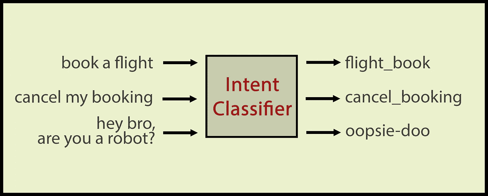
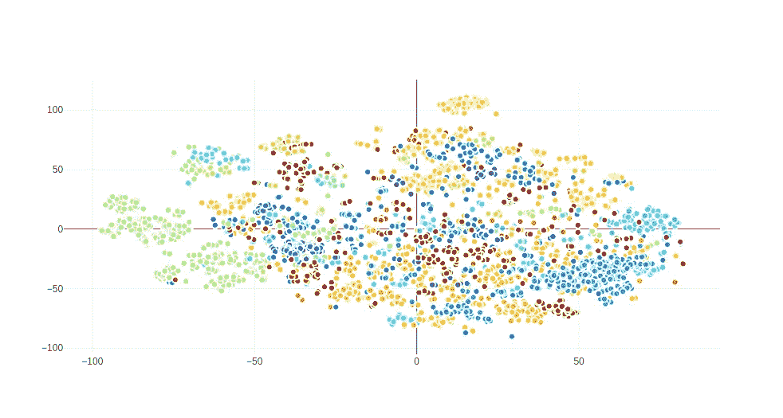
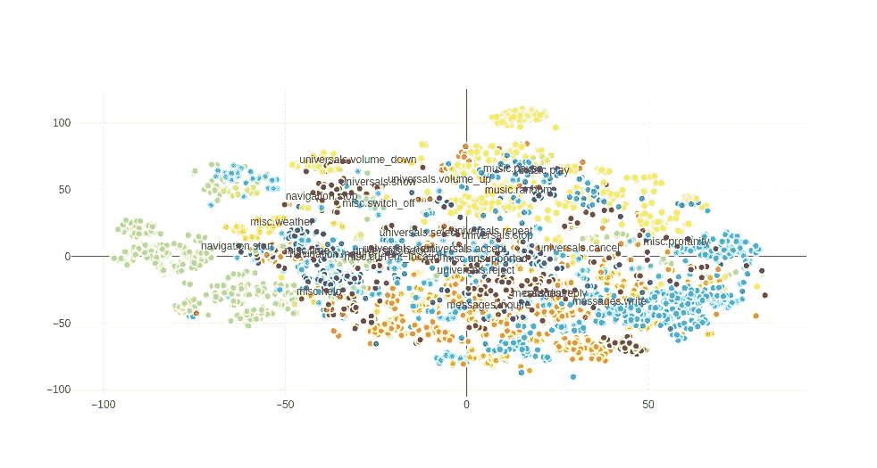
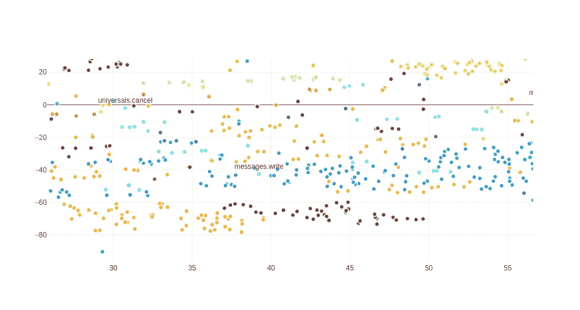
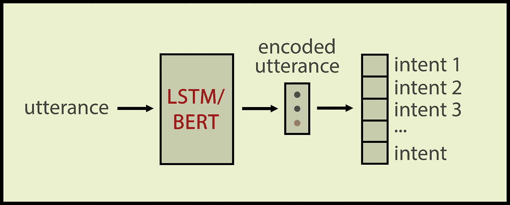
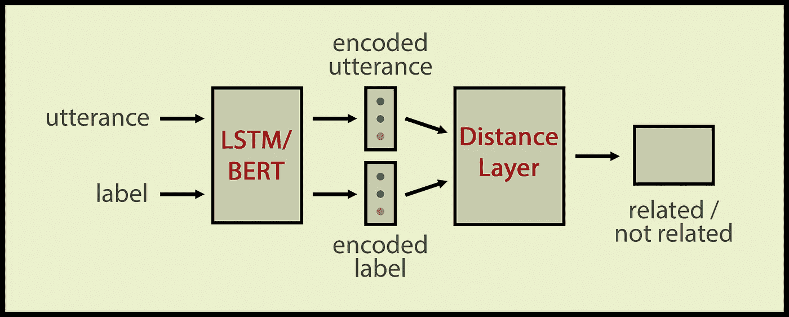

# 使用连体网络的零射击意图分类

> 原文：<https://towardsdatascience.com/zero-shot-intent-classification-with-siamese-networks-35900471c7fd?source=collection_archive---------8----------------------->

## 通过零触发意图分类有效定位域外意图

意图识别是面向目标的对话系统的基本任务。意图识别(有时也称为意图检测)是用标签对每个用户话语进行分类的任务，该标签来自预定义的一组标签。

分类器对标记数据进行训练，并学习区分哪个话语属于哪个类别。如果分类器得到一个看起来不像任何训练发音的发音，有时结果会很尴尬。这就是为什么我们也把**域外**话语归类，它们根本不属于那个域。



分类话语的意图分类器。这里，示例域是机票预订和话语“嘿，兄弟，你是机器人吗？”是一个域外的话语。作者图片

问题是用户和我们开发者生活在不同的世界里。开发人员希望呆在语义丛林中的安全农场(所谓的域)，但是用户并不十分了解分类器或聊天机器人 NLU 是如何工作的(他们也不需要了解)。你不能期望用户停留在正确的语义领域，相反，你应该给你的聊天机器人提供处理食物话语的技能。


在口语的野性中，你安全的语义农场。你永远不知道什么来自野外！作者图片

在这篇文章中，我们将讨论如何通过为我们的司机语音助手 Chris 检测哪些话语属于该领域，哪些话语不属于该领域，来保持我们的领域完好无损。首先，我将介绍克里斯域和话语，然后我们将通过暹罗网络学习文本分类。

## Chris 域和数据

[克里斯](https://www.youtube.com/watch?v=Qwnjszu3exY&t=1s)是司机的语音助手。我们的克里斯是司机助理，由[德国 Autolabs](https://germanautolabs.medium.com/) 打造。克里斯可以发送/阅读短信、WhatsApp 信息、给手机联系人打电话、播放音乐、导航、回复天气查询和闲聊。


我们的克里斯，在左边。右边是克里斯和他的能力。图片来自德国 Autolabs 网站。

Chris 是一个面向任务的对话代理，因此用户的话语通常简明扼要。这些是典型的用户话语:

```
play music
some music please
stop the music
send a message
send a message to Tess
send a whatsapp
read my messages
do I have any new messages
display the latest message
start the navigation
show navigation
show the map
stop the navigation
nearest gas station
find a parking spot
read it
no cancel
cancel
yes
next
no next
tell me the time
how is the weather today
```

意图名由一个子域名和一个动作名组成。以下是一些与上述说法相对应的意图名称:

```
music.play
music.pause
messages.write
messages.read
navigation.start
navigation.stop
universals.accept
universals.reject
universals.next
misc.time
misc.weather
```

域外话语呢？这里也有一些例子:

```
hey siri
launch siri
wake up siri
open my instagram
share my video on instagram
delete my facebook account
play my audibooks
set an alarm
show alarms
please delete all alarms
open the doors
```

要求一些你的聊天机器人根本不具备的能力，完全是正常用户的行为。例如，克里斯根本不具备打开车门的技能。即使 UX 团队在每个包装中都包含了关于克里斯技能的指南，用户也可能会跳过阅读😄这就是为什么你的聊天机器人 NLU 应该随时准备处理大量的域外话语，用户要求他们可以想象你的聊天机器人可以实现的能力，而不是用户手册中写的那些。

乍一看，简短的话语可能看起来“容易”，但也有一定的挑战。语音识别错误可能会造成困难，尤其是在简短的话语中，因为话语中可能会丢失语义上至关重要的单词(如“播放音乐”中的“播放”)。此外，语音引擎必须在正确的时间开始监听，否则它可能会错过单个单词的简短话语，如“是”、“否”，这些话语对于解析上下文至关重要。在 WER 方面，只缺少 3 个字母看起来不像是一个很大的 ASR 错误，但是如果您的代理多次要求用户批准，这可能会给用户带来挫败感。所有语音机器人都有声学和语义方面的挑战，永远不要低估语音工作的挑战。

## 什么是零拍文本分类？

零短文本分类的任务是在一组类别标签上训练分类器，并用分类器在训练集中看不到的类别标签测试分类器。NLP 最近的工作集中在更广泛的背景下的零射击学习，零射击学习 NLP 现在意味着*训练一个模型去做它没有明确训练过的任务。GPT-3 是一个零射击学习者，吸引了相当多的注意力。*

在零镜头分类中，我们用一些视觉线索或类名向分类器描述一个看不见的类。对于零镜头文本分类，通常使用意图名来描述意图的语义。当我第一次开始做克里斯 NLU，数据是为了“通常”的意图分类。然后我开始尝试 ood，发现我们的类命名方案**domain . action**(music . play，navigation.start 等)的确*非常适合零镜头学习*。

## 将标签和话语嵌入同一个空间

零镜头文本分类中的一种常见方法是将意图名称和话语嵌入到同一空间中。这样，零拍算法可以通过语义组学习意图名称和话语之间的语义关系，就像我们人类一样。这根本不是一个新的想法，研究人员使用词向量来表示固定维度中的文本和意图名称(例如在 [*Veeranna 中)。2016*](https://www.esann.org/sites/default/files/proceedings/legacy/es2016-174.pdf) )。随着变形金刚的发明，密集表示经历了一场革命，现在我们有了更多高质量的句子和单词嵌入。

在我们的研究中，我们首先使用平均池单词向量来表示话语，然后使用 BERT 来编码我们的话语以生成话语向量。首先，让我们看看当我们使用单词向量时，意图名称是如何与话语结合在一起的。我们使用 100 维手套向量。我们通过平均单词的单词向量来为话语生成句子嵌入。为了获得标签的嵌入(例如，music.play)，我们对域(音乐)和动作(播放)的嵌入进行了平均。在为所有话语生成嵌入之后，我们用 t-SNE 将我们的数据集转换成二维(用于可视化目的)。以下散点图显示了所有数据集话语和意图名称，具有相同意图的话语用相同的颜色着色:



克里斯说，每种颜色都代表一种意图

这就是话语和意图名称的对齐方式:



将意图名称和话语嵌入到同一空间中

如果我们放大一点，我们会看到意图名称和相应的话语确实排列得很好:



放大上面的图像

数据集的话语创建了一个相当漂亮的散点图，没有太多的离群值，相同意图的话语与意图名称组合在一起。

如果我们想用 BERT 来嵌入话语和意图名称呢？这对表达很有效，但是意图名不是真正的句子和简短的表达。BERT 是为完整的句子而训练的，对于像我们的意图名这样的短表达可能不太管用。在这种情况下，我们可以通过 BERT 为话语创建 768 维嵌入，通过词向量为意图名称创建 100 维嵌入。为了将它们嵌入到同一空间中，我们需要计算一个投影矩阵ϕ，将 768 维话语向量投影到 100 维意图向量上。因为我们有带注释的数据，我们可以通过回归学习投影矩阵。(尽管包含正则化以防止过度拟合很重要)。然后，我们有一个类似于上面的视觉对齐。

**用于零镜头文本分类的连体网络**

上面的探索性数据分析向我们展示了意图名称和话语之间的语义相似性是非常明显和可学习的。然后，我们可以让一个连体神经网络学习意图名称和话语之间的相似性。

传统的意图分类器输入话语并生成类别标签。通常我们用 LSTM 或伯特对话语进行编码，然后将编码后的话语送入密集层，得到一个类别标签:



传统的意图分类器。图片 bu 作者

相反，我们的零触发意图分类器学习标签和话语是否语义相似。我们使用了暹罗网络架构，这对于计算语义相似度非常有用。我们的暹罗网络输入一个意向名称和一个话语；输入相关或不相关时的输出。

架构和我在[上一篇暹罗 NN 文章](/siamese-nn-recipes-with-keras-72f6a26deb64)中描述的一样。该架构包括

*   编码话语和标签的 LSTM/伯特层
*   随后是距离层以计算话语和标签之间的语义距离
*   最后一个密集层挤压距离矢量到一个二进制值

这种结构仍然是一个文本分类器，但这次输入的数量是 2，输出向量的维数只有 1。输出是二进制的，0 表示标签和话语不相关；1 表示话语属于该标签的类别。



连体零射击意图分类器。作者图片

只要我们能够为标签提供良好的嵌入，我们就可以向暹罗分类器请求我们想要的任何标签(即使分类器以前从未见过这个标签)。这对于域外的话语来说是非常好的，因为即使你没有任何 ood 类的标记数据或者只有几个例子，暹罗零镜头分类器仍然可以决定一个话语是与 Chris 域相关还是与该域不相关。

暹罗网络在很长一段时间内被用于语义相似性，然而玩一些技巧可以带我们到一个毫不费力的零射击意图预测模型。有时候想法一直在你眼前，但你得换个角度去看。

在本文中，我们继承了一种全新的方法来解决“传统的”意图分类问题。首先，我们对克里斯的话语进行了语义分组。然后，我们刷新了我们关于暹罗网络的知识。最后，我们看到了如何使用暹罗网络进行零镜头分类。

我希望所有读者喜欢我们的 Chris 的能力和数据，并希望在更多的 Chris 文章中与您见面。在那之前，请继续关注健康的❤️

## 参考

*   语言模型是很少出手的学习者，【https://arxiv.org/abs/2005.14165 
*   预应变变压器在意图分类方面是否稳健？
    超范围意图检测评估中缺失的成分[https://arxiv.org/pdf/2106.04564.pdf](https://arxiv.org/pdf/2106.04564.pdf)
*   检测发给虚拟个人助理的域外话语[https://www . Microsoft . com/en-us/research/WP-content/uploads/2014/09/IS14-orphan 2 . pdf](https://www.microsoft.com/en-us/research/wp-content/uploads/2014/09/IS14-Orphan2.pdf)
*   利用语义相似度对文本文档进行多标签零炮
    分类，[https://www . esann . org/sites/default/files/proceedings/legacy/es 2016-174 . pdf](https://www.esann.org/sites/default/files/proceedings/legacy/es2016-174.pdf)