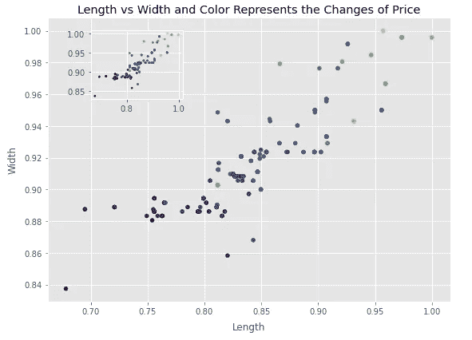
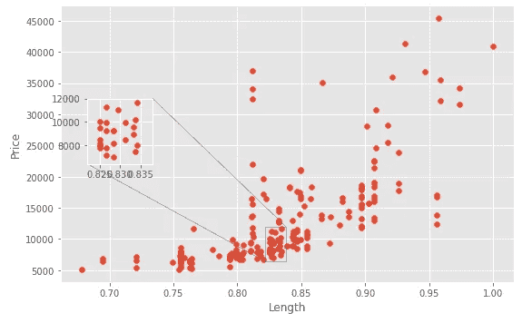
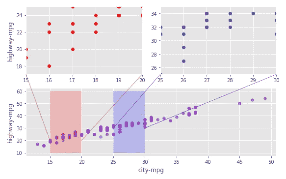

# 在 Matplotlib 中放大和缩小以更好地理解数据

> 原文：<https://towardsdatascience.com/zooming-in-and-zooming-out-in-matplotlib-to-better-understand-the-data-b4a5f5b4107d?source=collection_archive---------17----------------------->


钱德勒·克鲁登登在 [Unsplash](https://unsplash.com?utm_source=medium&utm_medium=referral) 上的照片

## 为每个地块提供完整的代码

Matplotlib 可以说是 Python 中最流行的可视化库。还有，其他一些更高端的库也是基于 Matplotlib 构建的。我有几篇关于 Matplotlib 可视化技术的文章。请随意查看。我在这一页的底部有链接。

本文将重点介绍一些缩放技术。有时，当我们制作散点图或线图时，我们可能会发现许多数据杂乱地放在一个地方。在这种情况下，放大那些杂乱的地方会有助于真正清楚地理解数据点。同样，如果数据点过于分散，就很难看出是否有趋势。缩小有助于查看数据中的任何趋势。

幸运的是，Matplotlib 库有一些非常酷的技巧可以帮助我们，我们也可以使用一些简单的技术来放大和缩小。

让我们来看一些例子。

让我们先导入并读取数据集。我用的是 Kaggle 的自动数据集。以下是数据集的链接:

[](https://github.com/rashida048/Data-visualization-in-python/blob/main/auto_clean.csv) [## main rashida 048/Data-visualization-in-python/auto _ clean . CSV

### 此时您不能执行该操作。您已使用另一个标签页或窗口登录。您已在另一个选项卡中注销，或者…

github.com](https://github.com/rashida048/Data-visualization-in-python/blob/main/auto_clean.csv) 

这是一个开放的数据集，这里提到的。

```
import pandas as pd
import matplotlib.pyplot as plt
import seaborn as snsd = pd.read_csv("auto_clean.csv")
```

这个数据集相当大。所以我不能在这里分享任何截图。这些是列:

```
d.columns
```

输出:

```
Index(['symboling', 'normalized-losses', 'make', 'aspiration', 'num-of-doors', 'body-style', 'drive-wheels', 'engine-location', 'wheel-base', 'length', 'width', 'height', 'curb-weight', 'engine-type', 'num-of-cylinders', 'engine-size', 'fuel-system', 'bore', 'stroke', 'compression-ratio', 'horsepower', 'peak-rpm', 'city-mpg', 'highway-mpg', 'price', 'city-L/100km', 'horsepower-binned', 'diesel', 'gas'], dtype='object')
```

首先，我想在缩小技术上下功夫。

为此，我将绘制一个长度与宽度的散点图。这是完整的代码，我会在情节之后解释一下:

```
fig = plt.figure(figsize = (8, 6))x = d['length']
y = d['width']
c = d['price']ax = plt.scatter(x, y, s = 25, c = c)plt.xlabel('Length', labelpad = 8)
plt.ylabel('Width', labelpad = 8)
plt.title("Length vs Width and Color Represents the Changes of Price")ax_new = fig.add_axes([0.2, 0.7, 0.2, 0.2])
plt.scatter(x, y, s=5, c = c)
```



作者图片

看，小区里面一个小的缩小窗口。我假设你已经知道如何做散点图了。我不想看那些代码。缩放窗口来自 fig.add_axes()函数，其中有一个参数。这是四个元素的列表[0.2，0.7，0.2，0.2]。这里最后两个元素 0.2 和 0.2 表示缩放窗口的高度和宽度。前两个元素 0.2 和 0.7 定义了缩放窗口的位置。请随意更改这些数字，看看会发生什么。

我们来看一些放大的技巧。这次我将使用长度与价格的关系图。我们需要先导入 mark_inset 和 inset_axes 函数。inset_axes 函数将定义缩放窗口的大小和缩放窗口的位置。另一方面，mark_inset 函数将绘制从原始点到缩放窗口的线。请查看下面代码中的注释，以获得一些清晰的理解。以下是完整的代码:

```
from mpl_toolkits.axes_grid1.inset_locator import mark_inset, inset_axesplt.figure(figsize = (8, 5))
x = d['length']
y = d['price']ax = plt.subplot(1, 1, 1)
ax.scatter(x, y)
ax.set_xlabel("Length")
ax.set_ylabel("Price")#Defines the size of the zoom window and the positioning
axins = inset_axes(ax, 1, 1, loc = 1, bbox_to_anchor=(0.3, 0.7),
                   bbox_transform = ax.figure.transFigure)axins.scatter(x, y)x1, x2 = 0.822, 0.838
y1, y2 = 6400, 12000#Setting the limit of x and y direction to define which portion to #zoom
axins.set_xlim(x1, x2)
axins.set_ylim(y1, y2)#Draw the lines from the portion to zoom and the zoom window
mark_inset(ax, axins, loc1=1, loc2=3, fc="none", ec = "0.4")
plt.show()
```



作者图片

这是最后一个放大的例子。这次我将使用支线剧情来呈现 zoom_in 窗口。上面会有两个小的放大窗口，下面是原来的大图。要缩放的部分将用颜色突出显示，连接线将清晰显示。请仔细检查代码中的注释，以便更清楚地了解代码。以下是完整的代码:

```
from matplotlib.patches import ConnectionPatchfig = plt.figure(figsize=(8, 5)) #the plot with red dots
plot1 = fig.add_subplot(2,2,1) # two rows, two columns, fist cell
plot1.scatter(d['city-mpg'], d['highway-mpg'], color = 'red')
plot1.set_xlim(15, 20)
plot1.set_ylim(17, 25)
plot1.set_ylabel('highway-mpg', labelpad = 5)#the plot with blue dots
plot2 = fig.add_subplot(2, 2, 2)
plot2.scatter(d['city-mpg'], d['highway-mpg'], color = 'blue')
plot2.set_xlim(25, 30)
plot2.set_ylim(25, 35)#the original plot
plot3 = fig.add_subplot(2,2,(3,4)) # two rows, two colums, combined third and fourth cell
plot3.scatter(d['city-mpg'], d['highway-mpg'], color = 'darkorchid', alpha = .7)
plot3.set_xlabel('city-mpg', labelpad = 5)
plot3.set_ylabel('highway-mpg', labelpad = 5)#highlighting the portion of original plot to zoon in 
plot3.fill_between((15, 20), 10, 60, facecolor= "red", alpha = 0.2)
plot3.fill_between((25, 30), 10, 60, facecolor= "blue", alpha = 0.2)#connecting line between the left corner of plot1 and the left #corner of the red hightlight
conn1 = ConnectionPatch(xyA = (15, 17), coordsA=plot1.transData,
                       xyB=(15, 20), coordsB=plot3.transData, color = 'red')
fig.add_artist(conn1)#connecting line between the rightcorner of plot1 and the right #corner of the red hightlight
conn2 = ConnectionPatch(xyA = (20, 17), coordsA=plot1.transData,
                       xyB=(20, 20), coordsB=plot3.transData, color = 'red')
fig.add_artist(conn2)#connecting line between the left corner of plot2 and the left #corner of the blue hightlight
conn3 = ConnectionPatch(xyA = (25, 25), coordsA=plot2.transData,
                       xyB=(25, 30), coordsB=plot3.transData, color = 'blue')
fig.add_artist(conn3)#connecting line between the right corner of plot2 and the right #corner of the blue hightlight
conn4 = ConnectionPatch(xyA = (30, 25), coordsA=plot2.transData,
                       xyB=(30, 30), coordsB=plot3.transData, color = 'blue')
fig.add_artist(conn4)
```



作者图片

如果您对本文中的任何代码有任何疑问，请在评论部分提问。

## 结论

对于这个数据集，放大或缩小可能不太重要。但在现实生活中，有很多数据集实际上需要放大或缩小才能更好地理解数据。我希望你能在现实生活的项目中使用这些技术，做一些很酷的工作。

欢迎随时关注我的推特(Twitter)和我的新 T2 YouTube 频道(T3)。

## 更多阅读

[](/your-everyday-cheatsheet-for-pythons-matplotlib-c03345ca390d) [## Python Matplotlib 的日常备忘单

### 完整的可视化课程

towardsdatascience.com](/your-everyday-cheatsheet-for-pythons-matplotlib-c03345ca390d) [](/five-advanced-plots-in-python-matplotlib-134bfdaeeb86) [## Python 中的五个高级绘图— Matplotlib

### 带示例的交互式 3d 绘图

towardsdatascience.com](/five-advanced-plots-in-python-matplotlib-134bfdaeeb86) [](/a-collection-of-advanced-visualization-in-matplotlib-and-seaborn-with-examples-2150e6c3f323) [## Matplotlib 和 Seaborn 中的高级可视化集合，带有示例

### 丰富可视化技术和技能

towardsdatascience.com](/a-collection-of-advanced-visualization-in-matplotlib-and-seaborn-with-examples-2150e6c3f323) [](/a-collection-of-advanced-data-visualization-in-matplotlib-and-seaborn-f08136172e14) [## Matplotlib 和 Seaborn 中的高级数据可视化集合

### 让你的故事更有趣

towardsdatascience.com](/a-collection-of-advanced-data-visualization-in-matplotlib-and-seaborn-f08136172e14) [](/an-ultimate-cheatsheet-of-data-visualization-in-seaborn-be8ed13a3697) [## 用 Python 的 Seaborn 库实现数据可视化的终极指南

### 对学习者来说也是一个很好的资源

towardsdatascience.com](/an-ultimate-cheatsheet-of-data-visualization-in-seaborn-be8ed13a3697) [](/an-ultimate-cheat-sheet-for-data-visualization-in-pandas-f7bc239c9937) [## 熊猫数据可视化的终极备忘单

### 熊猫的所有基本视觉类型和一些非常高级的视觉…

towardsdatascience.com](/an-ultimate-cheat-sheet-for-data-visualization-in-pandas-f7bc239c9937)